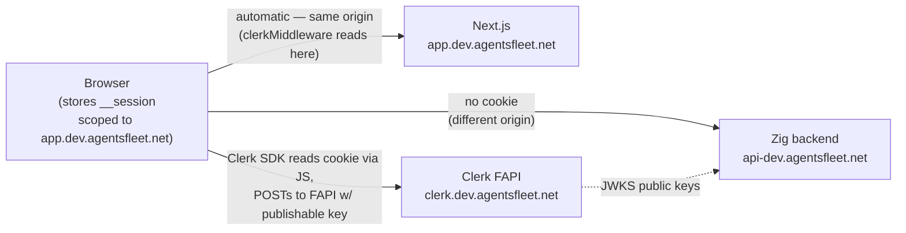
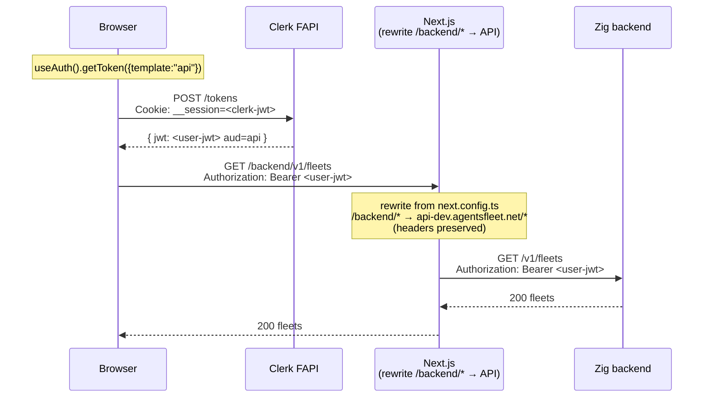
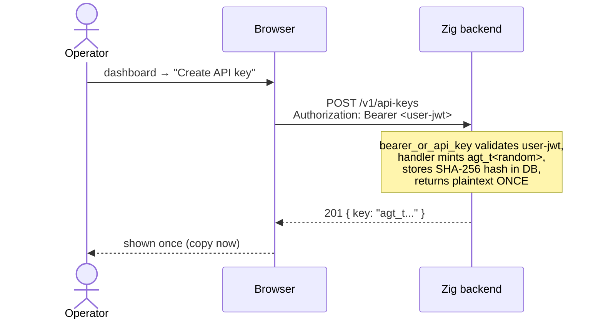
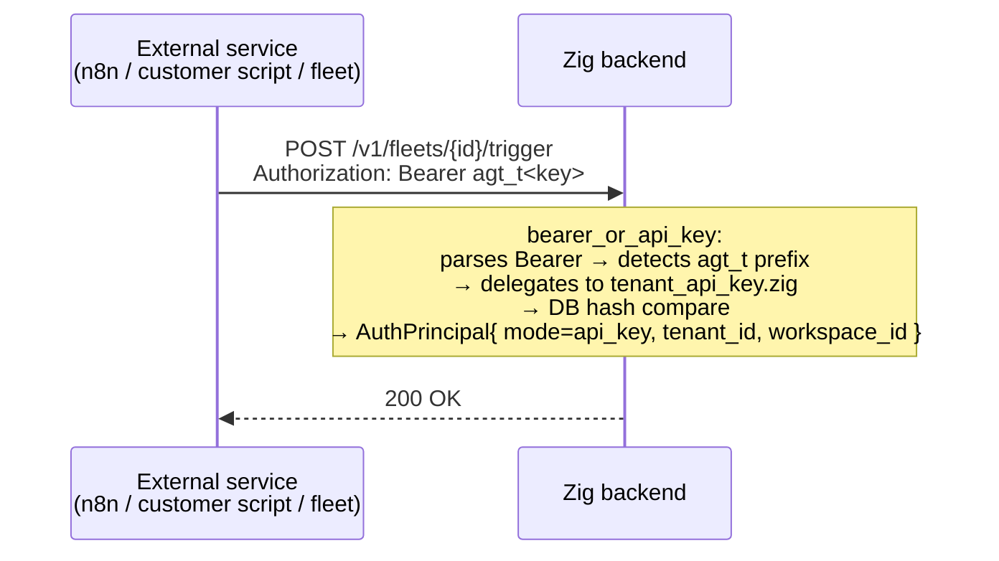
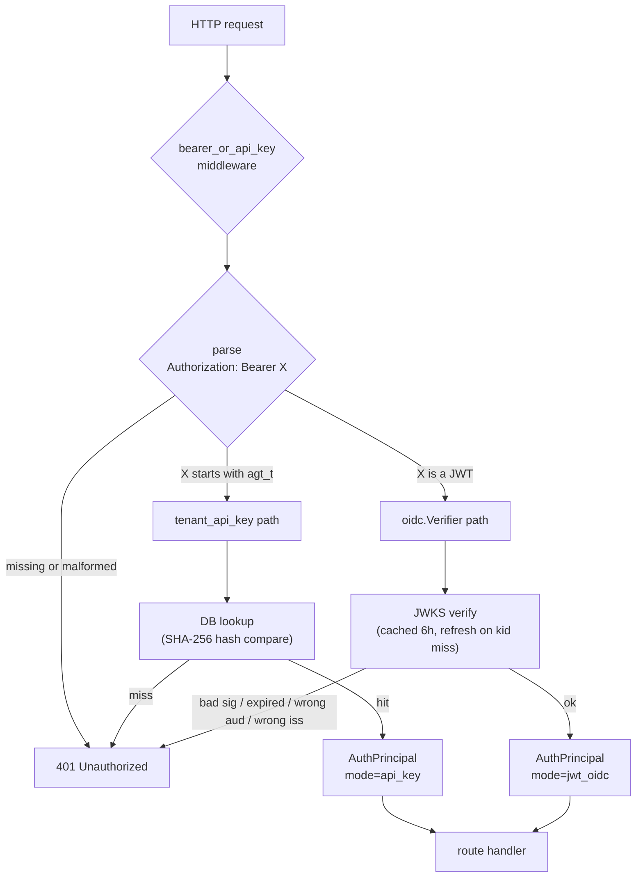
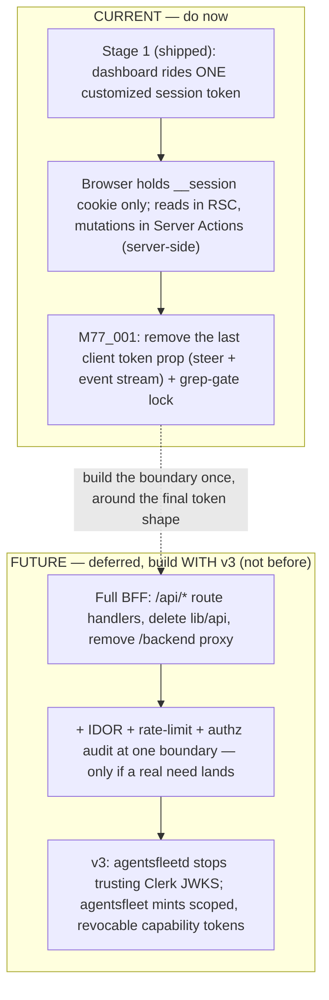
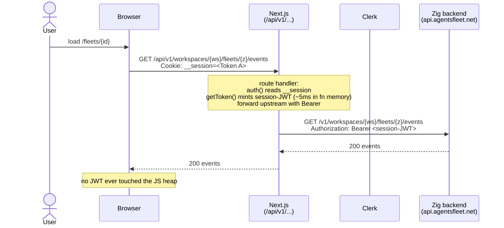

# Authentication

Three principal types reach the Zig backend. All three converge on a single credential shape at the wire:

```
Authorization: Bearer <…>
```

## The three flows at a glance

```
            ┌──────────────────────────────────────────────────────────────┐
            │                                                              │
            │  WHO IS THE ACTOR?                                           │
            │                                                              │
            │  ┌──────────────┐    ┌──────────────┐    ┌──────────────┐  │
            │  │ A human at a │    │ A human in a │    │ A machine    │  │
            │  │ terminal     │    │ browser tab  │    │ (script/bot) │  │
            │  └──────┬───────┘    └──────┬───────┘    └──────┬───────┘  │
            │         │                   │                   │           │
            │         ▼                   ▼                   ▼           │
            │   ┌─────────────┐    ┌─────────────┐    ┌─────────────┐    │
            │   │   FLOW 1    │    │   FLOW 2    │    │   FLOW 3    │    │
            │   │             │    │             │    │             │    │
            │   │ agentsfleet   │    │ Dashboard   │    │ Tenant API  │    │
            │   │ login       │    │ sign-in     │    │ key         │    │
            │   │             │    │             │    │ agt_t…     │    │
            │   │ verification│    │ Clerk       │    │ static hash │    │
            │   │ code + ECDH │    │ __session   │    │ in DB       │    │
            │   │ + 5-min TTL │    │ cookie →    │    │ long-lived  │    │
            │   │             │    │ getToken    │    │ revocable   │    │
            │   │             │    │ ({api})     │    │             │    │
            │   └──────┬──────┘    └──────┬──────┘    └──────┬──────┘    │
            │          │                  │                  │            │
            │          └──────────────────┴──────────────────┘            │
            │                             │                                │
            │                             ▼                                │
            │              Authorization: Bearer <…>                       │
            │                             │                                │
            │                             ▼                                │
            │              bearer_or_api_key middleware                    │
            │              (agt_t*  → DB hash lookup)                     │
            │              (anything → JWKS verify)                        │
            │                                                              │
            └──────────────────────────────────────────────────────────────┘
```

| When to use which | Flow 1 | Flow 2 | Flow 3 |
|---|---|---|---|
| Human present at the keyboard? | ✅ required (5-min interactive flow) | ✅ required | ❌ |
| Long-lived credential? | ❌ JWT expires ~15 min; CLI re-runs `login` on 401 | ❌ minted per request | ✅ until explicitly revoked |
| Provisioned via | `agentsfleet login` | Clerk sign-in form | dashboard "Create API Key" surface |
| Right answer for | a developer on a workstation; Cursor/Claude Code running locally with the developer present | someone using `app.agentsfleet.net` in a browser | n8n / Zapier / cron jobs / CI runners / Kubernetes / scheduled background work |
| Wrong answer for | unattended CI / cron / K8s / hosted-fleet platforms — see [`AUTH_DEVICE_LOGIN.md`](./AUTH_DEVICE_LOGIN.md) *Human-led-only invariant* | none — this is the only browser path | interactive humans (`agt_t` long-lived keys carry too much standing privilege for a workstation) |

There is also a fourth surface — **fleet keys** (`agt_a*` bound to a single fleet) — for narrowly-scoped webhook-driven inbound calls. It's a Flow 3 subtype: same DB-hash-lookup shape, narrower scope. See *Fleet keys* below.

A fifth surface — **inbound webhooks** — does not use Bearer at all (HMAC-signed by the provider). See *Webhook auth*.

A sixth surface — the **runner token** (`agt_r`) — is the first *machine* principal: a host-resident `agentsfleet-runner` that holds no tenant identity at all. Same Bearer wire shape and DB-hash lookup, but a separate middleware and trust plane. See *Runner token* below.

Cookies **never reach the Zig backend**. The Clerk `__session` cookie lives on the dashboard's own host (`app.agentsfleet.net`) — written by the Clerk SDK on the page after sign-in. Same-origin policy means it only attaches on requests back to the dashboard, never to `api-dev.agentsfleet.net`. See *Flow 2 — UI* below for the cookie-vs-Bearer picture.

The middleware that gates almost every route is `bearer_or_api_key` (`src/agentsfleetd/auth/middleware/bearer_or_api_key.zig`). It parses the `Bearer …` prefix, then routes by sub-prefix:

- `Bearer agt_t*` → `tenant_api_key.zig` (DB lookup, hash compare).
- `Bearer <anything else>` → `oidc.Verifier.verifyAuthorization` (cached JWKS, RS256 signature check, `iss` + `aud` + `exp` claims, `scopes`-claim parsing onto `principal.scopes`).

Both paths resolve to the same `AuthPrincipal` struct (`src/agentsfleetd/auth/principal.zig`). Handlers downstream never know which credential shape was used.

---

## Auth model in one screen

Six principal surfaces, one wire shape (`Authorization: Bearer …`), and a prefix that routes to the right validator.

| Principal | Credential | Issuer | Validation | Middleware |
|---|---|---|---|---|
| Human at a terminal (CLI) | Clerk JWT (`api` template) | Clerk | JWKS verify + `aud`/`iss`/`exp` | `bearer_or_api_key` → OIDC |
| Human in a browser (dashboard) | Clerk session JWT | Clerk | JWKS verify + `aud` | `bearer_or_api_key` → OIDC |
| Service / automation | `agt_t<hex>` tenant api key | backend | SHA-256 hash lookup | `bearer_or_api_key` → `tenant_api_key` |
| One-fleet webhook caller | `agt_a<hex>` fleet key | backend | SHA-256 hash lookup | bespoke, handler-local today — see *Fleet keys* |
| Host runner (machine) | `agt_r<hex>` runner token | backend (via `register`) | SHA-256 hash lookup in `fleet.runners` | `runnerBearer` on `/v1/runners/me/*` |
| Inbound webhook (provider) | HMAC signature (no Bearer) | provider | per-provider HMAC | `webhook_sig` |

Routing in `bearer_or_api_key.zig`: `agt_t` → tenant-key DB lookup; anything else → OIDC/JWKS verify; no token → 401. The runner plane is deliberately a separate middleware (`runnerBearer`, `agt_r` only) so a runner token cannot satisfy a tenant route and vice versa.

Authorization is **scope-based** (M104_001). Every capability is an explicit `resource:action` scope carried on the verified token's `scopes` claim and surfaced as `principal.scopes` (a bitset). Two independent axes decide a request:

1. **Capability** — `requireScope` (one middleware) checks the route's required scopes (declared per route + HTTP method in `http/route_scopes.zig`) against `principal.scopes`, any-of, hierarchy-expanded. Absent/insufficient ⇒ `403 UZ-AUTH-022` naming the missing scope.
2. **Ownership** — `authorizeWorkspace` (unchanged) checks the principal owns the target workspace (tenant-id match), independent of scopes. The two compose: holding `fleet:write` does not let you touch a workspace you do not own.

The former `AuthRole = user < operator < admin` ladder and the `platform_admin` bool are **gone** — they were undocumented capability bundles. See the **Scope catalogue** below for the full vocabulary, the `read < write < admin` hierarchy, and the default provisioning grants.

Everything below is per-surface detail. For the CLI device-flow threat model + crypto, see [`AUTH_DEVICE_LOGIN.md`](./AUTH_DEVICE_LOGIN.md).

---

## Scope catalogue

The complete capability vocabulary (`src/agentsfleetd/auth/scopes.zig`). Scope strings are the JWT `scopes` claim values — matched **verbatim** in the Clerk session-token template (RULE UFS). The `read < write < admin` ladder is stored as data: holding a higher scope satisfies a lower requirement (a `fleet:admin` holder passes a `fleet:read` gate), expanded at parse time.

**Laddered resources** (`read < write < admin`):

| Scope | Grants |
|---|---|
| `fleet:read` / `fleet:write` / `fleet:admin` | view fleets+events+memories / create+update+message fleets / delete a fleet |
| `secret:read` / `secret:write` | list workspace secrets / store, rotate, delete them (+ tenant LLM provider config) |
| `apikey:read` / `apikey:write` / `apikey:admin` | list tenant api-keys / create+rotate / delete (revoke) |
| `fleetkey:read` / `fleetkey:write` | list fleet-keys / create+delete |
| `grant:read` / `grant:write` | list integration grants / revoke them |
| `connector:read` / `connector:write` | read connector status / start a connector connect — gates the generic `{provider}` connector routes (every registry provider: Slack OAuth, GitHub App install, …); see §OAuth connectors |
| `model:read` / `model:admin` | read the priced model catalogue / create+update+delete catalogue rows |
| `platform-key:read` / `platform-key:admin` | read the platform default key/model / set+delete it |
| `runner:read` / `runner:write` | list runners + their events (operator plane) / cordon+patch a runner's state |

**Discrete verbs** (no ladder — a distinct action):

| Scope | Grants |
|---|---|
| `runner:enroll` | create a trusted runner (mint a `agt_r`) — uniquely dangerous (the host then receives every tenant's inline secrets); held independently of `runner:read`/`runner:write` so it is separately grantable/revocable |
| `stream:read` | view the live SSE streams open on an instance (operator diagnostic) |
| `approval:read` / `approval:resolve` | view the approval inbox / decide (approve or deny) an approval gate |
| `billing:read` | read tenant billing snapshot, charges, metering periods |
| `workspace:admin` | create workspaces; list the tenant's workspaces |
| `library:write` | mutate the Fleet library catalogue — tenant-tier onboarding, held by a workspace owner (consumed by M103) |
| `platform-library:write` | mutate the Fleet library catalogue — platform-tier onboarding (`POST /v1/admin/fleet-libraries`), held by a platform operator. Independent of `library:write` — no hierarchy between the two |

**Runner credential** (machine identity — minted onto the `agt_r` token, never granted to a human):

| Scope | Grants |
|---|---|
| `runner:self` | the runner's own plane: `/v1/runners/me/*` (heartbeat, lease, report, credential-mint, memory). Only the runner-token principal carries it, and it carries *only* this — so a runner cannot reach a tenant route and a user/api-key cannot reach a runner route |

**Cross-tenant override** (held by almost no one; every use audited):

| Scope | Grants |
|---|---|
| `workspace:any` | bypass the tenant-id ownership match to read and act on *any* tenant's workspace. Every bypass emits a `.auth_audit` record (operator, their tenant, the target tenant, workspace). Mirrors Sentry's `is_global`. |

### Provisioning grants

Capabilities reach a principal as an explicit `scopes` claim. Two grants are applied **in code** at principal construction — `scopes.zig::DefaultGrant`, keyed by *credential source* (not a role name) and **never checked at a gate** (gates take `Scope` values). All other capability sets are provisioned **manually** at the identity provider.

**Code-applied default grants** (`DefaultGrant` → `defaultScopes` / `defaultClaim`):

| Source | Scopes provisioned | Applied by |
|---|---|---|
| `.tenant` | `fleet:admin`, `secret:write`, `apikey:admin`, `fleetkey:write`, `grant:write`, `connector:write`, `billing:read`, `approval:resolve`, `workspace:admin`, `library:write` | a tenant owner at signup (Clerk `user.created` writeback, `identity_events_clerk.zig`) **and** every `agt_t` tenant api-key (`tenant_api_key.zig`) — every tenant capability, no platform/cross-tenant scope, preserving "an admin api-key cannot enroll a runner" |
| `.runner` | `runner:self` | minted onto every `agt_r` runner token (`runner_bearer.zig`) |

**Manually-provisioned scope sets** — written by a human onto `public_metadata.scopes` in Clerk. There is **no code bundle**: these are recommended scope lists, not roles. Copy the exact strings (RULE UFS); each capability is enforced per-scope like any other.

| Recommended for | Scope set |
|---|---|
| platform operator (almost no one) | `runner:enroll`, `runner:write`, `stream:read`, `model:admin`, `platform-key:admin`, `platform-library:write`, `workspace:any` |
| read-only collaborator | `fleet:read`, `fleetkey:read`, `grant:read`, `connector:read`, `billing:read`, `approval:read` |

**Development provisioning.** To unlock the Runners page and Model rates page for a local/dev user, grant only the read scopes those views need — set this onto that user's Clerk Public metadata:

```json
{ "tenant_id": "<their-tenant-uuid>", "scopes": "runner:read model:read" }
```

This requires the Clerk **session-token template** to project `public_metadata.scopes` → the top-level `scopes` claim (and `public_metadata.tenant_id` → `tenant_id`) — setting Public metadata alone does nothing if the JWT template doesn't map it. Only grant the full platform-operator bundle (`runner:enroll runner:write stream:read model:admin platform-key:admin platform-library:write workspace:any`, shown in the table above) to a dev user who genuinely needs to exercise write/admin actions — it carries `platform-key:admin` (can rotate the platform LLM key) and `workspace:any` (cross-tenant workspace access), so it is not the right default for "just let me see the page."

---

## Flow 1 — CLI device flow (`agentsfleet login`)

The one credential path humans use from a terminal: a browser-mediated device flow with a **verification code** binding the human approving in the browser to the human typing into the terminal, and **ECDH P-256 transport encryption** that keeps the minted JWT off every server-side surface but process memory. Bounded at five minutes; unfinished sessions expire. Once `credentials.json` (mode `0o600`) exists, the CLI carries the JWT on every request — same as a Flow 2 browser call after `getToken({template:"api"})`; on `401 token_expired` it re-runs `agentsfleet login`.

A non-interactive seeding path (`--token <pat>` → piped stdin) persists an already-held token without the browser, for non-TTY contexts (Continuous Integration runners, containers) — it never mints a new credential, so the device flow's human-led binding is untouched. For unattended machine principals the standing alternative is the `AGENTSFLEET_API_KEY` env var (an `agt_t…` tenant key); it is sent as the Bearer on every request and **takes precedence over a stored login session** (env slot wins over the on-disk credential).

The full data lifecycle, sequence, session state machine, threat model, pinned crypto primitives, the non-interactive token-seeding path, deploy rules, and the human-led-only invariant live in **[`AUTH_DEVICE_LOGIN.md`](./AUTH_DEVICE_LOGIN.md)**.

---

## Flow 2 — UI (browser dashboard)

> **Post-Stage-1 reconciliation (M74_002 §9 shipped).** The Token A / Token B description in this section is the **historical pre-Stage-1 shape**, kept for context on *why* the split existed. **Current shape:** the dashboard rides **one** token — the customized session token (`auth().getToken()`, no template arg). The browser holds no token of its own: reads run in React Server Components, mutations in Server Actions (both server-side), and the SSE route handler mints server-side. The single remaining client-held token — the `token` prop on the fleet-detail thread, serialized into hydration data — is closed by **M77_001** (`docs/v2/done/M77_001_P1_UI_AUTH_CLIENT_TOKEN_REMOVAL.md`). For where this is headed, see [`architecture/roadmap.md`](./architecture/roadmap.md).

### Shape

```
Browser tab on app.agentsfleet.net                            Zig backend (api.agentsfleet.net)
─────────────────────────────────                            ─────────────────────────────────
__session cookie  ──┐                                                    ▲
   (Token A)        │                                                    │
                    ▼                                                    │
    clerkMiddleware()                                                    │
    (Next.js page render)                                                │
                                                                         │
    useAuth().getToken({template:"api"})                                 │
        │  POST /tokens   + __session cookie                             │
        ▼                                                                │
    Clerk FAPI ───────────► <user-jwt>                                   │
                            (Token B, aud=api)                           │
                            │                                            │
                            ▼                                            │
    fetch("/backend/v1/…", { Authorization: Bearer Token B })            │
                            │                                            │
                            └─► /backend/:path* rewrite ──────────────────┘
                                (same-origin; preserved Bearer header)
```

The browser holds the Clerk `__session` cookie. It uses Clerk's SDK to convert that cookie into a short-lived API-audience JWT, then sends the JWT to the Zig backend. Two sub-flows:

- **Normal API calls** — the browser fetches `getToken()` directly via Clerk's React hook and sends the JWT as `Authorization: Bearer …` to `/backend/...` (same-origin proxy → Zig API).
- **SSE stream** — `EventSource` cannot set headers, so a Next.js Route Handler shadows the rewrite and injects the Bearer server-side.

### Where the cookie lives



The Zig backend never sees the cookie. It only ever validates Token B (the api-template JWT), signed by Clerk's private key and verified via the JWKS that Clerk publishes.

### Normal API call



### SSE stream — Next Route Handler injects Bearer

```mermaid
sequenceDiagram
    participant Browser
    participant Next as Next.js<br/>Route Handler<br/>(/backend/v1/fleets/{id}/events/stream)
    participant Clerk as Clerk FAPI
    participant API as Zig backend

    Browser->>Next: EventSource("/backend/v1/fleets/{id}/events/stream")<br/>Cookie attached only because Next is same-origin? NO<br/>Browser→Next has its own Next-issued session if any;<br/>Clerk session lives on clerk.dev.agentsfleet.net
    Note over Next: Route Handler shadows the<br/>rewrite for this one path

    Next->>Clerk: auth().getToken({template:"api"})<br/>(server-side; uses request cookies<br/>+ Clerk SDK's internal session resolution)
    Clerk-->>Next: { jwt: <user-jwt> aud=api }

    Next->>API: GET /v1/fleets/{id}/events/stream<br/>Authorization: Bearer <user-jwt><br/>Accept: text/event-stream
    API-->>Next: 200 text/event-stream

    Next-->>Browser: 200 Content-Type: text/event-stream<br/>(streams upstream body through)
    Note over Browser,API: For the lifetime of the connection<br/>Next pipes server-sent events from API to Browser
```

Browser never holds an API-audience JWT in this flow. The Bearer token only ever exists between Next and the Zig backend.

> **Cookie clarification:** `clerkMiddleware()` in `proxy.ts` is what makes the Route Handler's `auth()` call work. It runs on every request to Next.js and reads Token A from the `__session` cookie, which exists on the dashboard's app domain because the Clerk SDK in the browser writes it there post-sign-in. The middleware verifies Token A's signature, decodes `sub`, and gates the page render. For Bearer-to-agentsfleetd, `auth().getToken({template:"api"})` then uses Token A's session to mint a fresh Token B via Clerk FAPI — the cookie is the input to the mint, not the output sent to agentsfleetd.

---

## Flow 3 — Tenant API key (service-to-service)

Static, long-lived, never expires by default. Provisioned in the dashboard, used directly by external services (n8n, Zapier, custom scripts, customer fleets).

### Shape

```
Provisioning (one-time, via dashboard)            Usage (every subsequent call)
──────────────────────────────────────            ─────────────────────────────
Operator                                          External service (n8n/Zapier/…)
   │                                                │
   │ click "Create API key"                         │ Authorization: Bearer agt_t<hex>
   ▼                                                ▼
Dashboard ─► POST /v1/api-keys ─► Zig backend     Zig backend
              Authorization:        │                 │
              Bearer <user-jwt>     │                 │ bearer_or_api_key middleware:
              (Flow 2 mint)         │                 │ detects "agt_t" prefix
                                    │                 │ → tenant_api_key.zig
                                    │                 │ → SHA-256 hash compare in DB
                                    │                 ▼
                                    │             AuthPrincipal{ mode=api_key,
                                    │                            tenant_id, … }
                                    ▼
                            core.api_keys row
                            { hash: sha256(agt_t<hex>),
                              tenant_id, label, … }
                            (raw agt_t<hex> shown to
                             operator ONCE — never stored)
```

A tenant API key carries the same standing privilege as a long-lived JWT for the tenant — anyone who holds the raw `agt_t<hex>` value can act for that tenant until the key is revoked. Treat as a credential equivalent to a database password: rotate on suspected exposure, scope by workspace where the dashboard's "Create API Key" surface supports it, prefer short-lived JWTs (Flow 1 or Flow 2) for interactive use.

Successful `agt_t` authentication first performs a read-only hash lookup. For an active key, agentsfleetd then attempts a best-effort `core.api_keys.last_used_at` stamp with `FOR UPDATE SKIP LOCKED`; if that metadata write is blocked or fails, authentication still succeeds. The backend stores and compares only the SHA-256 hash; the raw key is returned once at creation time and is never persisted.

### Provisioning



### Every subsequent service call



API keys never touch Clerk. They live only in the backend DB, hashed at rest, and authenticate via the same `Authorization: Bearer …` header that JWTs use — the `agt_t` prefix tells the middleware to take the DB lookup branch instead of the JWKS verify branch.

---

## Fleet keys (`agt_a*`, bound to a single fleet)

A narrower subtype of Flow 3. Same DB-hash-lookup shape; same `Authorization: Bearer …` wire format; the only differences are scope (one fleet vs. one tenant) and provisioning surface (`POST /v1/workspaces/{ws}/fleet-keys` vs. `POST /v1/api-keys`).

```
core.fleet_keys row
{ hash: sha256(agt_a<hex>),
  workspace_id, fleet_id, label, … }
```

Used by webhook-driven external integrations that post events to a single fleet (one customer's GitHub Actions emitting to a specific automation, etc.). The narrow scope makes the blast radius of a leaked fleet key bounded to one fleet's event stream — preferred over `agt_t` for any caller that only needs to act on one fleet.

**Today this is a side door.** Fleet keys authenticate via a bespoke handler-local lookup (`integration_grants/handler.zig::authenticateFleet`), not `bearer_or_api_key`, and never become an `AuthPrincipal` (there is no `AuthMode.fleet_key`). The v2.1 revamp makes them a first-class principal — a dedicated middleware branch + `AuthMode.fleet_key` — aligning with the reference design at `~/Projects/oss/auth.md`. See [`architecture/roadmap.md`](./architecture/roadmap.md).

---

## Runner token (`agt_r`) — the machine principal

Flows 1–3 and fleet keys all act *on behalf of* a human or a tenant. The **runner token** is the first principal that represents infrastructure the platform runs — a host-resident `agentsfleet-runner` (see [`architecture/runner_fleet.md`](./architecture/runner_fleet.md)) — and carries **no tenant identity of its own**.

### Provisioning (register)

A runner has no credential until an **agentsfleet platform operator** mints one from the **dashboard "Add runner"** action (a session-authed server action — M84_001 retired the `register --token` CLI, so no identity credential ever reaches a shell). Enrollment is the trust decision — a runner that joins the shared fleet receives every tenant's inline `secrets_map` via the leases it is placed — so the endpoint that mints a `agt_r` (`POST /v1/runners`) requires the `runner:enroll` scope, a discrete capability held only by platform operators and independently revocable from `runner:read`/`runner:write` (separation of duties). A tenant-scoped JWT (no `runner:enroll`) and any `agt_t` api_key are rejected `403 UZ-AUTH-022`; an empty scope set fails closed. There is no open enrollment token. The operator plane has its own scopes: `runner:read` fronts the fleet list `GET /v1/fleets/runners` (M84_001) and event history `GET /v1/fleets/runners/{id}/events` (M84_002); `runner:write` fronts the operator-plane mutation `PATCH /v1/fleets/runners/{id}`.

The host **never self-registers** (Option B, the GitLab-16 "create runner → authentication token" model): the operator pre-mints the `agt_r` and installs it on the host as `AGENTSFLEET_RUNNER_TOKEN`; the daemon validates the `agt_r` prefix at boot and goes straight to the heartbeat/lease loop. No host ever holds an enrollment-grade credential.

```
Platform operator — dashboard "Add runner" (session JWT, scopes ∋ runner:enroll)  agentsfleetd
   │ server action → POST /v1/runners
   │   Authorization: Bearer <session-JWT>
   │   { host_id, sandbox_tier, labels[] }
   ▼
   bearer() chain [bearer_or_api_key, requireScope] gates the route (runner:enroll);
   the handler mints agt_r<random>, stores ONLY sha256(agt_r) in fleet.runners,
   returns the raw token ONCE
   │
   ◄── 201 { runner_id, runner_token: "agt_r…" }   (tenant admin / agt_t → 403)
   the operator installs agt_r on the host (env AGENTSFLEET_RUNNER_TOKEN); the host
   does NOT call register — it authenticates every later call with that agt_r
```

`fleet.runners` is a dedicated schema — runner identity must not share a trust boundary with tenant data in `core`. Rotation swaps `token_hash`; revocation sets `admin_state='revoked'`; cordon and drain use the same non-active runner gate.

### Validation — a separate middleware, on purpose

Every later call carries `Bearer agt_r` and hits a dedicated `runnerBearer` middleware wired **only** onto `/v1/runners/me/*`:

```
parse Bearer → require "agt_r" prefix          (else 401 — no JWKS fall-through)
SELECT id, admin_state FROM fleet.runners WHERE token_hash = sha256(token)   (timing-safe)
  admin_state='active' → AuthPrincipal{ mode=runner, runner_id, tenant_id=null }
  miss                 → 401 UZ-RUN-001
  non-active           → 401 UZ-RUN-009
```

This is the deliberate exception to "new principal types need no new middleware." A runner token must never satisfy a tenant route, and a user/tenant token must never satisfy a runner route — so the runner plane gets its own middleware rather than a `agt_r` branch in `bearer_or_api_key`. The boundary is enforced by *which middleware guards the route*, not by per-handler checks. The lookup is read-only; liveness (`last_seen_at`) is written by the heartbeat handler, not on every call.

### Least privilege

A runner principal authorizes exactly five self-scoped verbs — heartbeat, lease, report, activity, and a read-only **self** (`GET /v1/runners/me`, which the operator CLI's `status` reads so inspecting a host never writes liveness) — for the one runner the token identifies (`me`). It cannot enumerate tenants, read tenant data, or reach any `/v1` data-plane route. It receives a tenant's `secrets_map` inline in a lease only because `agentsfleetd` *placed* that tenant's work on it — a trust decision made when an operator registered a trusted-fleet runner, not authority the token carries. **Secret delivery is placement, not a standing grant.** `tenant_id=null` on the principal is the signal that this credential holds no tenant authority.

The same placement model carries the resolved **LLM provider key** (M80_009): `agentsfleetd` resolves it per lease (`resolveActiveProvider`, fresh + reclaim) and delivers it inline on `ExecutionPolicy.provider` + `ExecutionPolicy.api_key` — the same envelope as `secrets_map`, never the `secrets_map` object itself, never the `fleet.runner_leases` row. A runner receives the billed provider key only because work was placed on it; the key is `secureZero`d once the lease serializes. Operator-assigned-trust gating of *which* runners may receive the shared platform key (`trust_class`) is deferred to M80_007.

### The token never enters the sandboxed child

`AGENTSFLEET_RUNNER_TOKEN` lives in the **daemon's** environment (the un-sandboxed parent that speaks the control protocol). The per-lease sandboxed child that runs the prompt-injectable fleet must never see it. The parent forks the child with a **filtered environment** — `forkExec` passes `std.process.spawn` an `environ_map` built from a fail-closed **allowlist** (`HOME`, `PATH`, the engine's optional knobs, the TLS bundle path), so the child inherits only what tool execution needs and **nothing** from the `AGENTSFLEET_` (or `RUNNER_`) namespace. A prompt-injected fleet that runs `getenv("AGENTSFLEET_RUNNER_TOKEN")` or reads its own `/proc/self/environ` finds nothing — the control-plane credential is structurally absent from the child, not merely undisclosed. This pairs with the existing rule that lease secrets ride the child's **stdin pipe**, never argv/env (both `/proc`-readable).

### What ships when

> **Historical (pre-M104_001).** The sequencing below describes the original
> role/`platform_admin` rollout. M104_001 replaced that capability axis with
> explicit scopes: the `POST /v1/runners` gate is now `runner:enroll`, the
> operator plane `runner:{read,write}` — see *Scope catalogue* above.

M80_001 freezes the protocol, the `fleet.runners` schema, and the error codes — and, per the keystone's single-PR delivery, ships the working `register` handler, the `runnerBearer` middleware, and `AuthPrincipal.runner_id`. They land here rather than later because the `/v1/runners/*` routes are registered always-on: a real `lease`/`report` handler on `none` middleware would be a live, unauthenticated endpoint handing a tenant's `secrets_map` to any caller. M80_005 adds the `platform_admin` principal and re-gates `POST /v1/runners` from per-tenant `admin` to `platformAdmin()`, and flips the host to Option B (pre-minted `agt_r`, no self-register). Operator-assigned-trust placement fields (`trust_class`, `allowed_workspace_ids`) are deferred to M80_007 (scheduler), where a "required trust" data source lands; runner revocation/rotation and the fleet operator plane are M80_006.

---

## Fleet Bundle import and credential boundary

Fleet Bundle list, preview, upload, and public GitHub import routes are ordinary
workspace-authenticated API routes. They use the same human/session or tenant-key
middleware as the dashboard and command-line install paths; they do not mint a
new auth surface.

Bundle content is untrusted user content until validation finishes. The import
handler may store parsed metadata, required credential keys, required tools,
network hosts, and an immutable source snapshot, but it must never resolve or
store raw credential values. A bundle can say "requires `github`" or "requires
`zoho`"; it cannot carry the secret and cannot read the workspace vault during
preview.

Install is the first point where credential presence matters. The existing
`POST /v1/workspaces/{workspace_id}/fleets` path checks that the workspace has
the named credentials needed by the validated bundle, then stores references on
the fleet config. Secret bytes still resolve just-in-time at lease, inside
`agentsfleetd`, and ride only the existing runner lease envelope described above.

Runner materialization follows the same rule. A lease for a bundle-backed fleet
may include immutable snapshot metadata and support-file paths so the runner can
place files in the sandbox workspace before NullClaw starts. That manifest is
not a credential carrier. Prose files such as `SOUL.md` or `ZOHO.md` can instruct
the fleet, but capability comes only from the server-built `ExecutionPolicy` and
workspace credential grants.

Inbound provider webhooks remain separate: provider signatures are verified by
the webhook middleware, not by bundle import routes, and the receiver still uses
the installed fleet trigger config to decide which provider path is valid.

---

## Backend validation (the common path)



### Configuration knobs (from `src/agentsfleetd/cmd/serve.zig`)

| Knob              | Source                | Purpose                                                                         |
| ----------------- | --------------------- | ------------------------------------------------------------------------------- |
| `OIDC_ISSUER`     | env var → serve_cfg   | **Required.** Single source of identity: the required value of the `iss` claim, *and* the base the JWKS URL is derived from (`<issuer>/.well-known/jwks.json`). Enabling OIDC keys off this var.   |
| `OIDC_JWKS_URL`   | env var → serve_cfg   | **Optional override.** Where to fetch the signing keys; defaults to the value derived from `OIDC_ISSUER`. Set only for a non-standard JWKS path (e.g. a `custom` provider). Cached for 6 h, refreshed on `kid` miss.   |
| `OIDC_AUDIENCE`   | env var → serve_cfg   | Required value of `aud` claim. **Strict** — see audience-mismatch note below.   |

### The audience claim — why the UI cannot send `__session` directly

The Zig backend enforces `aud=https://api.agentsfleet.net` on every JWT it accepts. Clerk's `__session` cookie has either no audience or a Clerk-default audience — it would 401 against this verifier. The cookie is therefore *only* an instruction to Clerk FAPI to mint a real API-audience JWT (via the "api" JWT template). The minted JWT is what the backend trusts.

This is why the UI flow has the extra Clerk hop, and why the SSE path uses a Next Route Handler instead of forwarding the cookie raw.

### Per-microservice JWT templates

`api` is the only template today, but the model is intentionally extensible. Each future microservice gets its own template + its own audience claim:

| Template | `aud` | Verified by |
|---|---|---|
| `api` *(today)* | `https://api.agentsfleet.net` | agentsfleetd |
| `storage` *(future)* | `https://storage.agentsfleet.net` | hypothetical storage service |
| `fleets` *(future)* | `https://fleets.agentsfleet.net` | hypothetical fleet runtime |

Per-template audience isolation: a Token-B leak via agentsfleetd logs cannot be replayed against `storage-svc` because the `aud` doesn't match. Each microservice strict-checks only its own audience; cross-service replay is structurally prevented by the JWT verifier, not by application logic.

Templates can also be scope-gated (e.g. "only users whose `scopes` claim carries `library:write` can mint the `fleets` template") via Clerk dashboard configuration. Adding a new microservice = create a new JWT template in Clerk + add a new strict `OIDC_AUDIENCE` value on that service. No new auth middleware code in agentsfleetd (or any sibling service); the existing `bearer_or_api_key.zig` path serves all future Bearer-audience services with config alone.

---

## Why all three flows use Bearer

The wire shape is deliberately uniform: one credential header, one middleware, two payload branches. New **outbound** principal types plug in by issuing a JWT with the right `aud` or by minting a new prefixed API key — no new auth middleware required. **Inbound provider traffic is a separate story and never uses Bearer**: fleet-trigger webhooks (§Webhook auth) and OAuth connectors (§OAuth connectors) authenticate by signature — an HMAC over the raw body, or a signed single-use `state` on the OAuth callback — verified against a vault-held secret, not a token the caller presents.

Cookie handling stays inside Clerk and Next.js. The Zig backend is a stateless JWT/key validator.

---

## Security model — who can mint Token B and where the secrets live

Three mint paths exist for Token B (the api-template JWT that agentsfleetd accepts), with different authorization surfaces:

| Mint path | Caller | Authorization | Used by |
|---|---|---|---|
| Browser Frontend API (FAPI) | React in `app.agentsfleet.net` | Sarah's `__session` cookie (Token A) | `useAuth().getToken({template:"api"})` |
| Server-side Clerk SDK | Next.js Route Handlers | Request cookie + `CLERK_SECRET_KEY` | SSE proxy, Server Actions |
| Backend admin API | Trusted servers / Continuous Integration (CI) | `CLERK_SECRET_KEY` only | e2e fixture mint, admin tooling |

**Browser-path mints don't touch the secret key.** The publishable key (`pk_test_…` / `pk_live_…`) IS sent — but it's an instance identifier, not a credential. It says "talk to Clerk instance X". Anyone with only the publishable key can do exactly one harmful thing: sign UP to the instance (creating themselves an account on it). They cannot impersonate existing users, mint tokens for other users, or read/modify metadata. Clerk's threat model treats the publishable key the same way Stripe treats `pk_…`: leaking it is non-incident, and it is intentionally inlined into the browser bundle (any `NEXT_PUBLIC_*` env var ships to the client).

**The credential that needs hard protection is `CLERK_SECRET_KEY`** (`sk_test_…` / `sk_live_…`):

| Surface | How it gets there | Exposure scope |
|---|---|---|
| 1Password | `op://ZMB_CD_DEV/clerk-dev/secret-key` (DEV) · `op://ZMB_CD_PROD/clerk/secret-key` (PROD) | Operator devices + fleets acting on their behalf |
| Vercel | `vercel env add CLERK_SECRET_KEY` from vault, scoped per environment | Vercel runtime only; never in browser bundle |
| Fly | `fly secrets set CLERK_SECRET_KEY=...` from vault | Fly runtime only |
| Local dev | `~/Projects/agentsfleet/.env` (gitignored, symlinked into worktrees) | Operator's laptop only |
| CI | GitHub Actions secret mirrored from vault | CI workers only; not in build artifacts |

`NEXT_PUBLIC_CLERK_PUBLISHABLE_KEY` IS in the browser bundle by design (the `NEXT_PUBLIC_` prefix means "ship to client"). `CLERK_SECRET_KEY` is NOT — no `NEXT_PUBLIC_` prefix means Next.js never inlines it into client code. An accidental rename to `NEXT_PUBLIC_CLERK_SECRET_KEY` would be a catastrophic incident requiring immediate key rotation.

Compromise of `CLERK_SECRET_KEY` is total: anyone holding it can mint Token B for any user, modify any user's `publicMetadata` (which controls `tenant_id` + the `scopes` claim), and impersonate the entire user base.

### Rotation procedure

Rotation does NOT invalidate existing user JWTs (Clerk signs those with its own private key, fronted by JWKS — the secret key plays no part). It DOES revoke admin-API access for any holder of the old key. So normal-rotation order:

1. Generate the new key in Clerk dashboard. Keep the old key active until step 4.
2. Update vault — `op item edit ZMB_CD_DEV/clerk-dev secret-key=<new>` (DEV) and `ZMB_CD_PROD/clerk` (PROD). One vault update per environment.
3. Redeploy consumers in this order: **Vercel** first (Next.js Server Actions + Route Handlers do server-side `getToken({template:"api"})`); **Fly** second (agentsfleetd does NOT use the secret directly today, but pick up if the rotated bundle includes other secrets); **CI** last (GitHub Actions secret mirror, used for e2e fixture mint).
4. Revoke the old key in Clerk dashboard once all consumers report green.

If rotated under suspected compromise, skip the gradual revoke — invalidate the old key immediately at step 1. Users stay signed in (their JWTs remain valid until natural expiry); admin tooling fails until step 3 completes.

---

## Sensitive-data classification

Every named credential / token / identifier in the auth surface, with sensitivity class, acceptable surfaces, and forbidden surfaces. Reach for this table when designing a new audit-log event, a new metric label, a new error-response body, or a new diagnostic bundle — anything that copies data out of a process and into a place where humans or external systems can read it.

| Item | Class | Lifetime | Acceptable surfaces | Forbidden surfaces |
|---|---|---|---|---|
| `__session` cookie (Token A) | secret | session-bound (Clerk-managed) | dashboard origin (`app.agentsfleet.net`) only | any other origin · server logs · client logs · URLs |
| Clerk-signed JWT (Token B, `api` template) | secret | ~15 min | `Authorization: Bearer …` header on `/v1/*` calls | logs · query strings · client-side storage beyond the React closure that minted it · disk (the CLI's `credentials.json` is the one exception, mode 0o600) |
| `agt_t*` tenant API key | secret | until explicitly revoked | `Authorization: Bearer …` header on `/v1/*` calls; vault items; operator's password manager | logs · process lists · shell history · client-side storage · disk except a secrets manager · screenshots |
| `agt_a*` fleet key | secret | until explicitly revoked | `Authorization: Bearer …` header on `/v1/*` calls (specifically to the bound fleet's surface) | same as `agt_t*` |
| `CLERK_SECRET_KEY` | secret (catastrophic) | until rotated | Vercel runtime env · Fly runtime env · `~/Projects/agentsfleet/.env` (gitignored, operator laptop only) · CI runners (GitHub Actions secret) · 1Password vaults | client bundle (a rename to `NEXT_PUBLIC_*` would be a P0 incident) · logs · error bodies |
| `session_id` (M74_002 device-flow session ID) | sensitive ephemeral capability — treat as password-reset token | 5 min (or terminal state) | the API-generated `login_url` (`https://app.agentsfleet.net/cli-auth/{session_id}`) · API route paths that consume it (`/v1/auth/sessions/{id}{,/approve,/verify}`) | `.auth` log scope at info/warn/error (use `redactSessionId()` to 8-hex-prefix) · analytics · telemetry · metrics labels · secondary URLs (deep links, redirect targets, "share this page") · error response bodies routed to non-trusted surfaces · copied diagnostic bundles · support tickets |
| `verification_code` (6 digits, M74_002) | secret ephemeral capability | 5 min (or terminal state) | dashboard JS process (display) · CLI process (prompt) · TLS-encrypted POST /approve and POST /verify bodies | server-side persistence in any form · `.auth` log scope · `.auth_audit` log scope (audit events MUST NOT carry the plaintext code, nor the `verification_code_hmac`) · metrics · error bodies |
| `AUTH_SESSION_CODE_PEPPER` | secret (catastrophic if disclosed) | until rotated | 1Password vaults (`op://ops/ZMB_CD_{PROD,DEV,LOCAL_DEV}/AUTH_SESSION_CODE_PEPPER/credential`) · agentsfleetd process memory after Vault load | disk · logs · metrics · client bundles · environment-variable dumps · `op://` URI logged in any audit trail |
| `AUDIT_LOG_PEPPER` | secret | until rotated | 1Password vaults · agentsfleetd process memory | same as `AUTH_SESSION_CODE_PEPPER` |
| Fleet-trigger webhook secrets (per-provider HMAC keys) | secret | until rotated | vault items (`<source>` in workspace vault, field `webhook_secret`) · webhook_sig middleware in agentsfleetd | logs · error bodies · diagnostic bundles · operator screenshots |
| Connector per-install handle (`<provider>` in the **workspace** vault, M106/M108) — Slack: `{integration, bot_token (xoxb-…), …}`; GitHub: `{integration, installation_id}`; refresh connectors (Zoho/Jira/Linear): `{integration, refresh_token, access_token, expires_at_ms, …}`. (Datadog/Grafana/Fly are not connectors and write no per-install handle — their vendor keys are plain workspace secrets instead, governed by the standard workspace-vault write/read boundary above, not this connector-specific row.) | secret | until reconnected / revoked | workspace vault · agentsfleetd process memory (`loadBotToken` for the outbound poster + thread re-fetch, `vault.loadJson` for the status read, the installation-token + oauth2-refresh broker mints) · outbound HTTPS `Authorization: Bearer` to the provider | logs · error bodies · client bundles · telemetry · the connector status + catalog reads (return only `{status}` / `{configured, connected}` flags, never key material) |
| Platform connector-app secret bag (admin-workspace `<provider>-app`, e.g. `slack-app` → `{client_id, client_secret, signing_secret}` and `github-app` → `{app_id, app_slug, private_key_pem, webhook_secret}`) | secret except public identifiers (`app_id`, `app_slug`); catastrophic secrets are shared across every tenant | until rotated | admin-workspace vault (keyed by `Context.platform_admin_workspace_id`) · agentsfleetd process memory (connector exchange, token mint, inbound App-signature verify) | logs · error bodies · client bundles · any per-tenant surface · metrics labels |
| Connector OAuth `state` (signed, single-use, M106) | sensitive ephemeral capability | one callback round-trip (consumed on use) | the provider authorize URL · the callback query string it returns on | server-side persistence · reuse after consume · `.auth` logs |
| Language Model (LLM) provider `api_key` (platform OR self-managed, M80_009) | secret | per-lease ephemeral (resolved at lease, `secureZero`d after serialize) | vault items (`platform_provider_defaults` pointer / tenant `secret_ref`) · `agentsfleetd` process memory (`resolveActiveProvider`) · inline on the lease `ExecutionPolicy.api_key` over TLS to a *placed* trusted-fleet runner · the runner's in-process NullClaw session + outbound HTTPS `Authorization: Bearer` to the provider | logs · activity/progress frames · the `fleet.runner_leases` row · `secrets_map` · telemetry · error bodies · `doctor --json` · any user-facing surface |
| `clerk-{dev,prod}` publishable key (`pk_test_…`/`pk_live_…`) | non-credential identifier | until Clerk instance is rotated | client bundle (intentionally shipped via `NEXT_PUBLIC_…`) | (none — this is the "non-secret" one) |

---

## Roadmap — Flow 2 dashboard cleanup

> **Status:** Stage 1 SHIPPED (M74_002 §9, dashboard single-token collapse). **Current slice:** M77_001 — remove the last client-held token (the hydration-payload `token` prop). **The full Backend-for-Frontend (was "Stage 2"): DEFERRED** — see *Current direction vs future direction* below.
> **Scope:** dashboard (`ui/packages/app/`) and Clerk org config only. **Flow 1 (CLI) is unaffected by any stage** — see *CLI carve-out* below for the invariants the M74_002 work continues to satisfy throughout.

The Token A / Token B split documented in *The two tokens at a glance* is not load-bearing on agentsfleetd's side. `src/agentsfleetd/auth/jwks.zig` validates `sub`, `iss`, `exp`, and `aud`; `sid` is never checked. The split exists because Clerk's *default* session token does not carry `aud=https://api.agentsfleet.net` (agentsfleetd's strict-check rejects it) and Clerk's *custom JWT templates* (the `api` template) cannot include `sid` per Clerk's docs (so the template can't double as the dashboard's `clerkMiddleware()` session token). Hence two distinct JWTs running in parallel today.

Clerk's **session-token claim customization** — a separate Clerk feature from JWT templates — lifts the constraint. Adding `aud`, `metadata.tenant_id`, and the `scopes` claim to the session token produces one JWT that satisfies both `clerkMiddleware()` (it already carries `sid`) and agentsfleetd (the new `aud` claim passes the existing strict-check). Token B as a separate artifact for Flow 2 becomes unnecessary.

### Current direction vs future direction

> **Where we are, and where this is headed.** Stage 1 collapsed the dashboard to one token. The remaining *current* work (M77_001) is a hygiene slice — close the last client-held token. The full Backend-for-Frontend (BFF) is **deferred**: its value is a single audited boundary + a rate-limit home, neither needed now, and it would re-line the dashboard's Clerk-JWT plumbing that the v3 capability-token work rewrites anyway. A real authorization audit belongs in **agentsfleetd** (it sees CLI + dashboard + API-key flows), not a dashboard-only `/api` layer.



- **Not a token-secrecy fix.** Even after the full BFF, the `__session` cookie still mints an api-audience JWT via `getToken()` — so a compromised page can still obtain a token. Closing that is Content-Security-Policy + Subresource-Integrity (a separate spec), not this roadmap.

### Stage 1 — Option 2: single-token via session-token claim customization (shipped, M74_002 §9)

> Operator setup for the Clerk dashboard configuration lives at `playbooks/founding/03_priming_infra/001_playbook.md` §3.3 ("Clerk — Session Token Customization"). Per-env audience (`aud`) MUST match the env's `OIDC_AUDIENCE` Fly secret; defaults today are `https://api.agentsfleet.net` (PROD) and `https://api-dev.agentsfleet.net` (DEV).

```
┌──────────────────────────────────────────────────────────────────────────┐
│  Browser tab @ app.agentsfleet.net                                          │
│  ┌─────────────────────────────────────────────────────────────────────┐ │
│  │  __session cookie  (customized: sid + aud + metadata.tenant_id +    │ │
│  │                     scopes claim — ONE token)                       │ │
│  │  JS heap:                                                            │ │
│  │    useAuth().getToken()        // NO {template:"api"} arg            │ │
│  │      ← session JWT (already-issued)                                  │ │
│  │    fetch("/backend/v1/...", { Authorization: Bearer <sess JWT> })    │ │
│  └─────────────────────────────────────────────────────────────────────┘ │
│                          │                                                │
│                          ▼                                                │
│  Next.js /backend/:path* same-origin rewrite (UNCHANGED)                  │
│                          │                                                │
│                          ▼                                                │
│  Fleetd — bearer_or_api_key → OIDC verifier                              │
│  (aud check passes against new claim; sid present but ignored downstream) │
└──────────────────────────────────────────────────────────────────────────┘
```

**What shipped (M74_002 §9 D40–D49):**

| Surface | Outcome |
|---|---|
| Clerk org config (D40) | Session Token Claims += `aud`, `metadata.tenant_id`, `scopes`. DEV applied; PROD pending operator click. **⚠️ Now load-bearing for operator-UI visibility (M109_004 §4):** the dashboard operator surfaces (runners, admin models) gate on the top-level `scopes` claim via `lib/auth/platform.ts` `hasScope` — the legacy `metadata.platform_admin` boolean is retired. Until the PROD Session-Token-Claims config projects `scopes` **and** the operator user carries the scopes on `public_metadata.scopes`, PROD operators are hidden (fail-closed). The UI mirrors the backend's downward closure (`lib/auth/scopes.ts` `expandScopes`), so the documented operator set (`runner:write` / `model:admin`, without the `:read` rungs — see §Manually-provisioned scope sets) correctly reveals the read-gated runners/models pages. The backend `requireScope` (`route_scopes.zig`) stays the authoritative gate; the UI check is defence-in-depth. |
| `lib/auth/server.ts` (D41) | DELETED — `getServerToken()` / `getServerAuth()` / `getServerSessionMetadata()` / `API_TEMPLATE` const all gone. |
| `lib/api/redacted.ts` (D42) | N/A — file not present in this worktree; no surface to delete. |
| `lib/actions/with-token.ts` (D43) | Simplified — drops the `getServerToken` indirection; calls `auth().getToken()` directly. |
| `lib/api/{fleets,events,approvals,credentials,tenant_billing,tenant_provider,workspaces,client}.ts` (D44) | N/A — helper signatures already accept non-null `token`; no optional-bearer branches to remove. |
| `app/(dashboard)/**/page.tsx` server pages (D45) | 14 sites migrated to `const { getToken } = await auth(); const token = await getToken();`. `lib/workspace.ts:readWorkspaceClaim` switched to inline `sessionClaims.metadata` read. |
| `app/backend/.../events/stream/route.ts` (D46) | `getToken({template:"api"})` → `getToken()` (no template arg). |
| `app/cli-auth/[session_id]/page.tsx` (D47) | UNCHANGED — carve-out. The api-template mint survives at this single call site for the CLI handoff. |
| `tests/e2e/acceptance/fixtures/clerk-admin.ts` (D48) | Mint endpoint switched to `POST /v1/sessions/{id}/tokens` (default session token). `JWT_TEMPLATE` constant retired. |
| `playbooks/founding/03_priming_infra/001_playbook.md` §3.3 + this doc (D49) | Operator UI walkthrough + rollback procedure captured. |

**Reversibility:** Clerk dashboard → **Sessions → Customize session token** → reset to default. Next minted token lacks `aud`; dashboard fetches fail loudly with `AudienceMismatch` 401 on the next refresh. Re-apply the claims to restore. No agentsfleetd or schema state involved.

### Stage 2 — Option 3: BFF on top of single-token

> **DEFERRED (future direction, not scheduled).** The full BFF below is the target end-state, not near-term work — see *Current direction vs future direction* above. Build it **with** the v3 capability-token migration so the boundary is built once around the final token shape. The only near-term slice is **M77_001** (client-token removal); everything below — `/api/*` route handlers, `lib/api` teardown, `/backend` proxy removal, the IDOR + audit defense-in-depth — waits.

```
┌──────────────────────────────────────────────────────────────────────────┐
│  Browser tab @ app.agentsfleet.net                                          │
│  ┌─────────────────────────────────────────────────────────────────────┐ │
│  │  __session cookie ONLY                                               │ │
│  │  JS heap: NO TOKEN (browser is not a credential courier)             │ │
│  │  fetch("/api/v1/...", credentials:"include")  // cookie rides        │ │
│  └─────────────────────────────────────────────────────────────────────┘ │
│                          │                                                │
│                          ▼                                                │
│  /api/v1/... route handler (Next.js, server only)                         │
│  ┌─────────────────────────────────────────────────────────────────────┐ │
│  │  auth() reads __session                                              │ │
│  │  getToken() ──► customized session JWT (~5ms in fn memory)           │ │
│  │  forward to agentsfleetd                                                  │ │
│  └─────────────────────────────────────────────────────────────────────┘ │
│                          │                                                │
│  Server pages: import handler function and invoke in-process              │
│  Mutations: Server Actions ("use server") — no public POST routes         │
│                          ▼                                                │
│  Fleetd (unchanged verifier; same single token shape)                    │
└──────────────────────────────────────────────────────────────────────────┘
```

**Delta vs Stage 1:**

| Surface | Action |
|---|---|
| `ui/packages/app/app/backend/` | RENAME → `ui/packages/app/app/api/` |
| `next.config.ts` | Update or remove the rewrite — route handlers serve every dashboard→agentsfleetd path directly |
| `app/api/v1/.../route.ts` | NEW — one handler per agentsfleetd endpoint the dashboard reads (~10 routes); each reads cookie, mints token server-side via `auth().getToken()`, fetches upstream, forwards response |
| Server pages | Replace `fetch` calls with direct handler-function import + in-process invocation (no loopback fetch) |
| Client-side mutations | Migrate to Server Actions; drop public POST routes for steer / kill / approve / deny / install-fleet / delete-credential / set-provider |
| `lib/api/*` helpers | DELETE (residual remnants from Stage 1) |
| `/api/*` defense-in-depth | NEW — IDOR check (session tenant_id vs URL workspace_id) and audit emit reusing M74_002's `AUDIT_LOG_PEPPER` + `.auth_audit` sink pattern |

**Blast radius:** ~2 weeks of work on top of Stage 1. **Outcome:** browser carries zero usable credentials in JS heap; `/api/*` is the single dashboard trust boundary for IDOR, audit, and rate-limit policy.

### Stage 2 wire shapes — `/api` request paths

Post-Stage-2 the dashboard's data plane fans through `/api/*` route handlers. Two canonical request shapes capture the surface:

**Read (events backfill):**



**Mutation (Server Action — `steerFleet`):**

```mermaid
sequenceDiagram
    actor User
    participant Browser as Browser<br/>(client component)
    participant SA as Server Action<br/>steerFleetAction
    participant API as Zig backend

    User->>Browser: types message, submits
    Browser->>SA: RPC steerFleetAction({fleet_id, message})<br/>(React serializes args; uses __session cookie)
    Note over SA: "use server" function:<br/>auth() reads __session<br/>getToken() mints session-JWT<br/>POST upstream with Bearer<br/>(no public /api/.../messages POST route exposed)
    SA->>API: POST /v1/workspaces/{ws}/fleets/{z}/messages<br/>Authorization: Bearer <session-JWT>
    API-->>SA: 202 accepted
    SA-->>Browser: { ok: true }
```

Both shapes share two invariants:

1. **The browser's outgoing request carries only the `__session` cookie.** No `Authorization` header in client → Next traffic. The JWT is minted server-side per request and discarded.
2. **The Bearer JWT exists only inside one route-handler / Server-Action function call.** It never crosses an RSC → client boundary, never lands in a React server-component prop, never appears in HTML or hydration data.

### Stage 2 token lifecycle

After Stage 1 (single-token collapse) + Stage 2 (BFF), the dashboard carries one credential shape. The CLI carries a different shape via the M74_002 device flow. Both are summarized here for clarity.

| Token | Lives in | TTL | Refreshes | Crosses boundaries |
|---|---|---|---|---|
| **Customized session JWT** (dashboard) | `__session` cookie on `app.agentsfleet.net`; transient JS-heap copy via `auth().getToken()` inside a route handler / Server Action for ~5ms | ~60s (Clerk default) | Clerk SDK auto-refreshes via the cookie on every `getToken()` call | browser ↔ cookie ↔ Clerk FAPI ↔ Next.js server runtime; **never crosses into client-rendered React** |
| **Api-template JWT** (CLI carve-out) | `~/.config/agentsfleet/credentials.json` on the operator's workstation | ~15 min (Clerk api template default) | None — CLI re-runs `agentsfleet login` on 401 | dashboard JS process (mint) → ECDH-encrypted → CLI process (post-decrypt persistence) |
| **Tenant API key** `agt_t*` (Flow 3) | Operator's external-service config (n8n, Zapier, scheduled jobs) | Until explicit revoke | None | DB-hash-compare; never re-issued |

**"What happens if the dashboard's session JWT expires mid-request?"** Doesn't happen the way the question implies — Clerk SDK refreshes the cookie token on each `getToken()` call, and Stage 2's route handler mints fresh on every request. There is no long-lived in-memory copy of the JWT to expire.

**"What happens if the CLI's api-template JWT expires?"** `bearer_or_api_key.zig` returns `401 token_expired`; the CLI surfaces "session expired, re-run `agentsfleet login`" via `AUTH_PRESET.ExpiredSession`. Re-login is a 30-second human-mediated device flow; no transparent refresh path (intentional — see *Beyond Stage 2* row 1 for the long-term direction).

### Stage 2 threat model — `/api` as the trust boundary

Post-Stage-2, `/api/*` is the single dashboard-to-agentsfleetd trust boundary. Four threats and their closures:

| # | Threat | Closure |
|---|---|---|
| 1 | **Unauthenticated request hits `/api/v1/...`** — no `__session` cookie. | Route handler's `auth()` call returns null → handler returns `401 Unauthorized` with no upstream call. Fleetd never sees the request. |
| 2 | **Authenticated user crosses tenants** — Sarah at tenant A hits `GET /api/v1/workspaces/{ws_of_tenant_B}/fleets`. | Two layers: (a) agentsfleetd's existing IDOR check rejects with 403 (`tenant_id` claim mismatch); (b) Stage 2 adds a `/api/*` defense-in-depth check that reads `metadata.tenant_id` from the session, asserts the URL `workspace_id` belongs to it, and returns 403 **before** the upstream fetch. Lower latency + clearer audit trail on cross-tenant attempts. |
| 3 | **Token replay** — attacker captures a session JWT (e.g., XSS exfiltration) and replays it from outside the dashboard. | Two factors: (a) the JWT has ~60s TTL — replay window closes fast; (b) Stage 2's audit emit (reusing M74_002's `.auth_audit` sink + `AUDIT_LOG_PEPPER`) carries `xff` + `fly_client_ip` + `client_ip_divergent` on every `/api/*` accept, so replays from unusual IPs surface in audit. Not closed against same-IP replay within the TTL window — that requires hardware-backed key storage (out of scope; v3 trajectory). |
| 4 | **CSRF on a Server Action** — attacker-controlled origin tries to invoke `steerFleetAction` from a malicious page using the user's `__session` cookie. | React's Server Action transport includes built-in origin verification (form-encoded RPC with same-origin check). Bare public POST routes under `/api/*` (none should remain after Stage 2's Server Action migration; verify in C.8 audit) would need explicit double-submit cookie or origin-header validation. |

**What this threat model deliberately does NOT close:**

- **Compromised dashboard JS process** (XSS, malicious browser extension, supply-chain'd npm dependency). The JWT exists in transient server-side memory inside route handlers, so XSS-in-the-browser can't read it directly — but the cookie itself is still readable, and once an attacker controls the cookie they ARE the dashboard user. Closure lives upstream: CSP + SRI + dependency pinning (separate spec; *What's not in this doc* item 5).
- **Compromised Clerk control plane.** Stage 2 still trusts Clerk's JWKS directly. Replacing this with an agentsfleet-native issuer is the v3 trajectory — see *Beyond Stage 2* table row 2.

### CLI carve-out — Flow 1 is unaffected by both stages

The `/cli-auth/[session_id]/page.tsx` page **keeps minting Token B via `getToken({template:"api"})`** through both stages. The customized session token is not a substitute for the CLI's purposes:

| Why the customized session token can't serve the CLI |
|---|
| The CLI has no `__session` cookie and no Clerk SDK auto-refresh path. Once it receives a JWT, it must remain valid for ~15 min until a 401 forces re-login. |
| Customized session tokens are ~60s lived and refresh-coupled to the dashboard user's active browser session — wrong lifetime + wrong dependency for an artifact that lives on disk in a separate process. |
| The api template was designed precisely for this use case: configurable TTL, no session-introspection coupling, stable shape across browser sign-outs. |

Concrete invariants the M74_002 work continues to satisfy through both stages:

1. **One surviving api-template call site after Stage 1:** `ui/packages/app/app/cli-auth/[session_id]/page.tsx`. Every other `getToken({template:"api"})` (including indirect calls via the `API_TEMPLATE` const in `lib/auth/server.ts`) and every `getServerToken()` is deleted.
2. **The ECDH + AES-256-GCM envelope is payload-agnostic.** `lib/auth/cli-flow.ts:deriveSharedKey` / `encrypt` / `decrypt` operate on arbitrary bytes; M74_002's crypto layer requires zero changes regardless of what the dashboard encrypts in the future.
3. **`credentials.json` shape stored by agentsfleet is unchanged** — still `{ token, token_name, saved_at, session_id, api_url }` with `token` a Clerk-signed api-template JWT. *(The `token_name` field lands in Slice 5.C of M74_002 itself; readers on intermediate commits during PR #331's review window see four fields, not five. By the time PR #331 merges, the shape matches.)*
4. **`bearer_or_api_key.zig` validates the CLI's Bearer identically.** OIDC verifier path, JWKS caching, `aud=https://api.agentsfleet.net` check — all unchanged.

If a future milestone decides to move the CLI off the Clerk JWT to a server-mintable `agt_t*`-style token (the direction sketched at *What's not in this doc — item 6*), it ships as its own milestone — **never bundled with the Flow 2 cleanup**.

### Beyond Stage 2 — what this roadmap does NOT solve

Stages 1 and 2 are dashboard browser-session cleanup. They are NOT finished platform auth architecture. After both stages land, three structural smells remain.

| # | Smell | Why it survives Stages 1+2 |
|---|---|---|
| 1 | **The CLI's stored credential is a human session artifact.** agentsfleet's `credentials.json` holds a Clerk-issued api-template JWT — a browser-originated, human-session-bound token used as a machine credential. Adequate for human-led local development; wrong primitive for service principals, automation, robot accounts, offline auth, long-running fleet delegation, scoped execution tokens, and revocable capabilities. | The carve-out preserves the api template specifically because the customized session token's ~60s TTL + browser-refresh coupling doesn't fit the CLI. Stages 1+2 hide the smell better; they don't fix it. |
| 2 | **Clerk semantics still leak through the BFF.** At Stage 2, `/api/*` route handlers mint Clerk-issued tokens via `auth().getToken()`; agentsfleetd's verifier trusts Clerk's JWKS directly via `iss=https://clerk.dev.agentsfleet.net`. The platform's control-plane trust is anchored at an external SaaS identity provider. | Stages 1+2 collapse Token A/B into one Clerk token; they don't replace Clerk as the issuer. |
| 3 | **No agentsfleet-native capability layer.** The platform has no opinion of its own about credential shape, scope, delegation, or revocation — every authentication path inherits whatever Clerk decides. | Out of scope for browser-session cleanup. |

The end-state direction (sketched at *What's not in this doc — item 6*; worth stating more sharply here):

```
Clerk
  │  identity verification at sign-in ONLY
  ▼
agentsfleet identity exchange layer
  │  mints scoped, short-lived, server-revocable capability tokens
  │  per CLI install / per dashboard session / per fleet
  ▼
agentsfleet-issued capability token
  │  agentsfleetd trusts agentsfleet's issuer + signing keys
  ▼
agentsfleetd verifier
```

At that point: agentsfleetd stops trusting Clerk's JWKS directly. The CLI's stored credential is an agentsfleet capability token (revocable server-side, scoped per install, decoupled from any human's Clerk session lifecycle). The dashboard's BFF mints agentsfleet capabilities, not Clerk JWTs. Clerk reduces to identity verification at sign-in.

That work is the v3 trajectory and is not bundled with the Flow 2 cleanup. Stage 1 + Stage 2 explicitly do NOT preclude it — they are intermediate states on the path to it. Treat them as such; do not fossilize "Clerk JWTs everywhere" as the destination.

> **Naming caveat.** "Flow 1 / Flow 2 / Flow 3" are rollout-order labels, not trust-boundary names. A future doc refactor should rename around trust boundaries (e.g. *interactive-human-session* vs *standing-service-capability*). Not bundled here — would balloon this PR and bury the architectural decision under a doc rename.

### Cross-references

- Stage 1 spec: `docs/v2/pending/M{NN}_001_P1_UI_AUTH_SINGLE_TOKEN_COLLAPSE.md` (to be authored after M74_002 lands and Clerk verification above is green).
- Stage 2 spec: `docs/v2/pending/M{NN+1}_001_P1_UI_AUTH_BFF_CLEANUP.md` (to be authored after Stage 1 lands).
- Related CLI-future-state item: *What's not in this doc — item 6* (API-minted scoped access tokens for the CLI). Separate concern, separate milestone.

---

## What's not in this doc (yet)

Each of these is a real concern, named here so future fleets and security-review passes can find them without re-discovering the design tension. Each entry names the owning future work item (or, where no future spec yet exists, that fact is stated explicitly).

| # | Concern | Owning future work |
|---|---|---|
| 1 | **Autonomous fleet identity** — persistent keypair, signed challenges, scoped credentials, server-side fleet inventory, revocation for non-human callers. | **M75_xxx Fleet Identity** (to be authored). |
| 2 | **JWT revocation** — `agentsfleet logout` clears local credentials and aborts in-flight pending login sessions but does NOT revoke the active JWT (Clerk admin-API call would be needed; not free, rate-limited). | Separate Clerk-revocation-integration spec (to be authored) OR rolled into M75_xxx. |
| 3 | **Active API / proxy key-substitution MITM (Attack G)** — an active attacker on the API response path can swap `cli_public_key`, decrypt, re-encrypt. v2.0 explicitly does not close this. | **v2.1** (to be authored) — closure via URL fragment binding (`#cli_public_key=…` — fragments aren't sent to the server) + HKDF transcript binding (the `info` parameter binds both pubkeys + session_id; any substitution breaks decryption on the CLI). |
| 4 | **Verification-code entropy uplift** — 6 digits (1M entries) → 8 alphanumeric in a TOTP-style segmented format (e.g. `X4K9-TQ`). ~37× entropy improvement; human-typability preserved. Hygiene, not correctness — the 5-attempt cap + 5-min TTL already caps brute-force success at 0.0005% per session-lifetime. | Future follow-up spec (no milestone yet). |
| 5 | **Dashboard-JS-compromise hardening** — Sub-Resource Integrity (SRI) on the dashboard bundle, Content Security Policy (CSP) hardening, dependency-supply-chain pinning. Addresses [`AUTH_DEVICE_LOGIN.md`](./AUTH_DEVICE_LOGIN.md) *Threats this flow does NOT close* row 1. | Future spec (no milestone yet). |
| 6 | **API-minted scoped access tokens** instead of raw Clerk-JWT transport — long-term the dashboard should not act as a Clerk-JWT broker; the API should mint its own scoped, short-lived access tokens (derived from a verified Clerk session) and the dashboard hands those to the CLI. Lets the API revoke server-side; supports per-CLI-install scopes. | Future spec (no milestone yet). v2.0 ships raw Clerk JWT transport for delivery speed; do not fossilize the choice. |
| 7 | **Pub/sub for sub-second session-state push** — *obsolete.* Would have replaced the 1-5s CLI poll with a Redis pub/sub channel on `auth:session:{id}:state`, but M74_003 dropped CLI polling entirely (the CLI prompts for the code immediately), so no CLI-side poll remains to optimize. | Closed — superseded by the M74_003 poll removal. |
| 8 | **Hardware-backed CLI key storage** (TPM / Secure Enclave / WebAuthn / passkey) — closes [`AUTH_DEVICE_LOGIN.md`](./AUTH_DEVICE_LOGIN.md) *Threats this flow does NOT close* row 2 (malware on the CLI host). | Future spec (no milestone yet). |

---

## Manual fleet-webhook auth (separate surface)

The three flows above (CLI, UI, API key) all converge on `Authorization: Bearer …`. **Inbound webhooks are a different surface entirely** — they never carry a Bearer token. The manual fleet-addressed routes are signed by the calling provider and verified by `webhook_sig` middleware (`src/agentsfleetd/auth/middleware/webhook_sig.zig`). GitHub App and Slack App ingress verify their platform App secrets inside their handlers because their payload routing fields identify the workspace and fleet only after authentication. No route falls back to Bearer auth.

This is industry standard for inbound webhooks: GitHub (`X-Hub-Signature-256`), Slack (`X-Slack-Signature`), Stripe (`Stripe-Signature`), Linear (`linear-signature`), and Svix-fronted providers (Clerk, AgentMail) all ship HMAC-SHA256 over the raw body. Bearer tokens are for *outbound* API calls (where the caller authenticates itself); HMAC is for *inbound* (where the receiver verifies the body wasn't tampered with).

### Manual-route provider scheme registry

`src/agentsfleetd/fleet_runtime/webhook_verify.zig` holds the canonical `PROVIDER_REGISTRY` — one `VerifyConfig` per provider naming the signature header, prefix, and timestamp policy:

| Provider | `sig_header` | `prefix` | Includes timestamp? | Drift |
| --- | --- | --- | --- | --- |
| GitHub | `x-hub-signature-256` | `sha256=` | no | n/a |
| Slack | `x-slack-signature` | `v0=` | yes (`x-slack-request-timestamp`) | 5 min |
| Linear | `linear-signature` | (none) | no | n/a |

Adding a new manual-route provider is one new `VerifyConfig` const + one entry in the registry. No new middleware. App-level ingress uses the corresponding ingress descriptor and platform secret described under *OAuth connectors*.

### Manual-route workspace-credential resolver

The middleware itself is provider-agnostic. The host supplies a `lookup_fn` (`src/agentsfleetd/cmd/serve_webhook_lookup.zig:lookup`) that, given the URL's `{fleet_id}`, returns:

1. **`signature_scheme`** — populated whenever one of the fleet's `triggers[].source` entries matches a registry entry, even if the vault credential is missing. This is what makes "credential not configured" fail closed instead of silently falling back to anything else.
2. **`signature_secret`** — the HMAC key, resolved from `vault.secrets[workspace_id, key_name=<source>]` and parsed as JSON (`{ "webhook_secret": "<key>", ... }`). The vault key name defaults to the matching trigger's `source` value but can be overridden by the fleet's `x-agentsfleet.triggers[].credential_name` frontmatter for the per-fleet credential-scoping case — two fleets subscribing to the same source within one workspace can each point at distinct vault rows (e.g. multi-org GitHub, multi-app Slack, multi-tenant B2B-on-agentsfleet).

The credential being workspace-scoped (not fleet-scoped) means rotating the secret once rotates it for every fleet in that workspace using the same source — single point of rotation, the property the architecture wants.

### Manual-route error taxonomy

The middleware emits exactly three error codes for webhook auth failures, each with a distinct operator action:

| Code | When it fires | What the operator should do |
| --- | --- | --- |
| `UZ-WH-020 webhook_credential_not_configured` (401) | Provider not recognized OR `<source>` vault row missing OR row has no `webhook_secret` field OR field is empty | `agentsfleet secret create <source> --data='{"webhook_secret":"<key>"}'` in the workspace |
| `UZ-WH-010 invalid_signature` (401) | Provider + secret are both configured, but the signature header is missing OR the body's MAC doesn't match | The webhook secret stored in the workspace vault doesn't match what the provider has registered. Re-rotate. |
| `UZ-WH-011 stale_timestamp` (401) | Slack-style schemes only — request timestamp is outside the 5-minute drift window | Clock skew or replay attempt. Investigate. |

The `UZ-WH-020` vs `UZ-WH-010` split matters: the first is a recoverable misconfiguration, the second is either an attack or a real drift between provider config and our vault. Operators should respond differently to each.

### What does NOT auth a webhook

- **Bearer tokens.** Sending `Authorization: Bearer …` to `/v1/webhooks/...`, `/v1/ingress/...`, or a provider App-events route contributes nothing — the header is not consulted. Generic Bearer auth applies only to the normal API surface listed above.
- **Session cookies.** Webhook URLs are not session-authed; cookies are ignored.
- **URL-embedded secrets** (legacy `/v1/webhooks/{fleet_id}/{secret}` form). Removed in M43 — the matcher no longer recognizes the two-segment form.

### Cross-references

- Implementation: `src/agentsfleetd/auth/middleware/webhook_sig.zig` (middleware), `src/agentsfleetd/cmd/serve_webhook_lookup.zig` (resolver), `src/agentsfleetd/fleet_runtime/webhook_verify.zig` (provider registry).
- Operator-facing data flow: `docs/architecture/data_flow.md` §B (TRIGGER), `docs/architecture/user_flow.md` §8 (the GH Actions worked example).
- Error registry: `src/agentsfleetd/errors/error_entries.zig` (HTTP status + docs URI for each code), `src/agentsfleetd/auth/middleware/errors.zig` (the auth-layer mirror that keeps `src/agentsfleetd/auth/` portable).

---

## OAuth connectors (separate surface — M106, generalized by the M108 registry)

The dashboard's **connectors** (GitHub App, Slack, and every future registry provider) are distinct from both Bearer auth and fleet-trigger webhooks. agentsfleet is the OAuth **client**: connecting is a browser redirect round-trip that ends with a provider-issued handle vaulted server-side — never a token paste, and no Bearer on the callback. Since M108 the routes are one generic `{provider}` trio resolved against the comptime connector registry (`handlers/connectors/registry.zig`; unknown provider → 404 `UZ-CONN-004`). The platform shape lives in [`architecture/connectors.md`](./architecture/connectors.md); this section stays the behavior + trust-anchor reference. Scopes: `connector:write` gates `connector_connect`; `connector:read` gates `connector_status`.

### Connect + callback (the OAuth round-trip)

`POST /v1/workspaces/{ws}/connectors/{provider}/connect` (Bearer, `connector:write`) mints a **signed single-use `state`** — HMAC'd with the **approval signing secret** — that binds the workspace, and returns the provider authorize URL. The browser leaves for the provider and returns to `GET /v1/connectors/{provider}/callback`, a **Bearer-less** endpoint whose *sole* trust anchor is that signed `state` (verified + consumed; a *missing* state is a malformed request → `UZ-REQ-001`; forged/expired/replayed → `UZ-CONN-002 connector_state_invalid`). The generic callback dispatches on the registry entry's **archetype** — the oauth2 code exchange runs deadline-armed through `bounded_fetch` (a stalled vendor → 502 `UZ-CONN-003`, no vault write) — and hands the provider-specific part to the entry's hook. What that means per shipped provider:

- **Slack** is a real OAuth-2.0 code exchange: the callback trades the `code` for a bot token using the platform app's `client_id`/`client_secret`, then writes **two** rows — the per-install vault handle and the `core.connector_installs` routing row.
- **GitHub** is a GitHub App **installation**, not a code exchange: its callback carries `installation_id` (no `code`, nothing to exchange) and writes **two** records — the encrypted workspace vault handle used by the broker and the non-secret `core.connector_installs` row used for App-event routing. Both writes succeed or the callback fails; querying encrypted vault handles in reverse is never a routing mechanism.
- **Zoho Desk, Jira, Linear** (M108) are OAuth-2.0 code exchanges that issue a **refresh token**: the callback trades the `code` for `{access_token, refresh_token, expires_in}` and vaults a refresh handle. Jira's hook additionally resolves the Atlassian **cloud id** via the accessible-resources probe (bounded); Zoho captures its data-center label. The broker later mints fresh access tokens from the refresh handle (see *Broker refresh-mint* below) — the runner never sees the refresh token.
- **Datadog, Grafana, Fly are not connectors.** A registry shape for operator-pasted vendor keys was considered for these three and dropped (M108_002, `connectors.md:52` — no such archetype ships): a static vendor key is just a workspace secret, not a connector — there is no registry entry, no connect/callback round-trip, and no platform app bag to protect. The operator adds the key directly as a plain workspace secret (`agentsfleet secret create <name>` — see the docs site's Secrets guide) and it is referenced from `TRIGGER.md` as `${secrets.<name>.<field>}` like any other tool secret — never through this connect/callback surface.

The rows themselves:

- **Per-install handle** `<provider>` in the **workspace** vault — Slack `{integration, bot_token, bot_user_id, team_id, team_name, scopes}`; GitHub `{integration, installation_id}`; the refresh providers `{integration, refresh_token, access_token, expires_at_ms, …provider-instance fields}` (Jira adds `cloud_id`/`site_url`, Zoho `accounts_base`). Datadog/Grafana/Fly write **no** per-install handle at all — not being connectors, their keys live as ordinary named workspace secrets instead. This is the credential the broker/worker mints or reads from. RULE VLT — the token lives only here. (The `integration` field names the connector; see the M108 refactor note on renaming it to `connector`.)
- **`core.connector_installs`** — the non-secret external-account routing map: Slack stores `team_id → workspace_id`; GitHub stores `installation_id → workspace_id`. Tokens and App secrets never live here.

### Platform app secrets (`<provider>-app`, admin workspace)

The provider app is **one per connector, shared across every tenant**. Its secrets live in the **admin-workspace** vault under `<provider>-app` (`connectors/oauth2.zig` `APP_VAULT_KEY_SUFFIX = "-app"`), keyed by `Context.platform_admin_workspace_id`. The bag is per-provider: `slack-app` holds `{client_id, client_secret, signing_secret}`; `github-app` holds `{app_id, private_key_pem, app_slug, webhook_secret}` — the private key signs outbound App identity and the distinct webhook secret verifies inbound deliveries; the OAuth-2.0 refresh connectors `zoho-app`/`jira-app`/`linear-app` hold `{client_id, client_secret}`. Datadog, Grafana, and Fly are not connectors and have no `<provider>-app` bag. Catastrophic fields never touch a per-tenant surface.

### Integration-grant gate on every mint (restores M102_001 Invariant 3)

A connected integration alone does not authorize a fleet to use it. Every `POST /v1/runners/me/credentials/mint` requires the lease's **fleet** to hold an `approved` row in `core.integration_grants` for the requested integration — read via the single enforcement module `state/integration_grant_lookup.zig` **before** the vault handle is loaded (an ungranted request never touches handle bytes; refusal is 403 `UZ-GRANT-001`, no token, no upstream call). The same predicate gates lease-issue: the classifier emits an `ExecutionPolicy.mintable` entry only for approved integrations, and an ungranted connector credential is omitted from BOTH `mintable` and `secrets_map` (a static fallthrough would leak the raw handle to the child). A grant revoked mid-lease bites on the fleet's next mint; grant-read DB failures fail closed at mint (500, no token) and refuse the lease at issue (delivery stays leasable). The broker itself stays grant-free — it mints, the boundary authorizes. Static pasted secrets (no `integration` field) are not gated.

### Broker refresh-mint (M108 — Zoho, Jira, Linear)

The credential broker (`credentials/`) resolves a workspace's `<provider>` refresh handle to a short-lived access token on demand: it posts a `grant_type=refresh_token` form to the provider token endpoint using the `<provider>-app` client id/secret, caches the result until expiry-minus-skew (mirroring the GitHub installation-token mint), and degrades to `reconnect_required` on a revoked token (`invalid_grant`) — never a crash, never a raw refresh-token egress to the runner. The exchange is **deadline-armed** (`serve_broker.HttpClientExchange`, a per-call `call_deadline` watchdog): a hung vendor token endpoint fails closed, never stalls the broker. The runner-facing mint response carries only the access token + its expiry.

### GitHub App events ingress (`POST /v1/ingress/github`)

GitHub posts App-level events here after the platform operator activates the one webhook on the shared App. This is not the manual fleet-trigger route. The trust anchor is the platform `github-app.webhook_secret`; the App private key has no role in inbound verification.

Order is load-bearing:

1. Resolve the GitHub ingress descriptor and platform webhook secret.
2. Verify `x-hub-signature-256` over the untouched request body in constant time. A missing or bad signature returns the typed webhook refusal before any payload field or routing table is read.
3. Extract `installation.id`, `repository.full_name`, the GitHub event header, and the delivery identifier using the standard JSON parser.
4. Resolve `(provider=github, external_account_id=installation.id) → workspace_id` through `core.connector_installs`. An unknown installation is acknowledged and dropped without revealing whether another workspace owns it.
5. Select only active fleets in that workspace with an approved GitHub integration grant and a GitHub trigger whose explicit `repositories` contains `repository.full_name` and whose `events` admits the incoming event. Missing `repositories` means no App delivery; it remains valid for the manual fleet-addressed route.
6. Claim one replay slot per delivery and fleet, then append to `fleet:{id}:events`. If one append fails, release only that fleet's slot so GitHub's retry can complete the missing fan-out leg.

Pull Request events and completed failed `workflow_run` events are normalized into the ordinary webhook event envelope. Receiving the event does not disclose credentials. A later GitHub API tool call still crosses the runner-token mint boundary and rechecks the fleet's approved integration grant.

### Signed events ingress (`POST /v1/connectors/slack/events`)

Slack posts channel mentions here. This is **not** the fleet-trigger webhook path: it is registered with the `none` middleware and verifies **in the handler** (`connectors/slack/slack_sig.zig`), because the signing secret is the *platform-app* secret, not a per-fleet workspace credential. Order of operations (`connectors/slack/events.zig`):

1. Require the `x-slack-signature` + `x-slack-request-timestamp` headers.
2. **Resolve `signing_secret`** — from the once-per-process cache on `Context`; only the first request (or an unconfigured deployment, which keeps re-reading so live vaulting needs no restart) acquires a conn and reads the admin `slack-app` entry (missing → 503 `UZ-CONN-001`, fail loud). The read precedes the verify because you cannot verify without the secret.
3. **Verify**: freshness (5-min drift → 401 `UZ-SLK-011`), then a constant-time `v0=` HMAC over `v0:{ts}:{body}` (mismatch → 401 `UZ-SLK-010`). With the cache warm this rejects with zero database work.
4. Resolve `team_id → workspace_id` via `core.connector_installs`. An **unknown team is acknowledged with 200 and dropped** — the body says so (`{"ignored":"UZ-SLK-020"}`, `events.zig` `hx.ok`) — so Slack never enters a retry loop against an uninstalled workspace.

### The three signed inbound surfaces

Keep the credential owner and routing key straight:

| | Manual fleet trigger | GitHub App events | Slack App events |
| --- | --- | --- | --- |
| Route | `/v1/webhooks/{fleet_id}` (`…/{fleet_id}/github` for GitHub) | `/v1/ingress/github` | `/v1/connectors/slack/events` |
| Secret | workspace `<source>.webhook_secret` | admin `github-app.webhook_secret` | admin `slack-app.signing_secret` |
| Scope | one workspace/fleet URL | one platform App, every tenant | one platform App, every tenant |
| Routing | fleet identifier in URL | installation → workspace → repository/event/grant fleets | team → workspace → channel-resident fleet |

A workspace that connected the `@agentsfleet` Slack app stores a `fleet:slack` handle carrying `bot_token` — **not** a `webhook_secret`. The connector's inbound secret is the platform `slack-app` `signing_secret`, not that row.

### Error taxonomy

Log reasons in parentheses are the greppable `reason=` values the ingress emits (`events.zig`).

| Code | When | Surfaced as |
| --- | --- | --- |
| `UZ-CONN-001` (connector not configured) | platform app secrets missing at connect or the events ingress (the status read never emits it — it degrades to `not_connected`) | **503** — the ingress fails loud too, it is not a silent no-op |
| `UZ-CONN-002` (invalid connect state) | callback `state` forged / expired / replayed (a *missing* state is `UZ-REQ-001`) | 400 on the callback |
| `UZ-CONN-003` (vendor deadline exceeded) | a connector vendor call hit its enforced deadline (vendor accepted, then stalled) or could not be deadline-armed and was refused — never runs unbounded (`bounded_fetch`; shape in `architecture/connectors.md` §Bounded outbound) | **502** on the callback exchange; logged + retried on background paths |
| `UZ-CONN-004` (unknown connector provider) | the `{provider}` route segment resolves to no registry entry — connect, callback, and status answer identically, body names the id | 404 |
| `UZ-SLK-010` (`invalid_signature`) | events-ingress HMAC mismatch | 401 |
| `UZ-SLK-011` (`stale_timestamp`) | events-ingress timestamp outside the 5-min drift | 401 |
| `UZ-SLK-020` (`team_not_installed`) | events-ingress `team_id` not in `connector_installs` | **200 ack**, body `{"ignored":"UZ-SLK-020"}`, event dropped |
| `UZ-SLK-022` (token exchange failed) | `code`→token exchange rejected by the provider | **502** on the callback |
| `UZ-SLK-030` (answer post failed) | outbound answer POST to Slack failed | logged + retried (background worker; the run never fails) |

### Cross-references

- Platform shape (registry, archetypes, bounded outbound, add-a-provider recipe, terminology): [`architecture/connectors.md`](./architecture/connectors.md).
- Implementation: `connectors/registry.zig` (the comptime registry) + the generic `connectors/{connect,callback,status}.zig`; shared flow data + exchange in `connectors/oauth2.zig` (signed state + `<provider>-app` creds), outbound bound in `connectors/bounded_fetch.zig`; per-provider hooks `connectors/slack/{spec,callback,status}.zig` + `connectors/github/{spec,connect,callback,status}.zig`; Slack's bespoke ingress `connectors/slack/{events,slack_sig,post,thread}.zig`. Per-install/webhook handles are vaulted under their bare provider/source name — no storage-key prefix (M121).
- Scopes: `http/route_scopes.zig` (`connector_connect` → `connector:write`, `connector_status` → `connector:read`; the callback + events routes are Bearer-less by design).
- Error registry: `src/agentsfleetd/errors/error_registry.zig`.
