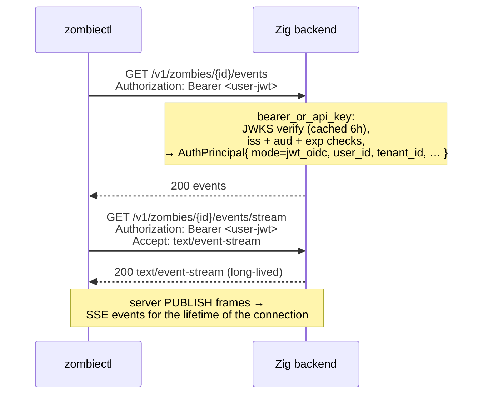
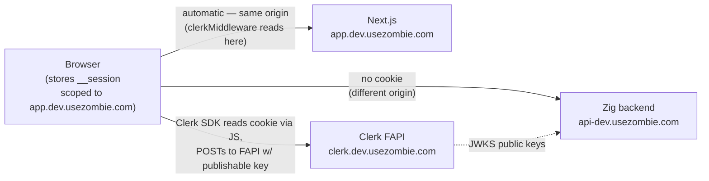
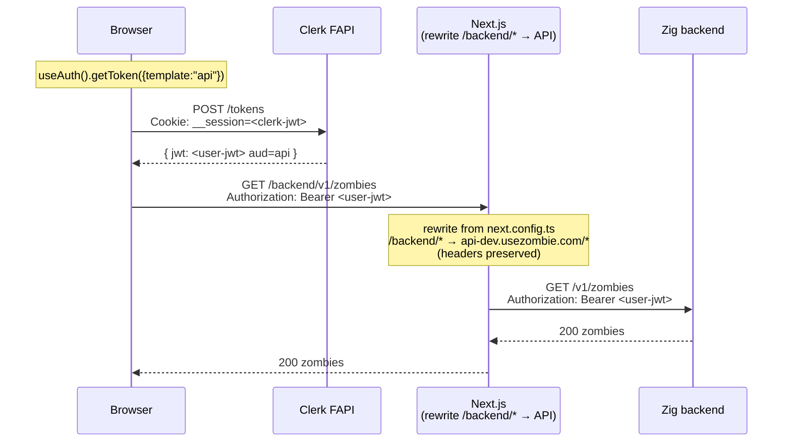
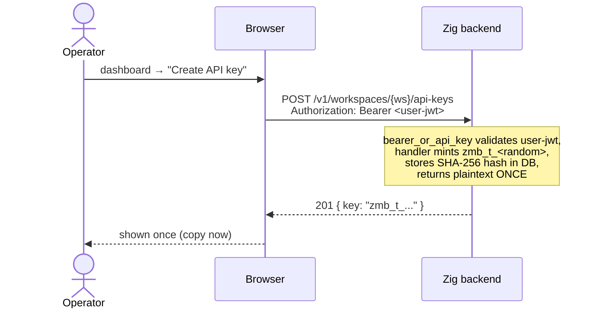
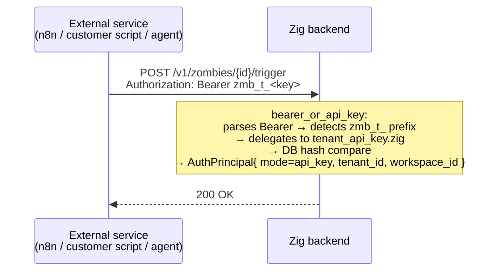
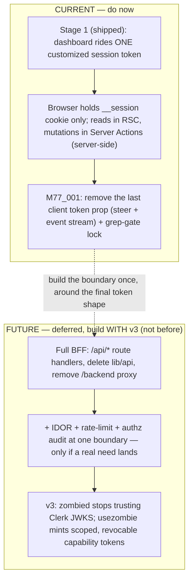

# Authentication

Three principal types reach the Zig backend. All three converge on a single credential shape at the wire:

```
Authorization: Bearer <…>
```

## The three flows at a glance

```
            ┌──────────────────────────────────────────────────────────────┐
            │                                                              │
            │  WHO IS THE ACTOR?                                           │
            │                                                              │
            │  ┌──────────────┐    ┌──────────────┐    ┌──────────────┐  │
            │  │ A human at a │    │ A human in a │    │ A machine    │  │
            │  │ terminal     │    │ browser tab  │    │ (script/bot) │  │
            │  └──────┬───────┘    └──────┬───────┘    └──────┬───────┘  │
            │         │                   │                   │           │
            │         ▼                   ▼                   ▼           │
            │   ┌─────────────┐    ┌─────────────┐    ┌─────────────┐    │
            │   │   FLOW 1    │    │   FLOW 2    │    │   FLOW 3    │    │
            │   │             │    │             │    │             │    │
            │   │ zombiectl   │    │ Dashboard   │    │ Tenant API  │    │
            │   │ login       │    │ sign-in     │    │ key         │    │
            │   │             │    │             │    │ zmb_t_…     │    │
            │   │ verification│    │ Clerk       │    │ static hash │    │
            │   │ code + ECDH │    │ __session   │    │ in DB       │    │
            │   │ + 5-min TTL │    │ cookie →    │    │ long-lived  │    │
            │   │             │    │ getToken    │    │ revocable   │    │
            │   │             │    │ ({api})     │    │             │    │
            │   └──────┬──────┘    └──────┬──────┘    └──────┬──────┘    │
            │          │                  │                  │            │
            │          └──────────────────┴──────────────────┘            │
            │                             │                                │
            │                             ▼                                │
            │              Authorization: Bearer <…>                       │
            │                             │                                │
            │                             ▼                                │
            │              bearer_or_api_key middleware                    │
            │              (zmb_t_*  → DB hash lookup)                     │
            │              (anything → JWKS verify)                        │
            │                                                              │
            └──────────────────────────────────────────────────────────────┘
```

| When to use which | Flow 1 | Flow 2 | Flow 3 |
|---|---|---|---|
| Human present at the keyboard? | ✅ required (5-min interactive flow) | ✅ required | ❌ |
| Long-lived credential? | ❌ JWT expires ~15 min; CLI re-runs `login` on 401 | ❌ minted per request | ✅ until explicitly revoked |
| Provisioned via | `zombiectl login` | Clerk sign-in form | dashboard "Create API Key" surface |
| Right answer for | a developer on a workstation; Cursor/Claude Code running locally with the developer present | someone using `app.usezombie.com` in a browser | n8n / Zapier / cron jobs / CI runners / Kubernetes / scheduled background work |
| Wrong answer for | unattended CI / cron / K8s / hosted-agent platforms — see [`AUTH_DEVICE_LOGIN.md`](./AUTH_DEVICE_LOGIN.md) *Human-led-only invariant* | none — this is the only browser path | interactive humans (`zmb_t_` long-lived keys carry too much standing privilege for a workstation) |

There is also a fourth surface — **agent keys** (`zmb_*` bound to a single zombie) — for narrowly-scoped webhook-driven inbound calls. It's a Flow 3 subtype: same DB-hash-lookup shape, narrower scope. See *Agent keys* below.

A fifth surface — **inbound webhooks** — does not use Bearer at all (HMAC-signed by the provider). See *Webhook auth*.

A sixth surface — the **runner token** (`zrn_`) — is the first *machine* principal: a host-resident `zombie-runner` that holds no tenant identity at all. Same Bearer wire shape and DB-hash lookup, but a separate middleware and trust plane. See *Runner token* below.

Cookies **never reach the Zig backend**. The Clerk `__session` cookie lives on the dashboard's own host (`app.usezombie.com`) — written by the Clerk SDK on the page after sign-in. Same-origin policy means it only attaches on requests back to the dashboard, never to `api-dev.usezombie.com`. See *Flow 2 — UI* below for the cookie-vs-Bearer picture.

The middleware that gates almost every route is `bearer_or_api_key` (`src/auth/middleware/bearer_or_api_key.zig`). It parses the `Bearer …` prefix, then routes by sub-prefix:

- `Bearer zmb_t_*` → `tenant_api_key.zig` (DB lookup, hash compare).
- `Bearer <anything else>` → `oidc.Verifier.verifyAuthorization` (cached JWKS, RS256 signature check, `iss` + `aud` + `exp` claims, role mapping).

Both paths resolve to the same `AuthPrincipal` struct (`src/auth/principal.zig`). Handlers downstream never know which credential shape was used.

---

## Auth model in one screen

Six principal surfaces, one wire shape (`Authorization: Bearer …`), and a prefix that routes to the right validator.

| Principal | Credential | Issuer | Validation | Middleware |
|---|---|---|---|---|
| Human at a terminal (CLI) | Clerk JWT (`api` template) | Clerk | JWKS verify + `aud`/`iss`/`exp` | `bearer_or_api_key` → OIDC |
| Human in a browser (dashboard) | Clerk session JWT | Clerk | JWKS verify + `aud` | `bearer_or_api_key` → OIDC |
| Service / automation | `zmb_t_<hex>` tenant api key | backend | SHA-256 hash lookup | `bearer_or_api_key` → `tenant_api_key` |
| One-zombie webhook caller | `zmb_<hex>` agent key | backend | SHA-256 hash lookup | bespoke, handler-local today — see *Agent keys* |
| Host runner (machine) | `zrn_<hex>` runner token | backend (via `register`) | SHA-256 hash lookup in `fleet.runners` | `runnerBearer` on `/v1/runners/me/*` |
| Inbound webhook (provider) | HMAC signature (no Bearer) | provider | per-provider HMAC | `webhook_sig` |

Routing in `bearer_or_api_key.zig`: `zmb_t_` → tenant-key DB lookup; anything else → OIDC/JWKS verify; no token → 401. The runner plane is deliberately a separate middleware (`runnerBearer`, `zrn_` only) so a runner token cannot satisfy a tenant route and vice versa.

Authorization is **role-based** today: `AuthRole = user < operator < admin` (`src/auth/rbac.zig`), enforced by `RequireRole`. Scope-based authz (`fleet:write`, finer tenant scopes) is a v2.1 item — see [`architecture/roadmap.md`](./architecture/roadmap.md).

Everything below is per-surface detail. For the CLI device-flow threat model + crypto, see [`AUTH_DEVICE_LOGIN.md`](./AUTH_DEVICE_LOGIN.md).

---

## Flow 1 — CLI device flow (`zombiectl login`)

The one credential path humans use from a terminal: a browser-mediated device flow with a **verification code** binding the human approving in the browser to the human typing into the terminal, and **ECDH P-256 transport encryption** that keeps the minted JWT off every server-side surface but process memory. Bounded at five minutes; unfinished sessions expire. Once `credentials.json` (mode `0o600`) exists, the CLI carries the JWT on every request — same as a Flow 2 browser call after `getToken({template:"api"})`; on `401 token_expired` it re-runs `zombiectl login`.

A fresh login takes one round-trip from `zombiectl` to create a session, one browser tab to Approve, and one terminal prompt to type the code. The whole flow is bounded at five minutes; an unfinished session expires automatically.

**Non-interactive token seeding (no device flow).** When a usable bearer token already exists, `zombiectl login` can persist it directly, skipping the browser entirely. The resolution order is `--token <pat>` → the `ZOMBIE_TOKEN` env var → piped stdin (non-TTY); the first hit is validated against the same `/v1/me` ping the device flow uses and, **only on success**, written to `credentials.json` (`0o600`, `session_id: null`) — an invalid token leaves the file untouched. This is the only login path available without an interactive terminal (a non-TTY context — Continuous Integration runners, containers): the verification code requires a human at the keyboard, so a non-TTY shell with no token fails fast rather than hanging. **The device flow itself is unchanged and terminal-only** — this path does not mint a new credential, it only stores one the caller already holds (a Flow 3 tenant key or a previously-minted JWT), so the human-led binding of the device flow is untouched.

### Where the JWT lives in plaintext (data lifecycle)

This view points in the *opposite* direction from the temporal sequence below, because the JWT is *born* in the dashboard's browser process (immediately after Clerk mints it) and *consumed* in the `zombiectl` process (after ECDH decryption). The CLI initiates the flow; the secret flows the other way.

```
┌────────────────────────────────────────────────────────────────────┐
│                                                                    │
│  Dashboard browser tab                                             │
│   ┌─────────────────────────────────────────────────────────────┐  │
│   │   Clerk mints user-JWT  ─►  AES-256-GCM encrypt(JWT)        │  │
│   │   (via FAPI /tokens)         under HKDF-SHA256-derived key  │  │
│   │                              from ECDH(dash_priv, cli_pub)   │  │
│   └─────────────────────────────────────────────────────────────┘  │
│                              │                                     │
│              PATCH /v1/auth/sessions/{id}/approve                  │
│              { dashboard_public_key, ciphertext, nonce,            │
│                verification_code }   (plaintext code over TLS;     │
│                                       API computes HMAC and        │
│                                       discards plaintext)          │
│                              │                                     │
│                              ▼                                     │
│  API process (zombied) + Redis                                     │
│   ┌─────────────────────────────────────────────────────────────┐  │
│   │   Redis row stores:                                         │  │
│   │     status, cli_public_key, dashboard_public_key,           │  │
│   │     ciphertext, nonce,                                      │  │
│   │     verification_code_hmac      ◄── HMAC-SHA256(            │  │
│   │     verification_attempts (≤5)        AUTH_SESSION_CODE_    │  │
│   │     created_at_ms, expires_at_ms      PEPPER,               │  │
│   │   ────────────────────────────         session_id ‖ code)   │  │
│   │   Nothing in this row decrypts the JWT.                     │  │
│   │   Pepper lives in zombied process memory only — never disk. │  │
│   └─────────────────────────────────────────────────────────────┘  │
│                              │                                     │
│              POST /v1/auth/sessions/{id}/verify { code }            │
│              (only after CLI presents the matching code; atomic    │
│               verification_pending → consumed in a single Lua-EVAL │
│               write that also returns the ciphertext payload)      │
│                              │                                     │
│                              ▼                                     │
│  CLI process (zombiectl)                                           │
│   ┌─────────────────────────────────────────────────────────────┐  │
│   │   shared = ECDH(cli_priv, dashboard_public_key)             │  │
│   │   key    = HKDF-SHA256(shared, info="m74-002-v1")           │  │
│   │   JWT    = AES-256-GCM-decrypt(ciphertext, key, nonce)      │  │
│   │   write { token, token_name } → credentials.json (0o600)    │  │
│   │   GET /v1/me  (validation ping; deletes credential on 401)  │  │
│   └─────────────────────────────────────────────────────────────┘  │
│                                                                    │
└────────────────────────────────────────────────────────────────────┘
```

**Honest-server assumption.** An honest API server stores `cli_public_key` and `dashboard_public_key` as the CLI and dashboard sent them. Under that assumption the API never possesses decryption capability, and a Redis dump alone does not yield the JWT — the attacker would need (a) `cli_priv` from the CLI process, and (b) the matching plaintext verification code. **An *active malicious* API server (or a TLS-terminating intermediary acting maliciously rather than passively) can swap `cli_public_key` and execute a textbook unauthenticated-Diffie-Hellman key-substitution MITM.** v2.0 explicitly does not close this; see *Threats this flow does NOT close*.

### Sequence — one-time login

```mermaid
sequenceDiagram
    actor User
    participant CLI as zombiectl
    participant UI as Dashboard<br/>(app.usezombie.com)
    participant API as Zig backend<br/>(api.usezombie.com)
    participant Clerk

    User->>CLI: zombiectl login [--token <pat>] [--token-name LABEL]
    Note over CLI: idempotencyCheck — refuse to overwrite an existing<br/>credential without --force. A non-TTY stdin counts as<br/>--no-input: it fails loudly rather than consuming a piped<br/>token as the replace-prompt answer.

    alt direct token — resolveDirectToken: --token flag > ZOMBIE_TOKEN env > piped stdin (non-TTY)
        Note over CLI: first source wins; no browser, no session_id
        CLI->>API: GET /v1/me   (validate-first — before any write)
        alt token valid
            API-->>CLI: 200
            CLI->>CLI: write { token, token_name } → credentials.json<br/>(0o600, session_id: null)
            CLI-->>User: "logged in" (no browser)
        else token invalid
            API-->>CLI: 4xx
            CLI-->>User: error — exit ≠ 0, credentials.json untouched
        end
    else interactive device flow — TTY, no direct token
        Note over CLI: generate (cli_priv, cli_pub) via crypto.subtle<br/>default token_name = platform family<br/>("macos-cli" / "linux-cli" / "windows-cli")

        CLI->>API: POST /v1/auth/sessions<br/>{ public_key: cli_pub, token_name }
        API-->>CLI: 201 { session_id }
        CLI-->>User: open https://app.usezombie.com/cli-auth/{session_id}

        Note over CLI: prompt "Verification code:" immediately — no polling.<br/>Possessing the code implies the dashboard approved.<br/>6-digit shape validated client-side (bad input re-prompts,<br/>no round-trip); SIGINT / EOF → exit 130, nothing persisted.

        User->>UI: open verify URL in browser
        Note over UI: Clerk session validates (__session cookie)
        UI->>API: GET /v1/auth/sessions/{id}
        API-->>UI: { status: pending, cli_public_key, token_name }
        UI-->>User: "Approve CLI login for {token_name}?"
        User->>UI: click Approve

        UI->>Clerk: POST /tokens (template: api)<br/>+ __session cookie
        Clerk-->>UI: { user-jwt }

        Note over UI: generate (dash_priv, dash_pub)<br/>shared = dash_priv × cli_pub<br/>key = HKDF-SHA256(shared, info="m74-002-v1")<br/>ciphertext = AES-256-GCM(jwt, key, nonce)<br/>verification_code = random 6 digits (CSPRNG)

        UI->>API: PATCH /v1/auth/sessions/{id}/approve<br/>{ dashboard_public_key, ciphertext, nonce, verification_code }<br/>Authorization: Bearer <user-jwt>
        Note over API: server computes verification_code_hmac<br/>= HMAC-SHA256(AUTH_SESSION_CODE_PEPPER, sid ‖ code)<br/>persists ciphertext + nonce + dash_pub + HMAC<br/>discards plaintext code<br/>state: pending → verification_pending
        API-->>UI: 200
        UI-->>User: "Type {verification_code} into your CLI"

        User->>CLI: types verification_code into the waiting prompt
        CLI->>API: POST /v1/auth/sessions/{id}/verify<br/>{ verification_code }
        Note over API: Lua-EVAL atomic transition:<br/>compare HMAC (constant-time);<br/>match → verification_pending → consumed<br/>in the same write; return payload
        API-->>CLI: 200 { dashboard_public_key, ciphertext, nonce }

        Note over CLI: shared = cli_priv × dashboard_public_key<br/>key = HKDF-SHA256(shared, info="m74-002-v1")<br/>jwt = AES-256-GCM-decrypt(ciphertext, key, nonce)

        CLI->>CLI: write { token, token_name } → credentials.json (0o600)
        CLI->>API: GET /v1/me   (post-write validation ping)
        alt ping ok
            API-->>CLI: 200
            CLI-->>User: "logged in as {token_name}"
        else 401 / network error
            API-->>CLI: 401
            CLI->>CLI: rollback — delete credentials.json
            CLI-->>User: error — exit ≠ 0
        end
    end
```

Two facts the diagram pins:
1. **The CLI is the initiator.** Every interaction with the UI, API, or Clerk is downstream of `zombiectl login`. The user typing the verification code closes the loop back to the CLI.
2. **Clerk is involved at exactly one step** (`POST /tokens`). The API server never talks to Clerk in this flow — Clerk's involvement is JWKS-only when the CLI later uses the minted JWT against normal API endpoints.

### Session state machine

```
┌─────────┐     PATCH /approve    ┌───────────────────────┐    POST /verify (correct,    ┌──────────┐
│ pending ├──────────────────────►│ verification_pending  ├─── single Lua-EVAL atomic ──►│ consumed │
└────┬────┘                       └───────────┬───────────┘    write; payload returned)  └──────────┘
     │                                        │                                            (terminal,
     │  5 min TTL                              │  5 failed verify attempts                  60s same-
     │  OR explicit DELETE                     │  OR 5 min TTL                              fingerprint
     │  OR replaced                            │  OR explicit DELETE                        replay
     ▼                                        ▼  OR replaced                                window)
┌─────────┐                       ┌───────────────────────┐
│ expired │  (terminal)           │ aborted               │  (terminal)
└─────────┘                       └───────────────────────┘
```

| State | Enters from | Exits to |
|---|---|---|
| `pending` | initial (POST /sessions) | `verification_pending` · `expired` · `aborted` |
| `verification_pending` | `pending` | `consumed` · `expired` · `aborted` |
| `consumed` | `verification_pending` | (terminal — single-read, with 60s same-fingerprint idempotency window) |
| `expired` | `pending` · `verification_pending` | (terminal) |
| `aborted` | `pending` · `verification_pending` | (terminal) |

**Invariants.** The state machine is monotonic — no backward transitions. There is no codepath from `pending` directly to `consumed`; verification code presentation is mandatory. `verified` is not a stored state; the successful POST /verify writes `consumed` atomically.

### Endpoint trust boundaries

| Endpoint | Trusted actor | Auth |
|---|---|---|
| `POST /v1/auth/sessions` | unauthenticated CLI | rate-limited at edge — Cloudflare WAF, 10 / IP / min (L2) |
| `GET /v1/auth/sessions/{id}` | unauthenticated dashboard fetch (renders the approve page) | no CLI poll — M74_003 dropped CLI polling; the CLI prompts for the code immediately. The dashboard reads the session once to show `token_name` |
| `PATCH /v1/auth/sessions/{id}/approve` | dashboard JS process | Clerk JWT (`api` template) · per-Clerk-user backstop deferred post-launch — Clerk-edge per-IP on sign-in / sign-up (L1) bounds upstream identity supply |
| `POST /v1/auth/sessions/{id}/verify` | CLI with the verification code | the code IS the auth · ≤5 attempts per session (Lua-internal, L3) |
| `DELETE /v1/auth/sessions/{id}` | dashboard JS process | Clerk JWT · must match session's `clerk_user_id` |
| `DELETE /v1/auth/sessions/all` | dashboard JS process | Clerk JWT |

### Security properties by layer

The contract. Every line of code in Flow 1 must trace to one of these properties. Any claim of "auth hardening" in the abstract should be re-read against this table.

| Layer | Property | Out of scope |
|---|---|---|
| TLS | server authenticity (cert chain to a trusted CA) + transport encryption | endpoint compromise on either side |
| Clerk session | browser-user authentication (the human at the keyboard owns the Clerk identity) | hijacked browser session · shared workstation |
| **Verification code** | **browser ↔ terminal authorization binding** — proves the human approving in the browser is the same human typing into the local terminal | user pasting attacker-supplied commands |
| `HMAC-SHA256(AUTH_SESSION_CODE_PEPPER, session_id ‖ code)` | disclosure-resistance of the verification code against passive server-side compromise. The pepper lives in zombied process memory only (Vault-loaded at boot, never on disk) — a Redis dump alone cannot recover the code via offline brute-force | compromise of the dashboard JS process where the code is displayed · compromise of the CLI process where it is typed · compromise of zombied process memory |
| ECDH P-256 | ciphertext-only session transport — no intermediate server, log, or DB row sees the JWT in plaintext | compromise of the dashboard or CLI endpoints |
| AES-256-GCM | tamper detection — any ciphertext modification produces a hard `DecryptError`, not silent corruption | — |
| Atomic `verified → consumed` | single-read ciphertext — captured response cannot be replayed against the same session | replay using a fresh session (closed by `verification_code` + rate limits) |
| Verify-attempt rate limit (≤5/session, L3 — Lua-internal) | brute-force resistance on the 6-digit code | distributed brute force across many sessions (closed by L1 Clerk-edge per-IP on sign-in / sign-up + L2 Cloudflare WAF per-IP on session creation — see *Rate-limit layers* below) |
| `token_name` | auditability only — operator can list active sessions by label | trust signal of any kind |

### Rate-limit layers

Rate limiting decomposes across three layers. Only L3 lives inside zombied.

| Layer | Owner | Surface | Limit |
|---|---|---|---|
| **L1** | Clerk edge | Sign-in / sign-up | 3 attempts / 10 s, 5 creates / 10 s per IP — bounds upstream Clerk-identity supply |
| **L2** | Cloudflare WAF in front of `api.usezombie.com` | `POST /v1/auth/sessions` | 10 / IP / minute — request never reaches origin on block |
| **L3** | zombied — `verifyAndConsume` Lua (already shipped) | `POST /v1/auth/sessions/{id}/verify` | 5 attempts per session → `auth.session.aborted` reason `rate_limit_exceeded` |

No in-app rate-limit middleware in zombied. The per-IP and per-Clerk-user counters that an earlier revision of the M74_002 spec described inside zombied are not authored — per-IP belongs at edge (L2), per-Clerk-user backstop is deferred post-launch (L1 already throttles the upstream Clerk identity supply). See `docs/v2/active/M74_002_*.md` Captain decision Q10 for the full rationale and the dead-code sweep that landed alongside this decision.

### Threats this flow closes

Each line is paired: the attack in one sentence, the mechanism that thwarts it in the next.

| # | Threat | How it's thwarted |
|---|---|---|
| 1 | **Session-row plaintext disclosure** — Redis dumps, logs, queue inspections, metrics blobs, memory snapshots. | ECDH ciphertext transport. The Redis row holds `{ ciphertext, nonce, public keys, verification_code_hmac }`; nothing in that set decrypts to the JWT. |
| 2 | **Passive network observation of the JWT** — TLS-inspecting corporate proxies, captured HTTPS payload logs, intermediaries that terminate and re-issue TLS. | ECDH ciphertext transport. After this spec, intermediaries see ciphertext only — the JWT plaintext lives nowhere on the wire. |
| 3 | **Session-id phishing without terminal access** — attacker has only the `session_id` (URL sniff, browser-history sync, shoulder surf). | The `verification_code` requirement + moving ciphertext release from GET to POST /verify. An attacker without terminal access cannot present the matching code and cannot trigger ciphertext release. |
| 4 | **Verification-code disclosure via passive server compromise** — attacker reads the session row but only sees the keyed HMAC; tries to offline-brute-force the 1M-entry 6-digit space. | `HMAC-SHA256(AUTH_SESSION_CODE_PEPPER, …)` storage. The pepper lives in zombied process memory only — without it the attacker cannot compute candidate HMACs even if they own the Redis blob. |
| 5 | **Verification-code online brute force** — attacker with `session_id` tries the 1,000,000 6-digit code space against POST /verify. | ≤5 verify attempts per session, then the session transitions to `aborted` with `reason="rate_limit_exceeded"`. Attacker exhausts 0.0005% of the space before being locked out. |
| 6 | **Ciphertext replay** — attacker captures a single POST /verify response and retries the same `session_id`. | Atomic transition `verification_pending → consumed` in the same Lua-EVAL write that returns the ciphertext. Subsequent verify calls return 410 `SessionConsumed` (with a 60-second same-fingerprint idempotency window for the legitimate "consume succeeded, response lost, client retried" failure mode). |
| 7 | **Distributed brute force across many sessions** — attacker scripts 200,000 sessions × 5 codes each = 1M attempts. | Per-IP session-creation rate limit (10/min) and per-Clerk-user PATCH-approve rate limit (20/hr). Attacker cannot fan out fast enough. |

### Threats this flow does NOT close

Each line names the attack and points at where its closure lives (or why it cannot be closed by any flow this spec could produce).

| # | Threat | Why not — and where closure lives |
|---|---|---|
| 1 | **Compromised browser session** — XSS on the dashboard, malicious browser extension, session-cookie theft, injected analytics, compromised NPM dependency in the dashboard bundle. | The plaintext JWT lives momentarily in the dashboard JS process before encryption. Anything with execution access to that process sees the JWT; ECDH does not help. Future hardening: SRI + CSP + dependency supply-chain pinning (separate spec). |
| 2 | **Malware on the CLI host** — compromised `zombiectl` machine, malicious user-space process, memory scraping. | `cli_priv` lives in CLI process memory during the flow; the decrypted JWT lives in `credentials.json` after. Local malware reads either. No future milestone closes this without hardware-backed key storage (TPM / Secure Enclave) — a separate downstream spec. |
| 3 | **Attacker with simultaneous browser + terminal access** — user runs attacker-supplied software ("paste this curl into your terminal"). | The verification code cannot defend against the user actively typing the code into the attacker's tool. The human-led-only invariant is the only defense, and it is documentation, not code. |
| 4 | **Device impersonation / fake `zombiectl` binaries** — any actor can generate a valid ECDH keypair using publicly known math; any actor can ship a binary called `zombiectl`. | Possessing a valid public key proves nothing about identity. Closure: **M75_xxx Agent Identity** (persistent device keypair) or a binary-signing spec — both to be authored. |
| 5 | **Autonomous-agent authentication** — CI runners, Kubernetes workloads, hosted agent platforms calling our API. | Out of trust model. A human MUST be present at flow time to type the verification code; remove the human and the verification code property collapses into theatre. Closure: **M75_xxx Agent Identity** (persistent keypair + signed challenges + scoped credentials + server-side agent inventory). |
| 6 | **Active API or proxy key-substitution MITM** — attacker with active control over an API response path swaps `cli_public_key` in GET /sessions, intercepts the encrypted PATCH /approve, decrypts with their own key, re-encrypts to the real CLI's key. | Unauthenticated Diffie-Hellman — passing the public key through the API and trusting the API to return it honestly is the textbook setup. **v2.0 explicitly does NOT close this; tracked as the v2.1 priority.** Closure: URL fragment binding (`#cli_public_key=…` — fragments aren't sent to the server) + HKDF transcript binding (`info` parameter binds both pubkeys + session_id, so any substitution breaks decryption on the CLI). |

### Replay semantics

Six invariants. All are tested explicitly.

1. **Verification code is single-use, with a bounded same-fingerprint idempotency window.** A successful POST /verify atomically transitions to `consumed` in the same Lua-EVAL write that returns the ciphertext. Subsequent POST /verify calls within 60 seconds **from the same client fingerprint** (sha256 of `derived_client_ip ‖ user_agent ‖ session_id`) return the same payload (handles "consume succeeded, response lost, client retried"). Outside 60 seconds, or from a different fingerprint, or after the payload-retention TTL elapses → HTTP 410 `SessionConsumed`.
2. **Ciphertext is single-read per client fingerprint.** Item 1's mechanism: only the originating fingerprint can replay during the window; any other source gets 410. This narrows the replay surface to "captured-network-packet-within-60s-from-same-source", which is dominated by existing TLS + network-perimeter assumptions.
3. **Verified sessions cannot revert.** The state machine is monotonic; no path from `consumed` / `expired` / `aborted` back to any active state.
4. **PATCH /approve is single-write.** Calling it against a session already in `verification_pending` returns HTTP 409 Conflict. The dashboard MUST NOT retry PATCH /approve if it has previously succeeded for the same session.
5. **`session_id` is high-entropy.** UUIDv7; 128 bits; CSPRNG; not enumerable.
6. **`session_id` is capability-bearing** — combined with the verification code, it authorizes ciphertext release. Classified equivalent to a password-reset token. **`session_id` appears only in the primary verification URL (`https://app.usezombie.com/cli-auth/{session_id}`) and in the API route paths that consume it.** It MUST NOT appear in logs (at info/warn/error level — use the `redactSessionId()` helper), analytics, telemetry, metrics labels, secondary URLs, error response bodies routed to non-trusted surfaces, or copied diagnostic bundles. Audit-log events carry `session_id_hash` (keyed HMAC with `AUDIT_LOG_PEPPER`) + `session_id_prefix` (first 8 hex chars) — never the raw ID in default mode.

### Cryptographic primitives (pinned)

| Primitive | Value | Why pinned |
|---|---|---|
| Curve | P-256 (NIST) | `crypto.subtle` supports it natively in both Node.js ≥20 and modern browsers. |
| Key derivation | HKDF-SHA-256, output 32 bytes, `info = "m74-002-v1"`, empty salt | Versioned `info` lets a future protocol change rev without colliding. The ECDH shared secret is already high-entropy, so the salt adds nothing. |
| Authenticated encryption | AES-256-GCM, 256-bit key, 96-bit random nonce per encryption, 128-bit auth tag | — |
| Verification code | 6 random digits (CSPRNG) | Brute force closed by attempt cap, not code entropy. (Future improvement: 8 alphanumeric, ~37× entropy, segmented for human-typability.) |
| Verification-code storage | `HMAC-SHA256(AUTH_SESSION_CODE_PEPPER, session_id ‖ code)`; pepper Vault-loaded at boot, process-memory-only | Defeats offline brute force from a Redis dump (attacker needs the pepper too). Constant-time comparison via `std.crypto.utils.timingSafeEql` on the comparison side. |
| Crypto library | `crypto.subtle` on both sides (Node.js + browser Web Crypto) | Zero extra dependencies; identical API surface; avoids `tweetnacl` / `@noble/curves` drift. |

### Log and audit redaction — `session_id` is sensitive

| Surface | What can appear | What must NOT appear |
|---|---|---|
| `std.log.scoped(.auth)` info/warn/error | `request_id`, status names, error categories, sanitized error messages | full `session_id`, full verification code, ciphertext bytes, public keys (informational risk only, redact anyway) |
| `std.log.scoped(.auth)` debug/trace | `session_id` redacted to first 8 hex chars + length suffix (`abcd1234…(len=36)`) | full `session_id` |
| `std.log.scoped(.auth_audit)` | `session_id_hash` (keyed HMAC with `AUDIT_LOG_PEPPER`) + `session_id_prefix` (first 8 hex chars). Plus per-event client-IP attribution: raw `X-Forwarded-For` (`xff`), raw `Fly-Client-IP` (`fly_client_ip`), derived `client_ip_source` enum (`xff` / `fly_client_ip` / `tcp_peer`), and `client_ip_divergent` bool flagging XFF/Fly disagreement (forgery signal). | plaintext verification code (always redact; not even hashed), `verification_code_hmac` value, ciphertext bytes, raw `session_id` (no env override exists) |
| HTTP response error bodies | `request_id`, error code (`UZ-AUTH-XXX`), generic message | `session_id` (the client already knows it; echoing it back in errors routed to log-aggregators is forbidden) |
| Metrics / traces | high-cardinality labels avoided | `session_id` as a tag (cardinality explosion + capability leakage into observability surfaces) |

The `.auth_audit` log sink MUST be routed to a destination distinct from customer-visible logs (separate ACL, separate destination, tighter access controls than `.auth`). This is deploy-side discipline, not enforced by code; documented in the deploy README.

### Every subsequent CLI call

Once `credentials.json` exists, the CLI carries the JWT on every request — same as a Flow 2 browser call after `getToken({template:"api"})`.



On `401 token_expired`, the CLI re-runs `zombiectl login`. Clerk JWTs are short-lived (~15 min); JWT revocation is **not** done by `zombiectl logout` (Clerk admin API would be required; see *What's not in this doc*).

---

## Flow 2 — UI (browser dashboard)

> **Post-Stage-1 reconciliation (M74_002 §9 shipped).** The Token A / Token B description in this section is the **historical pre-Stage-1 shape**, kept for context on *why* the split existed. **Current shape:** the dashboard rides **one** token — the customized session token (`auth().getToken()`, no template arg). The browser holds no token of its own: reads run in React Server Components, mutations in Server Actions (both server-side), and the SSE route handler mints server-side. The single remaining client-held token — the `token` prop on the zombie-detail thread, serialized into hydration data — is closed by **M77_001** (`docs/v2/active/M77_001_P1_UI_AUTH_CLIENT_TOKEN_REMOVAL.md`). For where this is headed, see [`architecture/roadmap.md`](./architecture/roadmap.md).

### Shape

```
Browser tab on app.usezombie.com                            Zig backend (api.usezombie.com)
─────────────────────────────────                            ─────────────────────────────────
__session cookie  ──┐                                                    ▲
   (Token A)        │                                                    │
                    ▼                                                    │
    clerkMiddleware()                                                    │
    (Next.js page render)                                                │
                                                                         │
    useAuth().getToken({template:"api"})                                 │
        │  POST /tokens   + __session cookie                             │
        ▼                                                                │
    Clerk FAPI ───────────► <user-jwt>                                   │
                            (Token B, aud=api)                           │
                            │                                            │
                            ▼                                            │
    fetch("/backend/v1/…", { Authorization: Bearer Token B })            │
                            │                                            │
                            └─► /backend/:path* rewrite ──────────────────┘
                                (same-origin; preserved Bearer header)
```

The browser holds the Clerk `__session` cookie. It uses Clerk's SDK to convert that cookie into a short-lived API-audience JWT, then sends the JWT to the Zig backend. Two sub-flows:

- **Normal API calls** — the browser fetches `getToken()` directly via Clerk's React hook and sends the JWT as `Authorization: Bearer …` to `/backend/...` (same-origin proxy → Zig API).
- **SSE stream** — `EventSource` cannot set headers, so a Next.js Route Handler shadows the rewrite and injects the Bearer server-side.

### Where the cookie lives



The Zig backend never sees the cookie. It only ever validates Token B (the api-template JWT), signed by Clerk's private key and verified via the JWKS that Clerk publishes.

### Normal API call



### SSE stream — Next Route Handler injects Bearer

```mermaid
sequenceDiagram
    participant Browser
    participant Next as Next.js<br/>Route Handler<br/>(/backend/v1/zombies/{id}/events/stream)
    participant Clerk as Clerk FAPI
    participant API as Zig backend

    Browser->>Next: EventSource("/backend/v1/zombies/{id}/events/stream")<br/>Cookie attached only because Next is same-origin? NO<br/>Browser→Next has its own Next-issued session if any;<br/>Clerk session lives on clerk.dev.usezombie.com
    Note over Next: Route Handler shadows the<br/>rewrite for this one path

    Next->>Clerk: auth().getToken({template:"api"})<br/>(server-side; uses request cookies<br/>+ Clerk SDK's internal session resolution)
    Clerk-->>Next: { jwt: <user-jwt> aud=api }

    Next->>API: GET /v1/zombies/{id}/events/stream<br/>Authorization: Bearer <user-jwt><br/>Accept: text/event-stream
    API-->>Next: 200 text/event-stream

    Next-->>Browser: 200 Content-Type: text/event-stream<br/>(streams upstream body through)
    Note over Browser,API: For the lifetime of the connection<br/>Next pipes server-sent events from API to Browser
```

Browser never holds an API-audience JWT in this flow. The Bearer token only ever exists between Next and the Zig backend.

> **Cookie clarification:** `clerkMiddleware()` in `proxy.ts` is what makes the Route Handler's `auth()` call work. It runs on every request to Next.js and reads Token A from the `__session` cookie, which exists on the dashboard's app domain because the Clerk SDK in the browser writes it there post-sign-in. The middleware verifies Token A's signature, decodes `sub`, and gates the page render. For Bearer-to-zombied, `auth().getToken({template:"api"})` then uses Token A's session to mint a fresh Token B via Clerk FAPI — the cookie is the input to the mint, not the output sent to zombied.

---

## Flow 3 — Tenant API key (service-to-service)

Static, long-lived, never expires by default. Provisioned in the dashboard, used directly by external services (n8n, Zapier, custom scripts, customer agents).

### Shape

```
Provisioning (one-time, via dashboard)            Usage (every subsequent call)
──────────────────────────────────────            ─────────────────────────────
Operator                                          External service (n8n/Zapier/…)
   │                                                │
   │ click "Create API key"                         │ Authorization: Bearer zmb_t_<hex>
   ▼                                                ▼
Dashboard ─► POST /v1/api-keys ─► Zig backend     Zig backend
              Authorization:        │                 │
              Bearer <user-jwt>     │                 │ bearer_or_api_key middleware:
              (Flow 2 mint)         │                 │ detects "zmb_t_" prefix
                                    │                 │ → tenant_api_key.zig
                                    │                 │ → SHA-256 hash compare in DB
                                    │                 ▼
                                    │             AuthPrincipal{ mode=api_key,
                                    │                            tenant_id, … }
                                    ▼
                            core.api_keys row
                            { hash: sha256(zmb_t_<hex>),
                              tenant_id, label, … }
                            (raw zmb_t_<hex> shown to
                             operator ONCE — never stored)
```

A tenant API key carries the same standing privilege as a long-lived JWT for the tenant — anyone who holds the raw `zmb_t_<hex>` value can act for that tenant until the key is revoked. Treat as a credential equivalent to a database password: rotate on suspected exposure, scope by workspace where the dashboard's "Create API Key" surface supports it, prefer short-lived JWTs (Flow 1 or Flow 2) for interactive use.

### Provisioning



### Every subsequent service call



API keys never touch Clerk. They live only in the backend DB, hashed at rest, and authenticate via the same `Authorization: Bearer …` header that JWTs use — the `zmb_t_` prefix tells the middleware to take the DB lookup branch instead of the JWKS verify branch.

---

## Agent keys (`zmb_*`, bound to a single zombie)

A narrower subtype of Flow 3. Same DB-hash-lookup shape; same `Authorization: Bearer …` wire format; the only differences are scope (one zombie vs. one tenant) and provisioning surface (`POST /v1/workspaces/{ws}/agent-keys` vs. `POST /v1/api-keys`).

```
core.agent_keys row
{ hash: sha256(zmb_<hex>),
  workspace_id, zombie_id, label, … }
```

Used by webhook-driven external integrations that post events to a single zombie (one customer's GitHub Actions emitting to a specific automation, etc.). The narrow scope makes the blast radius of a leaked agent key bounded to one zombie's event stream — preferred over `zmb_t_` for any caller that only needs to act on one zombie.

**Today this is a side door.** Agent keys authenticate via a bespoke handler-local lookup (`integration_grants/handler.zig::authenticateZombie`), not `bearer_or_api_key`, and never become an `AuthPrincipal` (there is no `AuthMode.agent_key`). The v2.1 revamp makes them a first-class principal — a dedicated middleware branch + `AuthMode.agent_key` — aligning with the reference design at `~/Projects/oss/auth.md`. See [`architecture/roadmap.md`](./architecture/roadmap.md).

---

## Runner token (`zrn_`) — the machine principal

Flows 1–3 and agent keys all act *on behalf of* a human or a tenant. The **runner token** is the first principal that represents infrastructure the platform runs — a host-resident `zombie-runner` (see [`architecture/runner_fleet.md`](./architecture/runner_fleet.md)) — and carries **no tenant identity of its own**.

### Provisioning (register)

A runner has no credential until someone with an *existing* credential registers it. `register` is authed by a Clerk JWT (an operator at the dashboard/CLI) or a `zmb_t_` api_key (an automated provisioner) — there is no enrollment token and no separate admin endpoint.

```
Operator / provisioner                              zombied
   │ POST /v1/runners
   │   Authorization: Bearer <Clerk-JWT | zmb_t_>
   │   { host_id, sandbox_tier, labels[] }
   ▼
   bearer_or_api_key validates the caller; the handler mints zrn_<random>,
   stores ONLY sha256(zrn_) in fleet.runners, returns the raw token ONCE
   │
   ◄── 201 { runner_id, runner_token: "zrn_…" }
   the operator installs zrn_ on the host (env ZOMBIE_RUNNER_TOKEN)
```

`fleet.runners` is a dedicated schema — runner identity must not share a trust boundary with tenant data in `core`. Rotation swaps `token_hash`; revocation sets `status='revoked'`.

### Validation — a separate middleware, on purpose

Every later call carries `Bearer zrn_` and hits a dedicated `runnerBearer` middleware wired **only** onto `/v1/runners/me/*`:

```
parse Bearer → require "zrn_" prefix          (else 401 — no JWKS fall-through)
SELECT id, status FROM fleet.runners WHERE token_hash = sha256(token)   (timing-safe)
  status='active' → AuthPrincipal{ mode=runner, runner_id, tenant_id=null }
  miss / revoked  → 401
```

This is the deliberate exception to "new principal types need no new middleware." A runner token must never satisfy a tenant route, and a user/tenant token must never satisfy a runner route — so the runner plane gets its own middleware rather than a `zrn_` branch in `bearer_or_api_key`. The boundary is enforced by *which middleware guards the route*, not by per-handler checks. The lookup is read-only; liveness (`last_seen_at`) is written by the heartbeat handler, not on every call.

### Least privilege

A runner principal authorizes exactly four self-scoped verbs — heartbeat, lease, report, activity — for the one runner the token identifies (`me`). It cannot enumerate tenants, read tenant data, or reach any `/v1` data-plane route. It receives a tenant's `secrets_map` inline in a lease only because `zombied` *placed* that tenant's work on it — a trust decision made when an operator registered a trusted-fleet runner, not authority the token carries. **Secret delivery is placement, not a standing grant.** `tenant_id=null` on the principal is the signal that this credential holds no tenant authority.

### What ships when

M80_001 freezes the protocol, the `fleet.runners` schema, and the error codes — and, per the keystone's single-PR delivery, ships the working `register` handler, the `runnerBearer` middleware, and `AuthPrincipal.runner_id`. They land here rather than later because the `/v1/runners/*` routes are registered always-on: a real `lease`/`report` handler on `none` middleware would be a live, unauthenticated endpoint handing a tenant's `secrets_map` to any caller. M80_005 narrows to Transport-Layer-Security (TLS) hardening and the operator-assigned-trust authz fields (`trust_class`, `allowed_workspace_ids`).

---

## Backend validation (the common path)


### Configuration knobs (from `src/cmd/serve.zig`)

| Knob              | Source                | Purpose                                                                         |
| ----------------- | --------------------- | ------------------------------------------------------------------------------- |
| `OIDC_JWKS_URL`   | env var → serve_cfg   | Where to fetch Clerk's signing keys. Cached for 6 h, refreshed on `kid` miss.   |
| `OIDC_ISSUER`     | env var → serve_cfg   | Required value of `iss` claim on every Bearer JWT.                              |
| `OIDC_AUDIENCE`   | env var → serve_cfg   | Required value of `aud` claim. **Strict** — see audience-mismatch note below.   |

### The audience claim — why the UI cannot send `__session` directly

The Zig backend enforces `aud=https://api.usezombie.com` on every JWT it accepts. Clerk's `__session` cookie has either no audience or a Clerk-default audience — it would 401 against this verifier. The cookie is therefore *only* an instruction to Clerk FAPI to mint a real API-audience JWT (via the "api" JWT template). The minted JWT is what the backend trusts.

This is why the UI flow has the extra Clerk hop, and why the SSE path uses a Next Route Handler instead of forwarding the cookie raw.

### Per-microservice JWT templates

`api` is the only template today, but the model is intentionally extensible. Each future microservice gets its own template + its own audience claim:

| Template | `aud` | Verified by |
|---|---|---|
| `api` *(today)* | `https://api.usezombie.com` | zombied |
| `storage` *(future)* | `https://storage.usezombie.com` | hypothetical storage service |
| `agents` *(future)* | `https://agents.usezombie.com` | hypothetical agent runtime |

Per-template audience isolation: a Token-B leak via zombied logs cannot be replayed against `storage-svc` because the `aud` doesn't match. Each microservice strict-checks only its own audience; cross-service replay is structurally prevented by the JWT verifier, not by application logic.

Templates can also be role-gated (e.g. "only users with `metadata.role=admin` can mint the `agents` template") via Clerk dashboard configuration. Adding a new microservice = create a new JWT template in Clerk + add a new strict `OIDC_AUDIENCE` value on that service. No new auth middleware code in zombied (or any sibling service); the existing `bearer_or_api_key.zig` path serves all future Bearer-audience services with config alone.

---

## Why all three flows use Bearer

The wire shape is deliberately uniform: one credential header, one middleware, two payload branches. New principal types (webhook-bound bots, third-party OAuth apps) plug in by issuing a JWT with the right `aud` or by minting a new prefixed API key — no new auth middleware required.

Cookie handling stays inside Clerk and Next.js. The Zig backend is a stateless JWT/key validator.

---

## Security model — who can mint Token B and where the secrets live

Three mint paths exist for Token B (the api-template JWT that zombied accepts), with different authorization surfaces:

| Mint path | Caller | Authorization | Used by |
|---|---|---|---|
| Browser Frontend API (FAPI) | React in `app.usezombie.com` | Sarah's `__session` cookie (Token A) | `useAuth().getToken({template:"api"})` |
| Server-side Clerk SDK | Next.js Route Handlers | Request cookie + `CLERK_SECRET_KEY` | SSE proxy, Server Actions |
| Backend admin API | Trusted servers / Continuous Integration (CI) | `CLERK_SECRET_KEY` only | e2e fixture mint, admin tooling |

**Browser-path mints don't touch the secret key.** The publishable key (`pk_test_…` / `pk_live_…`) IS sent — but it's an instance identifier, not a credential. It says "talk to Clerk instance X". Anyone with only the publishable key can do exactly one harmful thing: sign UP to the instance (creating themselves an account on it). They cannot impersonate existing users, mint tokens for other users, or read/modify metadata. Clerk's threat model treats the publishable key the same way Stripe treats `pk_…`: leaking it is non-incident, and it is intentionally inlined into the browser bundle (any `NEXT_PUBLIC_*` env var ships to the client).

**The credential that needs hard protection is `CLERK_SECRET_KEY`** (`sk_test_…` / `sk_live_…`):

| Surface | How it gets there | Exposure scope |
|---|---|---|
| 1Password | `op://ZMB_CD_DEV/clerk-dev/secret-key` (DEV) · `op://ZMB_CD_PROD/clerk/secret-key` (PROD) | Operator devices + agents acting on their behalf |
| Vercel | `vercel env add CLERK_SECRET_KEY` from vault, scoped per environment | Vercel runtime only; never in browser bundle |
| Fly | `fly secrets set CLERK_SECRET_KEY=...` from vault | Fly runtime only |
| Local dev | `~/Projects/usezombie/.env` (gitignored, symlinked into worktrees) | Operator's laptop only |
| CI | GitHub Actions secret mirrored from vault | CI workers only; not in build artifacts |

`NEXT_PUBLIC_CLERK_PUBLISHABLE_KEY` IS in the browser bundle by design (the `NEXT_PUBLIC_` prefix means "ship to client"). `CLERK_SECRET_KEY` is NOT — no `NEXT_PUBLIC_` prefix means Next.js never inlines it into client code. An accidental rename to `NEXT_PUBLIC_CLERK_SECRET_KEY` would be a catastrophic incident requiring immediate key rotation.

Compromise of `CLERK_SECRET_KEY` is total: anyone holding it can mint Token B for any user, modify any user's `publicMetadata` (which controls `tenant_id` + `role`), and impersonate the entire user base.

### Rotation procedure

Rotation does NOT invalidate existing user JWTs (Clerk signs those with its own private key, fronted by JWKS — the secret key plays no part). It DOES revoke admin-API access for any holder of the old key. So normal-rotation order:

1. Generate the new key in Clerk dashboard. Keep the old key active until step 4.
2. Update vault — `op item edit ZMB_CD_DEV/clerk-dev secret-key=<new>` (DEV) and `ZMB_CD_PROD/clerk` (PROD). One vault update per environment.
3. Redeploy consumers in this order: **Vercel** first (Next.js Server Actions + Route Handlers do server-side `getToken({template:"api"})`); **Fly** second (zombied does NOT use the secret directly today, but pick up if the rotated bundle includes other secrets); **CI** last (GitHub Actions secret mirror, used for e2e fixture mint).
4. Revoke the old key in Clerk dashboard once all consumers report green.

If rotated under suspected compromise, skip the gradual revoke — invalidate the old key immediately at step 1. Users stay signed in (their JWTs remain valid until natural expiry); admin tooling fails until step 3 completes.

---

## Sensitive-data classification

Every named credential / token / identifier in the auth surface, with sensitivity class, acceptable surfaces, and forbidden surfaces. Reach for this table when designing a new audit-log event, a new metric label, a new error-response body, or a new diagnostic bundle — anything that copies data out of a process and into a place where humans or external systems can read it.

| Item | Class | Lifetime | Acceptable surfaces | Forbidden surfaces |
|---|---|---|---|---|
| `__session` cookie (Token A) | secret | session-bound (Clerk-managed) | dashboard origin (`app.usezombie.com`) only | any other origin · server logs · client logs · URLs |
| Clerk-signed JWT (Token B, `api` template) | secret | ~15 min | `Authorization: Bearer …` header on `/v1/*` calls | logs · query strings · client-side storage beyond the React closure that minted it · disk (the CLI's `credentials.json` is the one exception, mode 0o600) |
| `zmb_t_*` tenant API key | secret | until explicitly revoked | `Authorization: Bearer …` header on `/v1/*` calls; vault items; operator's password manager | logs · process lists · shell history · client-side storage · disk except a secrets manager · screenshots |
| `zmb_*` agent key | secret | until explicitly revoked | `Authorization: Bearer …` header on `/v1/*` calls (specifically to the bound zombie's surface) | same as `zmb_t_*` |
| `CLERK_SECRET_KEY` | secret (catastrophic) | until rotated | Vercel runtime env · Fly runtime env · `~/Projects/usezombie/.env` (gitignored, operator laptop only) · CI runners (GitHub Actions secret) · 1Password vaults | client bundle (a rename to `NEXT_PUBLIC_*` would be a P0 incident) · logs · error bodies |
| `session_id` (M74_002 device-flow session ID) | sensitive ephemeral capability — treat as password-reset token | 5 min (or terminal state) | the primary CLI-generated verification URL (`https://app.usezombie.com/cli-auth/{session_id}`) · API route paths that consume it (`/v1/auth/sessions/{id}{,/approve,/verify}`) | `.auth` log scope at info/warn/error (use `redactSessionId()` to 8-hex-prefix) · analytics · telemetry · metrics labels · secondary URLs (deep links, redirect targets, "share this page") · error response bodies routed to non-trusted surfaces · copied diagnostic bundles · support tickets |
| `verification_code` (6 digits, M74_002) | secret ephemeral capability | 5 min (or terminal state) | dashboard JS process (display) · CLI process (prompt) · TLS-encrypted POST /approve and POST /verify bodies | server-side persistence in any form · `.auth` log scope · `.auth_audit` log scope (audit events MUST NOT carry the plaintext code, nor the `verification_code_hmac`) · metrics · error bodies |
| `AUTH_SESSION_CODE_PEPPER` | secret (catastrophic if disclosed) | until rotated | 1Password vaults (`op://ops/ZMB_CD_{PROD,DEV,LOCAL_DEV}/AUTH_SESSION_CODE_PEPPER/credential`) · zombied process memory after Vault load | disk · logs · metrics · client bundles · environment-variable dumps · `op://` URI logged in any audit trail |
| `AUDIT_LOG_PEPPER` | secret | until rotated | 1Password vaults · zombied process memory | same as `AUTH_SESSION_CODE_PEPPER` |
| Webhook secrets (per-provider HMAC keys) | secret | until rotated | vault items (`zombie:<source>` in workspace vault) · webhook_sig middleware in zombied | logs · error bodies · diagnostic bundles · operator screenshots |
| `clerk-{dev,prod}` publishable key (`pk_test_…`/`pk_live_…`) | non-credential identifier | until Clerk instance is rotated | client bundle (intentionally shipped via `NEXT_PUBLIC_…`) | (none — this is the "non-secret" one) |

---

## Deployment requirements (Flow 1)

Flow 1's protocol assumes the following deploy contract. Diverging from these turns the flow's security claims into wishes.

| Requirement | Detail |
|---|---|
| **HTTPS-only** for `/v1/auth/*` | Load balancer / reverse proxy enforces. HTTP requests promoted via HTTP 308 to HTTPS. `api.usezombie.com` already enforces this in prod. |
| **HSTS** header on every API response | `Strict-Transport-Security: max-age=31536000; includeSubDomains; preload`. Source: load balancer or `src/http/middleware/security_headers.zig`. |
| **TLS ≥ 1.2** (1.3 preferred) | Load balancer config. |
| **Redis required** | `REDIS_URL` env must resolve to a single-node Redis reachable from every API pod (acceptable for dev / single-region prod) OR a Redis Sentinel / Cluster with ≥1 reachable primary per pod. In-memory session storage is **not** acceptable under any multi-pod topology. zombied fails fast on boot if `REDIS_URL` is unset. |
| `maxmemory-policy allkeys-lfu` (recommended) | Under memory pressure, least-frequently-accessed session keys evict first. Deploy-time config, not enforced by code. |
| Client-IP attribution | `src/auth/middleware/trusted_client_ip.zig` derives the client IP from two header signals — `X-Forwarded-For` (industry-standard, default attribution source) and `Fly-Client-IP` (Fly's authoritative single-value header, the trust anchor since Fly's proxy is the only path to zombied in any non-dev deploy and Fly strips client-supplied copies of its own header). When both are present we compare; agree → use XFF, disagree → flip to `Fly-Client-IP` + stamp `client_ip_divergent=true` in audit events (forgery signal). Local-dev / direct-internet → neither header → fall back to raw TCP peer. **No env / no allowlist** (Captain decision May 18 2026 — Q8 in spec). Per-IP rate-limit buckets and consume-idempotency fingerprints both consume the derived IP. |
| **NTP-synced pod clocks** within ≤1s drift | Server-authoritative expiry uses a 30-second grace window over `expires_at_ms`; expiry surfaces to the CLI at `POST /verify` (410), since M74_003 the CLI no longer polls or shows a countdown. Cross-pod drift >1s is a deploy bug. |
| **Two peppers in Vault** | `AUTH_SESSION_CODE_PEPPER` (defeats offline brute-force of the verification code) and `AUDIT_LOG_PEPPER` (pseudonymizes `session_id` in the `.auth_audit` log scope) — both at `op://ops/ZMB_CD_{PROD,DEV,LOCAL_DEV}/{auth-session-code,audit-log}-pepper/credential`. Boot fails fast if either is missing. Provisioning is documented in `playbooks/001_bootstrap/001_playbook.md §1.3b`. |
| **`.auth_audit` sink isolation** | The `.auth_audit` Zig log scope MUST route to a destination distinct from customer-visible logs — separate ACL, separate destination (e.g., security-team-only S3 bucket, separate Loki tenant, separate syslog facility). Deploy-side discipline, not enforced by code. |

---

## Human-led-only invariant (Flow 1)

**M74_002's Flow 1 supports only human-led agents.** A human MUST be present at flow time to (a) approve in the browser AND (b) type the verification code into the terminal. The verification code is the security property that closes the phishing-without-terminal attack; remove the human and the property collapses into theatre — an attacker who controls the agent's environment completes the flow themselves without the operator's awareness.

**Unattended use of `zombiectl login` is a spec violation, not a supported deployment shape.**

Examples that are NOT supported and MUST NOT be retrofitted as "agent auth":

- CI runners (GitHub Actions, GitLab CI, CircleCI, Jenkins, …).
- Cron jobs, systemd timers, scheduled background execution.
- Kubernetes workloads, deployments, jobs.
- Hosted agent platforms calling the API on behalf of a human.
- Headless containers running `zombiectl login` against a pre-supplied verification code.
- "Local agent" frames where the agent runs in the background without a human present at flow time.

For any of the above, see **M75_xxx Agent Identity** (to be authored): persistent agent keypair → signed challenges → scoped credentials → server-side agent inventory → revocation.

This is enforced by **discipline + documentation**, not by code. The login flow has no programmatic way to detect "is a real human present" — that is precisely why misuse must be called out as a spec violation rather than left as a runtime error.

Local coding agents that run on the same workstation where the human can complete the browser approval AND the terminal verification (Cursor, Claude Code, etc.) ARE supported by Flow 1 — the human's presence is what makes it work, not the absence of a coding agent.

---

## Roadmap — Flow 2 dashboard cleanup

> **Status:** Stage 1 SHIPPED (M74_002 §9, dashboard single-token collapse). **Current slice:** M77_001 — remove the last client-held token (the hydration-payload `token` prop). **The full Backend-for-Frontend (was "Stage 2"): DEFERRED** — see *Current direction vs future direction* below.
> **Scope:** dashboard (`ui/packages/app/`) and Clerk org config only. **Flow 1 (CLI) is unaffected by any stage** — see *CLI carve-out* below for the invariants the M74_002 work continues to satisfy throughout.

The Token A / Token B split documented in *The two tokens at a glance* is not load-bearing on zombied's side. `src/auth/jwks.zig` validates `sub`, `iss`, `exp`, and `aud`; `sid` is never checked. The split exists because Clerk's *default* session token does not carry `aud=https://api.usezombie.com` (zombied's strict-check rejects it) and Clerk's *custom JWT templates* (the `api` template) cannot include `sid` per Clerk's docs (so the template can't double as the dashboard's `clerkMiddleware()` session token). Hence two distinct JWTs running in parallel today.

Clerk's **session-token claim customization** — a separate Clerk feature from JWT templates — lifts the constraint. Adding `aud`, `metadata.tenant_id`, `metadata.role` to the session token produces one JWT that satisfies both `clerkMiddleware()` (it already carries `sid`) and zombied (the new `aud` claim passes the existing strict-check). Token B as a separate artifact for Flow 2 becomes unnecessary.

### Current direction vs future direction

> **Where we are, and where this is headed.** Stage 1 collapsed the dashboard to one token. The remaining *current* work (M77_001) is a hygiene slice — close the last client-held token. The full Backend-for-Frontend (BFF) is **deferred**: its value is a single audited boundary + a rate-limit home, neither needed now, and it would re-line the dashboard's Clerk-JWT plumbing that the v3 capability-token work rewrites anyway. A real authorization audit belongs in **zombied** (it sees CLI + dashboard + API-key flows), not a dashboard-only `/api` layer.



- **Not a token-secrecy fix.** Even after the full BFF, the `__session` cookie still mints an api-audience JWT via `getToken()` — so a compromised page can still obtain a token. Closing that is Content-Security-Policy + Subresource-Integrity (a separate spec), not this roadmap.

### Stage 1 — Option 2: single-token via session-token claim customization (shipped, M74_002 §9)

> Operator setup for the Clerk dashboard configuration lives at `playbooks/003_priming_infra/001_playbook.md` §3.3 ("Clerk — Session Token Customization"). Per-env audience (`aud`) MUST match the env's `OIDC_AUDIENCE` Fly secret; defaults today are `https://api.usezombie.com` (PROD) and `https://api-dev.usezombie.com` (DEV).

```
┌──────────────────────────────────────────────────────────────────────────┐
│  Browser tab @ app.usezombie.com                                          │
│  ┌─────────────────────────────────────────────────────────────────────┐ │
│  │  __session cookie  (customized: sid + aud + metadata.tenant_id +    │ │
│  │                     metadata.role — ONE token)                       │ │
│  │  JS heap:                                                            │ │
│  │    useAuth().getToken()        // NO {template:"api"} arg            │ │
│  │      ← session JWT (already-issued)                                  │ │
│  │    fetch("/backend/v1/...", { Authorization: Bearer <sess JWT> })    │ │
│  └─────────────────────────────────────────────────────────────────────┘ │
│                          │                                                │
│                          ▼                                                │
│  Next.js /backend/:path* same-origin rewrite (UNCHANGED)                  │
│                          │                                                │
│                          ▼                                                │
│  Zombied — bearer_or_api_key → OIDC verifier                              │
│  (aud check passes against new claim; sid present but ignored downstream) │
└──────────────────────────────────────────────────────────────────────────┘
```

**What shipped (M74_002 §9 D40–D49):**

| Surface | Outcome |
|---|---|
| Clerk org config (D40) | Session Token Claims += `aud`, `metadata.tenant_id`, `metadata.role`. DEV applied; PROD pending operator click. |
| `lib/auth/server.ts` (D41) | DELETED — `getServerToken()` / `getServerAuth()` / `getServerSessionMetadata()` / `API_TEMPLATE` const all gone. |
| `lib/api/redacted.ts` (D42) | N/A — file not present in this worktree; no surface to delete. |
| `lib/actions/with-token.ts` (D43) | Simplified — drops the `getServerToken` indirection; calls `auth().getToken()` directly. |
| `lib/api/{zombies,events,approvals,credentials,tenant_billing,tenant_provider,workspaces,client}.ts` (D44) | N/A — helper signatures already accept non-null `token`; no optional-bearer branches to remove. |
| `app/(dashboard)/**/page.tsx` server pages (D45) | 14 sites migrated to `const { getToken } = await auth(); const token = await getToken();`. `lib/workspace.ts:readWorkspaceClaim` switched to inline `sessionClaims.metadata` read. |
| `app/backend/.../events/stream/route.ts` (D46) | `getToken({template:"api"})` → `getToken()` (no template arg). |
| `app/cli-auth/[session_id]/page.tsx` (D47) | UNCHANGED — carve-out. The api-template mint survives at this single call site for the CLI handoff. |
| `tests/e2e/acceptance/fixtures/clerk-admin.ts` (D48) | Mint endpoint switched to `POST /v1/sessions/{id}/tokens` (default session token). `JWT_TEMPLATE` constant retired. |
| `playbooks/003_priming_infra/001_playbook.md` §3.3 + this doc (D49) | Operator UI walkthrough + rollback procedure captured. |

**Reversibility:** Clerk dashboard → **Sessions → Customize session token** → reset to default. Next minted token lacks `aud`; dashboard fetches fail loudly with `AudienceMismatch` 401 on the next refresh. Re-apply the claims to restore. No zombied or schema state involved.

### Stage 2 — Option 3: BFF on top of single-token

> **DEFERRED (future direction, not scheduled).** The full BFF below is the target end-state, not near-term work — see *Current direction vs future direction* above. Build it **with** the v3 capability-token migration so the boundary is built once around the final token shape. The only near-term slice is **M77_001** (client-token removal); everything below — `/api/*` route handlers, `lib/api` teardown, `/backend` proxy removal, the IDOR + audit defense-in-depth — waits.

```
┌──────────────────────────────────────────────────────────────────────────┐
│  Browser tab @ app.usezombie.com                                          │
│  ┌─────────────────────────────────────────────────────────────────────┐ │
│  │  __session cookie ONLY                                               │ │
│  │  JS heap: NO TOKEN (browser is not a credential courier)             │ │
│  │  fetch("/api/v1/...", credentials:"include")  // cookie rides        │ │
│  └─────────────────────────────────────────────────────────────────────┘ │
│                          │                                                │
│                          ▼                                                │
│  /api/v1/... route handler (Next.js, server only)                         │
│  ┌─────────────────────────────────────────────────────────────────────┐ │
│  │  auth() reads __session                                              │ │
│  │  getToken() ──► customized session JWT (~5ms in fn memory)           │ │
│  │  forward to zombied                                                  │ │
│  └─────────────────────────────────────────────────────────────────────┘ │
│                          │                                                │
│  Server pages: import handler function and invoke in-process              │
│  Mutations: Server Actions ("use server") — no public POST routes         │
│                          ▼                                                │
│  Zombied (unchanged verifier; same single token shape)                    │
└──────────────────────────────────────────────────────────────────────────┘
```

**Delta vs Stage 1:**

| Surface | Action |
|---|---|
| `ui/packages/app/app/backend/` | RENAME → `ui/packages/app/app/api/` |
| `next.config.ts` | Update or remove the rewrite — route handlers serve every dashboard→zombied path directly |
| `app/api/v1/.../route.ts` | NEW — one handler per zombied endpoint the dashboard reads (~10 routes); each reads cookie, mints token server-side via `auth().getToken()`, fetches upstream, forwards response |
| Server pages | Replace `fetch` calls with direct handler-function import + in-process invocation (no loopback fetch) |
| Client-side mutations | Migrate to Server Actions; drop public POST routes for steer / kill / approve / deny / install-zombie / delete-credential / set-provider |
| `lib/api/*` helpers | DELETE (residual remnants from Stage 1) |
| `/api/*` defense-in-depth | NEW — IDOR check (session tenant_id vs URL workspace_id) and audit emit reusing M74_002's `AUDIT_LOG_PEPPER` + `.auth_audit` sink pattern |

**Blast radius:** ~2 weeks of work on top of Stage 1. **Outcome:** browser carries zero usable credentials in JS heap; `/api/*` is the single dashboard trust boundary for IDOR, audit, and rate-limit policy.

### Stage 2 wire shapes — `/api` request paths

Post-Stage-2 the dashboard's data plane fans through `/api/*` route handlers. Two canonical request shapes capture the surface:

**Read (events backfill):**


**Mutation (Server Action — `steerZombie`):**

```mermaid
sequenceDiagram
    actor User
    participant Browser as Browser<br/>(client component)
    participant SA as Server Action<br/>steerZombieAction
    participant API as Zig backend

    User->>Browser: types message, submits
    Browser->>SA: RPC steerZombieAction({zombie_id, message})<br/>(React serializes args; uses __session cookie)
    Note over SA: "use server" function:<br/>auth() reads __session<br/>getToken() mints session-JWT<br/>POST upstream with Bearer<br/>(no public /api/.../messages POST route exposed)
    SA->>API: POST /v1/workspaces/{ws}/zombies/{z}/messages<br/>Authorization: Bearer <session-JWT>
    API-->>SA: 202 accepted
    SA-->>Browser: { ok: true }
```

Both shapes share two invariants:

1. **The browser's outgoing request carries only the `__session` cookie.** No `Authorization` header in client → Next traffic. The JWT is minted server-side per request and discarded.
2. **The Bearer JWT exists only inside one route-handler / Server-Action function call.** It never crosses an RSC → client boundary, never lands in a React server-component prop, never appears in HTML or hydration data.

### Stage 2 token lifecycle

After Stage 1 (single-token collapse) + Stage 2 (BFF), the dashboard carries one credential shape. The CLI carries a different shape via the M74_002 device flow. Both are summarized here for clarity.

| Token | Lives in | TTL | Refreshes | Crosses boundaries |
|---|---|---|---|---|
| **Customized session JWT** (dashboard) | `__session` cookie on `app.usezombie.com`; transient JS-heap copy via `auth().getToken()` inside a route handler / Server Action for ~5ms | ~60s (Clerk default) | Clerk SDK auto-refreshes via the cookie on every `getToken()` call | browser ↔ cookie ↔ Clerk FAPI ↔ Next.js server runtime; **never crosses into client-rendered React** |
| **Api-template JWT** (CLI carve-out) | `~/.config/zombiectl/credentials.json` on the operator's workstation | ~15 min (Clerk api template default) | None — CLI re-runs `zombiectl login` on 401 | dashboard JS process (mint) → ECDH-encrypted → CLI process (post-decrypt persistence) |
| **Tenant API key** `zmb_t_*` (Flow 3) | Operator's external-service config (n8n, Zapier, scheduled jobs) | Until explicit revoke | None | DB-hash-compare; never re-issued |

**"What happens if the dashboard's session JWT expires mid-request?"** Doesn't happen the way the question implies — Clerk SDK refreshes the cookie token on each `getToken()` call, and Stage 2's route handler mints fresh on every request. There is no long-lived in-memory copy of the JWT to expire.

**"What happens if the CLI's api-template JWT expires?"** `bearer_or_api_key.zig` returns `401 token_expired`; the CLI surfaces "session expired, re-run `zombiectl login`" via `AUTH_PRESET.ExpiredSession`. Re-login is a 30-second human-mediated device flow; no transparent refresh path (intentional — see *Beyond Stage 2* row 1 for the long-term direction).

### Stage 2 threat model — `/api` as the trust boundary

Post-Stage-2, `/api/*` is the single dashboard-to-zombied trust boundary. Four threats and their closures:

| # | Threat | Closure |
|---|---|---|
| 1 | **Unauthenticated request hits `/api/v1/...`** — no `__session` cookie. | Route handler's `auth()` call returns null → handler returns `401 Unauthorized` with no upstream call. Zombied never sees the request. |
| 2 | **Authenticated user crosses tenants** — Sarah at tenant A hits `GET /api/v1/workspaces/{ws_of_tenant_B}/zombies`. | Two layers: (a) zombied's existing IDOR check rejects with 403 (`tenant_id` claim mismatch); (b) Stage 2 adds a `/api/*` defense-in-depth check that reads `metadata.tenant_id` from the session, asserts the URL `workspace_id` belongs to it, and returns 403 **before** the upstream fetch. Lower latency + clearer audit trail on cross-tenant attempts. |
| 3 | **Token replay** — attacker captures a session JWT (e.g., XSS exfiltration) and replays it from outside the dashboard. | Two factors: (a) the JWT has ~60s TTL — replay window closes fast; (b) Stage 2's audit emit (reusing M74_002's `.auth_audit` sink + `AUDIT_LOG_PEPPER`) carries `xff` + `fly_client_ip` + `client_ip_divergent` on every `/api/*` accept, so replays from unusual IPs surface in audit. Not closed against same-IP replay within the TTL window — that requires hardware-backed key storage (out of scope; v3 trajectory). |
| 4 | **CSRF on a Server Action** — attacker-controlled origin tries to invoke `steerZombieAction` from a malicious page using the user's `__session` cookie. | React's Server Action transport includes built-in origin verification (form-encoded RPC with same-origin check). Bare public POST routes under `/api/*` (none should remain after Stage 2's Server Action migration; verify in C.8 audit) would need explicit double-submit cookie or origin-header validation. |

**What this threat model deliberately does NOT close:**

- **Compromised dashboard JS process** (XSS, malicious browser extension, supply-chain'd npm dependency). The JWT exists in transient server-side memory inside route handlers, so XSS-in-the-browser can't read it directly — but the cookie itself is still readable, and once an attacker controls the cookie they ARE the dashboard user. Closure lives upstream: CSP + SRI + dependency pinning (separate spec; *What's not in this doc* item 5).
- **Compromised Clerk control plane.** Stage 2 still trusts Clerk's JWKS directly. Replacing this with a usezombie-native issuer is the v3 trajectory — see *Beyond Stage 2* table row 2.

### CLI carve-out — Flow 1 is unaffected by both stages

The `/cli-auth/[session_id]/page.tsx` page **keeps minting Token B via `getToken({template:"api"})`** through both stages. The customized session token is not a substitute for the CLI's purposes:

| Why the customized session token can't serve the CLI |
|---|
| The CLI has no `__session` cookie and no Clerk SDK auto-refresh path. Once it receives a JWT, it must remain valid for ~15 min until a 401 forces re-login. |
| Customized session tokens are ~60s lived and refresh-coupled to the dashboard user's active browser session — wrong lifetime + wrong dependency for an artifact that lives on disk in a separate process. |
| The api template was designed precisely for this use case: configurable TTL, no session-introspection coupling, stable shape across browser sign-outs. |

Concrete invariants the M74_002 work continues to satisfy through both stages:

1. **One surviving api-template call site after Stage 1:** `ui/packages/app/app/cli-auth/[session_id]/page.tsx`. Every other `getToken({template:"api"})` (including indirect calls via the `API_TEMPLATE` const in `lib/auth/server.ts`) and every `getServerToken()` is deleted.
2. **The ECDH + AES-256-GCM envelope is payload-agnostic.** `lib/auth/cli-flow.ts:deriveSharedKey` / `encrypt` / `decrypt` operate on arbitrary bytes; M74_002's crypto layer requires zero changes regardless of what the dashboard encrypts in the future.
3. **`credentials.json` shape stored by zombiectl is unchanged** — still `{ token, token_name, saved_at, session_id, api_url }` with `token` a Clerk-signed api-template JWT. *(The `token_name` field lands in Slice 5.C of M74_002 itself; readers on intermediate commits during PR #331's review window see four fields, not five. By the time PR #331 merges, the shape matches.)*
4. **`bearer_or_api_key.zig` validates the CLI's Bearer identically.** OIDC verifier path, JWKS caching, `aud=https://api.usezombie.com` check — all unchanged.

If a future milestone decides to move the CLI off the Clerk JWT to a server-mintable `zmb_t_*`-style token (the direction sketched at *What's not in this doc — item 6*), it ships as its own milestone — **never bundled with the Flow 2 cleanup**.

### Beyond Stage 2 — what this roadmap does NOT solve

Stages 1 and 2 are dashboard browser-session cleanup. They are NOT finished platform auth architecture. After both stages land, three structural smells remain.

| # | Smell | Why it survives Stages 1+2 |
|---|---|---|
| 1 | **The CLI's stored credential is a human session artifact.** zombiectl's `credentials.json` holds a Clerk-issued api-template JWT — a browser-originated, human-session-bound token used as a machine credential. Adequate for human-led local development; wrong primitive for service principals, automation, robot accounts, offline auth, long-running agent delegation, scoped execution tokens, and revocable capabilities. | The carve-out preserves the api template specifically because the customized session token's ~60s TTL + browser-refresh coupling doesn't fit the CLI. Stages 1+2 hide the smell better; they don't fix it. |
| 2 | **Clerk semantics still leak through the BFF.** At Stage 2, `/api/*` route handlers mint Clerk-issued tokens via `auth().getToken()`; zombied's verifier trusts Clerk's JWKS directly via `iss=https://clerk.dev.usezombie.com`. The platform's control-plane trust is anchored at an external SaaS identity provider. | Stages 1+2 collapse Token A/B into one Clerk token; they don't replace Clerk as the issuer. |
| 3 | **No usezombie-native capability layer.** The platform has no opinion of its own about credential shape, scope, delegation, or revocation — every authentication path inherits whatever Clerk decides. | Out of scope for browser-session cleanup. |

The end-state direction (sketched at *What's not in this doc — item 6*; worth stating more sharply here):

```
Clerk
  │  identity verification at sign-in ONLY
  ▼
usezombie identity exchange layer
  │  mints scoped, short-lived, server-revocable capability tokens
  │  per CLI install / per dashboard session / per agent
  ▼
usezombie-issued capability token
  │  zombied trusts usezombie's issuer + signing keys
  ▼
zombied verifier
```

At that point: zombied stops trusting Clerk's JWKS directly. The CLI's stored credential is a usezombie capability token (revocable server-side, scoped per install, decoupled from any human's Clerk session lifecycle). The dashboard's BFF mints usezombie capabilities, not Clerk JWTs. Clerk reduces to identity verification at sign-in.

That work is the v3 trajectory and is not bundled with the Flow 2 cleanup. Stage 1 + Stage 2 explicitly do NOT preclude it — they are intermediate states on the path to it. Treat them as such; do not fossilize "Clerk JWTs everywhere" as the destination.

> **Naming caveat.** "Flow 1 / Flow 2 / Flow 3" are rollout-order labels, not trust-boundary names. A future doc refactor should rename around trust boundaries (e.g. *interactive-human-session* vs *standing-service-capability*). Not bundled here — would balloon this PR and bury the architectural decision under a doc rename.

### Cross-references

- Stage 1 spec: `docs/v2/pending/M{NN}_001_P1_UI_AUTH_SINGLE_TOKEN_COLLAPSE.md` (to be authored after M74_002 lands and Clerk verification above is green).
- Stage 2 spec: `docs/v2/pending/M{NN+1}_001_P1_UI_AUTH_BFF_CLEANUP.md` (to be authored after Stage 1 lands).
- Related CLI-future-state item: *What's not in this doc — item 6* (API-minted scoped access tokens for the CLI). Separate concern, separate milestone.

---

## What's not in this doc (yet)

Each of these is a real concern, named here so future agents and security-review passes can find them without re-discovering the design tension. Each entry names the owning future work item (or, where no future spec yet exists, that fact is stated explicitly).

| # | Concern | Owning future work |
|---|---|---|
| 1 | **Autonomous agent identity** — persistent keypair, signed challenges, scoped credentials, server-side agent inventory, revocation for non-human callers. | **M75_xxx Agent Identity** (to be authored). |
| 2 | **JWT revocation** — `zombiectl logout` clears local credentials and aborts in-flight pending login sessions but does NOT revoke the active JWT (Clerk admin-API call would be needed; not free, rate-limited). | Separate Clerk-revocation-integration spec (to be authored) OR rolled into M75_xxx. |
| 3 | **Active API / proxy key-substitution MITM (Attack G)** — an active attacker on the API response path can swap `cli_public_key`, decrypt, re-encrypt. v2.0 explicitly does not close this. | **v2.1** (to be authored) — closure via URL fragment binding (`#cli_public_key=…` — fragments aren't sent to the server) + HKDF transcript binding (the `info` parameter binds both pubkeys + session_id; any substitution breaks decryption on the CLI). |
| 4 | **Verification-code entropy uplift** — 6 digits (1M entries) → 8 alphanumeric in a TOTP-style segmented format (e.g. `X4K9-TQ`). ~37× entropy improvement; human-typability preserved. Hygiene, not correctness — the 5-attempt cap + 5-min TTL already caps brute-force success at 0.0005% per session-lifetime. | Future follow-up spec (no milestone yet). |
| 5 | **Dashboard-JS-compromise hardening** — Sub-Resource Integrity (SRI) on the dashboard bundle, Content Security Policy (CSP) hardening, dependency-supply-chain pinning. Addresses Flow 1 *Threats this flow does NOT close* row 1. | Future spec (no milestone yet). |
| 6 | **API-minted scoped access tokens** instead of raw Clerk-JWT transport — long-term the dashboard should not act as a Clerk-JWT broker; the API should mint its own scoped, short-lived access tokens (derived from a verified Clerk session) and the dashboard hands those to the CLI. Lets the API revoke server-side; supports per-CLI-install scopes. | Future spec (no milestone yet). v2.0 ships raw Clerk JWT transport for delivery speed; do not fossilize the choice. |
| 7 | **Pub/sub for sub-second session-state push** — *obsolete.* Would have replaced the 1-5s CLI poll with a Redis pub/sub channel on `auth:session:{id}:state`, but M74_003 dropped CLI polling entirely (the CLI prompts for the code immediately), so no CLI-side poll remains to optimize. | Closed — superseded by the M74_003 poll removal. |
| 8 | **Hardware-backed CLI key storage** (TPM / Secure Enclave / WebAuthn / passkey) — closes Flow 1 *Threats this flow does NOT close* row 2 (malware on the CLI host). | Future spec (no milestone yet). |

---

## Webhook auth (separate surface)

The three flows above (CLI, UI, API key) all converge on `Authorization: Bearer …`. **Inbound webhooks are a different surface entirely** — they never carry a Bearer token. Every inbound webhook MUST be HMAC-signed by the calling provider, verified by the `webhook_sig` middleware (`src/auth/middleware/webhook_sig.zig`), and rejected if the signature is missing or wrong. There is no fallback.

This is industry standard for inbound webhooks: GitHub (`X-Hub-Signature-256`), Slack (`X-Slack-Signature`), Stripe (`Stripe-Signature`), Linear (`linear-signature`), and Svix-fronted providers (Clerk, AgentMail) all ship HMAC-SHA256 over the raw body. Bearer tokens are for *outbound* API calls (where the caller authenticates itself); HMAC is for *inbound* (where the receiver verifies the body wasn't tampered with).

### Provider scheme registry

`src/zombie/webhook_verify.zig` holds the canonical `PROVIDER_REGISTRY` — one `VerifyConfig` per provider naming the signature header, prefix, and timestamp policy:

| Provider | `sig_header` | `prefix` | Includes timestamp? | Drift |
| --- | --- | --- | --- | --- |
| GitHub | `x-hub-signature-256` | `sha256=` | no | n/a |
| Slack | `x-slack-signature` | `v0=` | yes (`x-slack-request-timestamp`) | 5 min |
| Linear | `linear-signature` | (none) | no | n/a |

Adding a new provider is one new `VerifyConfig` const + one entry in the registry. No new middleware.

### Workspace-credential resolver

The middleware itself is provider-agnostic. The host supplies a `lookup_fn` (`src/cmd/serve_webhook_lookup.zig:lookup`) that, given the URL's `{zombie_id}`, returns:

1. **`signature_scheme`** — populated whenever one of the zombie's `triggers[].source` entries matches a registry entry, even if the vault credential is missing. This is what makes "credential not configured" fail closed instead of silently falling back to anything else.
2. **`signature_secret`** — the HMAC key, resolved from `vault.secrets[workspace_id, key_name=zombie:<source>]` and parsed as JSON (`{ "webhook_secret": "<key>", ... }`). The vault key name defaults to the matching trigger's `source` value but can be overridden by the zombie's `x-usezombie.triggers[].credential_name` frontmatter for the per-zombie credential-scoping case — two zombies subscribing to the same source within one workspace can each point at distinct vault rows (e.g. multi-org GitHub, multi-app Slack, multi-tenant B2B-on-usezombie).

The credential being workspace-scoped (not zombie-scoped) means rotating the secret once rotates it for every zombie in that workspace using the same source — single point of rotation, the property the architecture wants.

### Error taxonomy

The middleware emits exactly three error codes for webhook auth failures, each with a distinct operator action:

| Code | When it fires | What the operator should do |
| --- | --- | --- |
| `UZ-WH-020 webhook_credential_not_configured` (401) | Provider not recognized OR `zombie:<source>` vault row missing OR row has no `webhook_secret` field OR field is empty | `zombiectl credential add <source> --data='{"webhook_secret":"<key>"}'` in the workspace |
| `UZ-WH-010 invalid_signature` (401) | Provider + secret are both configured, but the signature header is missing OR the body's MAC doesn't match | The webhook secret stored in the workspace vault doesn't match what the provider has registered. Re-rotate. |
| `UZ-WH-011 stale_timestamp` (401) | Slack-style schemes only — request timestamp is outside the 5-minute drift window | Clock skew or replay attempt. Investigate. |

The `UZ-WH-020` vs `UZ-WH-010` split matters: the first is a recoverable misconfiguration, the second is either an attack or a real drift between provider config and our vault. Operators should respond differently to each.

### What does NOT auth a webhook

- **Bearer tokens.** Sending `Authorization: Bearer …` to any `/v1/webhooks/...` URL contributes nothing — the header is not consulted. (Generic Bearer auth applies only to the normal API surface listed in the three flows above.)
- **Session cookies.** Webhook URLs are not session-authed; cookies are ignored.
- **URL-embedded secrets** (legacy `/v1/webhooks/{zombie_id}/{secret}` form). Removed in M43 — the matcher no longer recognizes the two-segment form.

### Cross-references

- Implementation: `src/auth/middleware/webhook_sig.zig` (middleware), `src/cmd/serve_webhook_lookup.zig` (resolver), `src/zombie/webhook_verify.zig` (provider registry).
- Operator-facing data flow: `docs/architecture/data_flow.md` §B (TRIGGER), `docs/architecture/user_flow.md` §8 (the GH Actions worked example).
- Error registry: `src/errors/error_entries.zig` (HTTP status + docs URI for each code), `src/auth/middleware/errors.zig` (the auth-layer mirror that keeps `src/auth/` portable).
