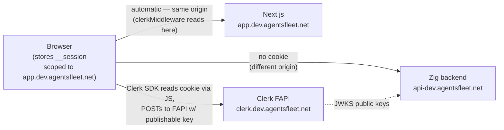
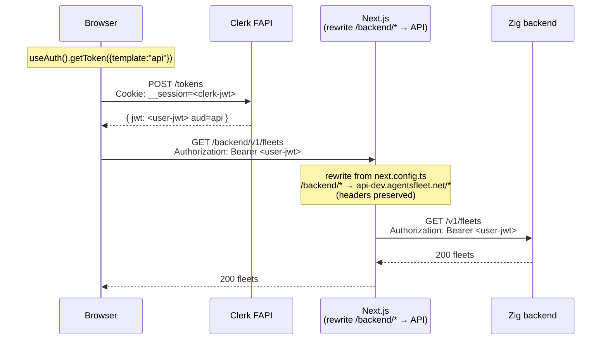
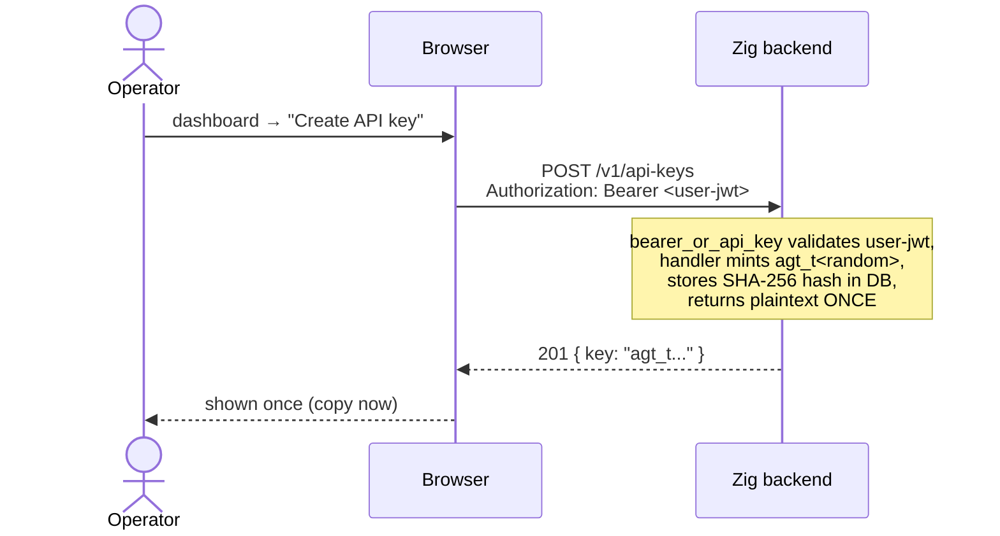
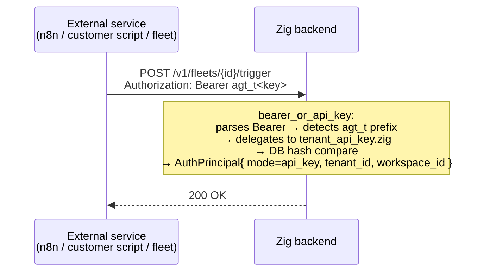
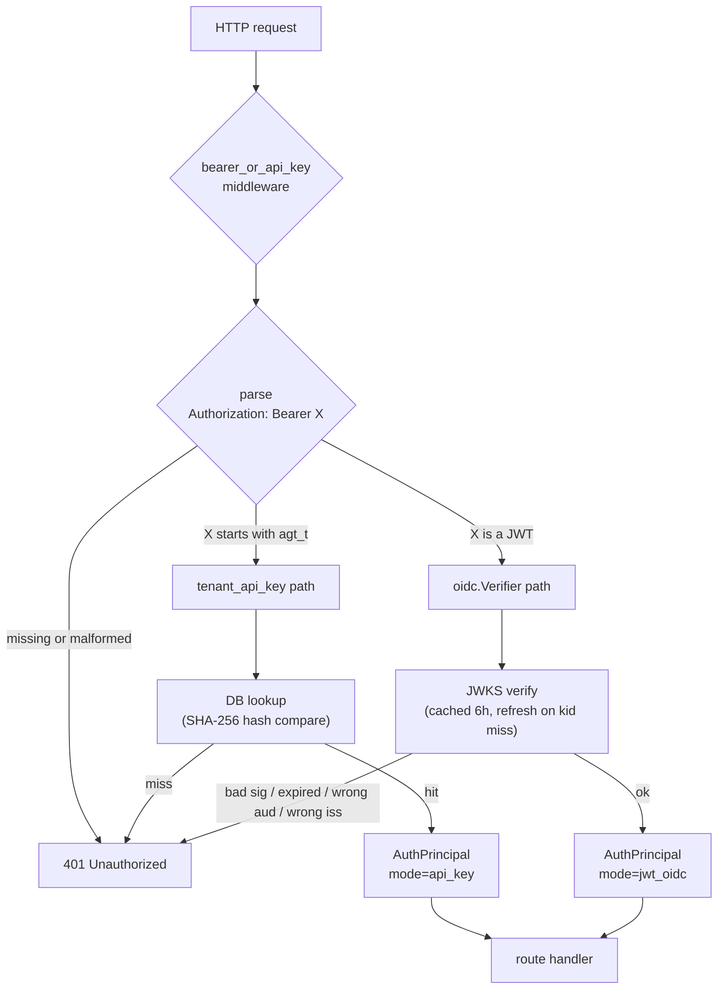

# Authentication

Five principal surfaces reach the Zig backend. The three credential flows for people and services converge on a single shape at the wire:

```
Authorization: Bearer <…>
```

## Question → anchor index

Find the question, jump to the one §-section that answers it. Do not read the whole file to answer one question. (User-facing auth usage — logging in, creating an API key — is published at [docs.agentsfleet.net](https://docs.agentsfleet.net); this file is the contributor-facing model.)

| Question | Where |
|---|---|
| Which validator handles my route's credential? | §Auth model in one screen |
| What scope does a route require? | `http/route_scopes.zig` (declaration) + §Scope catalogue (meaning) |
| Where do a principal's scopes come from, per credential? | §Scope catalogue → §CLI credential — resolved, not granted |
| How does `agentsfleet login` work, and its threat model? | §Flow 1 + [`AUTH_DEVICE_LOGIN.md`](./AUTH_DEVICE_LOGIN.md) |
| Why does the dashboard send Bearer, never the cookie? | §Flow 2 → §Where the cookie lives |
| Why does the dashboard carry one token and not two? | §Why the dashboard rides one token |
| How is the SSE stream authenticated? | §SSE stream — Next Route Handler injects Bearer |
| How is an `agt_t` tenant key checked? | §Flow 3 — Tenant API key |
| What can a runner token reach — and never reach? | §Runner token → §Least privilege |
| Who can mint Token B, and where do secrets live? | §Security model |
| Where may `CLERK_SECRET_KEY` be *sent*? | §Where the secret is sent — `CLERK_API_BASE` |
| How do I rotate `CLERK_SECRET_KEY`? | §Rotation procedure |
| Signed in, but nothing loads (`503 UZ-AUTH-004`)? | §How the key set is fetched |
| May field X appear in a log / metric / error body? | §Sensitive-data classification |
| How is a manual fleet webhook authenticated? | §Manual fleet-webhook auth |
| How does an OAuth connector mint and refresh? | §OAuth connectors |
| Which inbound surfaces are signature-verified? | §The three signed inbound surfaces |

## The three flows at a glance

```
            ┌──────────────────────────────────────────────────────────────┐
            │                                                              │
            │  WHO IS THE ACTOR?                                           │
            │                                                              │
            │   ┌─────────────┐  ┌─────────────┐  ┌─────────────┐          │
            │   │A human at a │  │A human in a │  │A machine    │          │
            │   │terminal     │  │browser tab  │  │(script/bot) │          │
            │   └──────┬──────┘  └──────┬──────┘  └──────┬──────┘          │
            │          │                │                │                 │
            │          ▼                ▼                ▼                 │
            │   ┌─────────────┐  ┌─────────────┐  ┌─────────────┐          │
            │   │   FLOW 1    │  │   FLOW 2    │  │   FLOW 3    │          │
            │   │             │  │             │  │             │          │
            │   │ agentsfleet │  │  Dashboard  │  │ Tenant API  │          │
            │   │ login       │  │  sign-in    │  │ key agt_t…  │          │
            │   │             │  │             │  │             │          │
            │   │ verification│  │ Clerk       │  │ static hash │          │
            │   │ code + ECDH │  │ __session   │  │ in DB       │          │
            │   │ 5-min       │  │ cookie →    │  │             │          │
            │   │ HANDSHAKE   │  │ getToken    │  │ long-lived  │          │
            │   │   ↓ mints   │  │ ({api})     │  │ revocable   │          │
            │   │ afc_… cred  │  │ ~60s, auto- │  │             │          │
            │   │ NO EXPIRY   │  │ refreshed   │  │             │          │
            │   └──────┬──────┘  └──────┬──────┘  └──────┬──────┘          │
            │          │                │                │                 │
            │          └────────────────┴────────────────┘                 │
            │                           │                                  │
            │                           ▼                                  │
            │              Authorization: Bearer <…>                       │
            │                           │                                  │
            │                           ▼                                  │
            │        bearer_or_api_key middleware — routes by prefix:      │
            │          afc_*  → DB lookup + live scope resolve  (a person) │
            │          agt_t* → DB hash lookup                  (a tenant) │
            │          agt_r* → runner-token lookup             (a machine)│
            │          else   → Clerk JWKS verify               (dashboard)│
            │                                                              │
            └──────────────────────────────────────────────────────────────┘
```

| When to use which | Flow 1 | Flow 2 | Flow 3 |
|---|---|---|---|
| Human present at the keyboard? | ✅ required (5-min interactive flow) | ✅ required | ❌ |
| Long-lived credential? | ✅ the `afc_` credential has no expiry — it ends by explicit revoke (M160_002 §3 wires `logout` to it) | ❌ minted per request | ✅ until explicitly revoked |
| Provisioned via | `agentsfleet login` | Clerk sign-in form | dashboard "Create API Key" surface |
| Right answer for | a developer on a workstation; Cursor/Claude Code running locally with the developer present | someone using `app.agentsfleet.net` in a browser | n8n / Zapier / cron jobs / CI runners / Kubernetes / scheduled background work |
| Wrong answer for | unattended CI / cron / K8s / hosted-fleet platforms — see [`AUTH_DEVICE_LOGIN.md`](./AUTH_DEVICE_LOGIN.md) *Human-led-only invariant* | none — this is the only browser path | interactive humans (`agt_t` long-lived keys carry too much standing privilege for a workstation) |

A fourth surface — **inbound webhooks** — does not use Bearer at all (HMAC-signed by the provider). See *Webhook auth*.

A fifth surface — the **runner token** (`agt_r`) — is the first *machine* principal: a host-resident `agentsfleet-runner` that holds no tenant identity at all. Same Bearer wire shape and DB-hash lookup, but a separate middleware and trust plane. See *Runner token* below.

Cookies **never reach the Zig backend**. The Clerk `__session` cookie lives on the dashboard's own host (`app.agentsfleet.net`) — written by the Clerk SDK on the page after sign-in. Same-origin policy means it only attaches on requests back to the dashboard, never to `api-dev.agentsfleet.net`. See *Flow 2 — UI* below for the cookie-vs-Bearer picture.

The middleware that gates almost every route is `bearer_or_api_key` (`src/agentsfleetd/auth/middleware/bearer_or_api_key.zig`). It parses the `Bearer …` prefix, then routes by sub-prefix:

- `Bearer agt_t*` → `tenant_api_key.zig` (DB lookup, hash compare).
- `Bearer <anything else>` → `oidc.Verifier.verifyAuthorization` (cached JWKS, RS256 signature check, `iss` + `aud` + `exp` claims, `scopes`-claim parsing onto `principal.scopes`).

Both paths resolve to the same `AuthPrincipal` struct (`src/agentsfleetd/auth/principal.zig`). Handlers downstream never know which credential shape was used.

---

## Auth model in one screen

Five principal surfaces, one wire shape (`Authorization: Bearer …`), and a prefix that routes to the right validator.

| Principal | Credential | Issuer | Validation | Middleware |
|---|---|---|---|---|
| Human at a terminal (CLI) | `afc_<hex>` CLI credential | backend (`POST /v1/cli-credentials`, paid for with a Clerk api-template JWT) | SHA-256 hash lookup + revocation check; scopes resolved live from Clerk on `oidc_subject` | `bearer_or_api_key` → `cli_credential` |
| Human in a browser (dashboard) | Clerk session JWT | Clerk | JWKS verify + `aud` | `bearer_or_api_key` → OIDC |
| Service / automation | `agt_t<hex>` tenant api key | backend | SHA-256 hash lookup | `bearer_or_api_key` → `tenant_api_key` |
| Host runner (machine) | `agt_r<hex>` runner token | backend (via `register`) | SHA-256 hash lookup in `fleet.runners` | `runnerBearer` on `/v1/runners/me/*` |
| Inbound webhook (provider) | HMAC signature (no Bearer) | provider | per-provider HMAC | `webhook_sig` |

Routing in `bearer_or_api_key.zig`, in order: `agt_t` → tenant-key DB lookup; `afc_` → CLI-credential DB lookup, then live scope resolution for the owning user; else if a verifier is configured → OIDC/JWKS verify; else → 401. Both prefixed branches sit ahead of the verifier check on purpose — each is a self-contained credential class, so a deployment with no identity provider configured still authenticates them instead of 401-ing a credential it could have resolved. The runner plane is deliberately a separate middleware (`runnerBearer`, `agt_r` only) so a runner token cannot satisfy a tenant route and vice versa.

Authorization is **scope-based** (M104_001). Every capability is an explicit `resource:action` scope carried on the verified token's `scopes` claim and surfaced as `principal.scopes` (a bitset). Two independent axes decide a request:

1. **Capability** — `requireScope` (one middleware) checks the route's required scopes (declared per route + HTTP method in `http/route_scopes.zig`) against `principal.scopes`, any-of, hierarchy-expanded. Absent/insufficient ⇒ `403 UZ-AUTH-022` naming the missing scope.
2. **Ownership** — `authorizeWorkspace` (unchanged) checks the principal owns the target workspace (tenant-id match), independent of scopes. The two compose: holding `fleet:write` does not let you touch a workspace you do not own.

The former `AuthRole = user < operator < admin` ladder and the `platform_admin` bool are **gone** — they were undocumented capability bundles. See the **Scope catalogue** below for the full vocabulary, the `read < write < admin` hierarchy, and the default provisioning grants.

Everything below is per-surface detail. For the CLI device-flow threat model + crypto, see [`AUTH_DEVICE_LOGIN.md`](./AUTH_DEVICE_LOGIN.md).

---

## Scope catalogue

The complete capability vocabulary. The enum in `src/agentsfleetd/auth/scopes.zig` is canon; this table restates it for reading, and drift between the two is a bug. The user-mintable subset (what a tenant API key can carry) is published separately at [docs.agentsfleet.net/api-reference/scopes](https://docs.agentsfleet.net/api-reference/scopes) — operator and platform scopes stay out of that page on purpose. Scope strings are the JWT `scopes` claim values — matched **verbatim** in the Clerk session-token template (RULE UFS). The `read < write < admin` ladder is stored as data: holding a higher scope satisfies a lower requirement (a `fleet:admin` holder passes a `fleet:read` gate), expanded at parse time.

**Laddered resources** (`read < write < admin`):

| Scope | Grants |
|---|---|
| `fleet:read` / `fleet:write` / `fleet:admin` | view fleets+events+memories / create+update+message fleets / delete a fleet |
| `schedule:read` / `schedule:write` | view hosted schedules / create, update, delete, and explicitly sync hosted schedules |
| `secret:read` / `secret:write` | list workspace secrets / store, rotate, delete them (+ tenant LLM provider config) |
| `apikey:read` / `apikey:write` / `apikey:admin` | list tenant api-keys / create+rotate / delete (revoke) |
| `grant:read` / `grant:write` | list integration grants / revoke them |
| `connector:read` / `connector:write` | read connector status / start a connector connect — gates the generic `{provider}` connector routes (every registry provider: Slack OAuth, GitHub App install, …); see §OAuth connectors |
| `model:read` / `model:admin` | read the priced model catalogue / create+update+delete catalogue rows |
| `platform-key:read` / `platform-key:admin` | read the platform default key/model / set+delete it |
| `runner:read` / `runner:write` | list runners + their events (operator plane) / cordon+patch a runner's state |

**Discrete verbs** (no ladder — a distinct action):

| Scope | Grants |
|---|---|
| `runner:enroll` | create a trusted runner (mint a `agt_r`) — uniquely dangerous (the host then receives every tenant's inline secrets); held independently of `runner:read`/`runner:write` so it is separately grantable/revocable |
| `stream:read` | view the live SSE streams open on an instance (operator diagnostic) |
| `approval:read` / `approval:resolve` | view the approval inbox / decide (approve or deny) an approval gate |
| `billing:read` | read tenant billing snapshot, charges, metering periods |
| `workspace:admin` | create workspaces; list the tenant's workspaces |
| `library:write` | mutate the Fleet library catalogue — tenant-tier onboarding, held by a workspace owner (consumed by M103) |
| `platform-library:write` | mutate the Fleet library catalogue — platform-tier onboarding (`POST /v1/admin/fleet-libraries`), held by a platform operator. Independent of `library:write` — no hierarchy between the two |

**Runner credential** (machine identity — minted onto the `agt_r` token, never granted to a human):

| Scope | Grants |
|---|---|
| `runner:self` | the runner's own plane: `/v1/runners/me/*` (heartbeat, lease, report, credential-mint, memory). Only the runner-token principal carries it, and it carries *only* this — so a runner cannot reach a tenant route and a user/api-key cannot reach a runner route |

**Cross-tenant override** (held by almost no one; every use audited):

| Scope | Grants |
|---|---|
| `workspace:any` | bypass the tenant-id ownership match to read and act on *any* tenant's workspace. Every bypass emits a `.auth_audit` record (operator, their tenant, the target tenant, workspace). Mirrors Sentry's `is_global`. |

### Provisioning grants

Capabilities reach a principal as an explicit `scopes` claim. The identity provider is the single authority for every credential that names a person; code carries exactly two scope constants (`scopes.zig`), one written *to* the provider at signup and one read for the machine plane — and **neither is checked at a gate** (gates take `Scope` values). All other capability sets are provisioned **manually** at the identity provider.

**Two sources resolve rather than grant.** The CLI credential (`afc_`, Flow 1) and the tenant api-key (`agt_t`, Flow 2 — since M160_002 §6) carry no code-side grant. Each proves *identity* only; capabilities are fetched from the identity provider per request — keyed on the owning user's `oidc_subject` for `afc_`, and on the creator's subject in `created_by` for `agt_t` — through one shared resolver and one cache, parsed by the same `parseClaim` the JWT path uses. A key is exactly as capable as the person who minted it: narrowing that person at the provider narrows every key they created, on the next request past the cache window, with no deploy and no backfill. See *CLI credential — resolved, not granted* below for the resolver's failure modes; the `agt_t` path shares all of them.

**Code-side scope sets** — two remain, for opposite reasons:

| Constant | Scopes | Why it exists in code |
|---|---|---|
| `SIGNUP_OWNER_CLAIM` | `fleet:admin`, `schedule:write`, `secret:write`, `apikey:admin`, `grant:write`, `connector:write`, `billing:read`, `workspace:admin`, `library:write`, `approval:resolve` | WRITTEN once into a new owner's `public_metadata.scopes` at signup (Clerk `user.created` writeback, `identity_events_clerk.zig`). A seed, not an authority: the provider owns the value from that instant, and an operator's edit wins permanently. No platform/cross-tenant scope, preserving "an admin cannot enroll a runner" |
| `RUNNER_SCOPES` | `runner:self` | READ at principal construction for every `agt_r` runner token (`runner_bearer.zig`) — the one credential class with no identity at the provider to resolve against, because it names a machine, not a person |

**Approving follows the person, not the credential class (M160_002 §6, Indy's call, Aug 13, 2026).** An earlier revision authored a machine grant in code — the owner set minus `approval:resolve` — so that a Fleet holding an `agt_t` key could not approve the gate guarding its own next action. That subtraction is retired with the grant that carried it: a key inherits its creator's capabilities exactly, so a key minted by someone holding `approval:resolve` can resolve approvals, and a key minted by a narrowly-provisioned collaborator cannot do what its creator cannot. The gate is scoped to the person; keeping an automation out of the approval surface is done by narrowing the person (or minting the key as a narrower one), not by a credential-class carve-out. `test_narrowing_the_creator_narrows_the_key` pins both halves live.

**Manually-provisioned scope sets** — written by a human onto `public_metadata.scopes` in Clerk. There is **no code bundle**: these are recommended scope lists, not roles. Copy the exact strings (RULE UFS); each capability is enforced per-scope like any other.

| Recommended for | Scope set |
|---|---|
| platform operator (almost no one) | `runner:enroll`, `runner:write`, `stream:read`, `model:admin`, `platform-key:admin`, `platform-library:write`, `workspace:any` |
| read-only collaborator | `fleet:read`, `schedule:read`, `grant:read`, `connector:read`, `billing:read`, `approval:read` |

### CLI credential — resolved, not granted

> **Status: minting and authentication are live; revocation and deployment binding are not.** `POST`/`GET /v1/cli-credentials` and `DELETE /v1/cli-credentials/{id}` are routed (`http/router.zig`, `http/routes.zig`), the `afc_` branch in `bearer_or_api_key.zig` resolves a user principal, and `serve_boot.zig` wires the lookup and the scope resolver into the middleware registry, so the path below runs on a deployed instance. `agentsfleet login` spends its session token on a mint and persists the returned credential; no Clerk JWT reaches disk.
>
> **Not yet landed (M160_002 §3 and §4).** Logout clears local state without revoking server-side, and a re-login does not revoke what the same machine left behind — so credentials accumulate one per login until §3 lands. A credential is also not yet bound to the deployment that minted it, so one minted against host A is still accepted by host B.

The `afc_` credential minted by `agentsfleet login` proves identity and resolves capability, the model the `agt_t` key now shares. Its authenticate path is:

```
Bearer afc_… → SHA-256 → core.cli_credentials row (JOIN core.users)
             → user_id, tenant_id, revoked_at, oidc_subject
             → revoked?  → UZ-AUTH-023
             → scope resolver, keyed on oidc_subject (cached, short TTL)
             → parseClaim(claim)            ← same parser the JWT path uses
             → principal{ mode = .cli_credential, scopes }
             → require_scope                ← same gate, same route table
```

**How `agt_t` relates (M160_002 §6).** A tenant key now takes the same path, keyed on the creator's subject in `created_by`. That reverses an earlier position on this page which held the two apart so a key would outlive the admin who minted it — superseded by Indy's Aug 13, 2026 decision: one authority, the key follows its person. The consequence is deliberate and fail-closed: erase a key's creator at the provider and the key resolves to no capability on its next uncached request — it authenticates and is refused at every gate, exactly as a deleted person's terminal credential is. A key that must survive personnel change belongs to a person-shaped service identity at the provider, not to a carve-out in code.

**What a fixed grant would have cost.** Start from what a normal account holds. A self-serve signup is written the full `.tenant_owner` set at `user.created` (`identity_events_clerk.zig`, `DEFAULT_SIGNUP_SCOPES`). So the ordinary command-line user is a tenant admin in the terminal for the same reason they are one in the dashboard: Clerk says so. A narrower person is not what signup produces. They exist only where an operator hand-wrote a smaller set onto `public_metadata.scopes` (see *Manually-provisioned scope sets*).

That is exactly who a code-applied grant would have harmed. A grant authored in code is keyed by *credential source*, not by person, so a CLI entry would have had to name one fixed set applied to every terminal — and the only sensible candidates are the tenant sets. A hand-narrowed collaborator would then have been widened back to that set on their next `login`, silently, by the credential change alone. Resolving the claim avoids authoring a grant at all: the terminal cannot disagree with the dashboard, and narrowing someone in Clerk reaches every terminal they hold within the cache window instead of requiring a hunt for credentials to revoke.

**Why the claim is not stored on the row.** Snapshotting it at mint would make `core.cli_credentials` a second store of a fact Clerk owns, and it would freeze at issuance; a Postgres projection fed by `user.updated` webhooks would add backfill, ordering, and reconciliation to operate. The resolver holds an in-memory TTL cache instead — a latency optimisation with no persistence, so there is nothing to reconcile and staleness self-heals toward Clerk within the TTL.

**Failure modes.** Provider unreachable with a warm cache: serve cached up to a hard ceiling. Past the ceiling, or cold: `ERR_AUTH_UNAVAILABLE`, matching what a JWKS-fetch failure already returns on the JWT path. No claim provisioned for the subject: empty set, fail closed.

**Subject unknown to Clerk (404) — empty set, and deliberately not cached.** This cannot arise at login: the device flow needs a live Clerk user to approve in the browser, so an unknown subject never reaches a mint. It arises *after* one, and only because the credential is durable — the row outlives the person. The ordinary path already closes that window: `user.deleted` reaches `identity_events_delete.zig` → `account_teardown.zig` → `DELETE FROM core.users`, and `250_cli_credentials.sql`'s `ON DELETE CASCADE` takes the credential row with it, so the next request is an ordinary unknown-credential 401 that never reaches the resolver. The 404 branch is the backstop for when that webhook did not arrive — a wiped Clerk development instance replays no per-user events, a delivery can be lost or rejected, and a database restored from a backup predating the deletion resurrects the row. In each case a live credential names someone Clerk no longer knows, so it resolves to no capabilities and every gate refuses it by scope. `ERR_AUTH_UNAVAILABLE` was the alternative and is wrong here: it tells a terminal to retry a credential that will never work again. The result is not cached, because a deletion is permanent and needs no cache while a transient 404 must not blank a live operator for a whole freshness window.

**Known gap.** Flow 1's credential is durable and shareable (accepted, see the M160 spec), so a shared credential carries the *sharer's* current scopes. Narrowing the sharer narrows every terminal holding it, which is the intended direction, but there is no per-credential ceiling below the person's own grant. Adding one is a row column and an intersection at `parseClaim`, not a redesign.

**Development provisioning.** To unlock the Runners page and Model rates page for a local/dev user, grant only the read scopes those views need — set this onto that user's Clerk Public metadata:

```json
{ "tenant_id": "<their-tenant-uuid>", "scopes": "runner:read model:read" }
```

This requires the Clerk **session-token template** to project `public_metadata.scopes` into the top-level `scopes` claim, and `public_metadata.tenant_id` into `tenant_id`. Setting Public metadata alone does nothing if the template does not map it.

Grant the full platform-operator bundle only to a dev user who genuinely needs write and admin actions. The bundle is `runner:enroll runner:write stream:read model:admin platform-key:admin platform-library:write workspace:any`, shown in the table above. It carries `platform-key:admin`, which can rotate the platform language-model key, and `workspace:any`, which reaches across tenants. Neither belongs in a "just let me see the page" default.

---

## Flow 1 — CLI device flow (`agentsfleet login`)

The one credential path humans use from a terminal: a browser-mediated device flow with a **verification code** binding the human approving in the browser to the human typing into the terminal, and **ECDH P-256 transport encryption** that keeps the minted JWT off every server-side surface but process memory. Bounded at five minutes; unfinished sessions expire. The recovered session token is spent immediately on `POST /v1/cli-credentials` and is never written to disk — what `credentials.json` (mode `0o600`) holds is the durable `afc_` credential that mint returns, and that is what the CLI carries on every subsequent request. The credential does not expire, so there is no `401 token_expired` re-login cycle; a 401 means the credential was revoked (`UZ-AUTH-023`) or is unknown. See [§CLI credential — resolved, not granted](#cli-credential--resolved-not-granted) for how it authenticates.

There is no non-interactive login. M160_002 §3 removed the `--token` flag and its piped-stdin fallback. `AGENTSFLEET_API_KEY` already carries an `agt_t…` tenant key on every request and **takes precedence over the stored credential**, so the flag was a second route to the same place — and the only one that could write a value the credential loader later refuses.

Unattended contexts, meaning Continuous Integration runners and containers, set the environment variable, which persists nothing. A non-TTY `login` fails immediately and says why. One rule, no overlap: interactive is the device flow, unattended is the environment variable.

The full data lifecycle, sequence, session state machine, threat model, pinned crypto primitives, the non-interactive token-seeding path, deploy rules, and the human-led-only invariant live in **[`AUTH_DEVICE_LOGIN.md`](./AUTH_DEVICE_LOGIN.md)**.

---

## Flow 2 — UI (browser dashboard)

> **Post-Stage-1 reconciliation (M74_002 §9 shipped).** The Token A / Token B description in this section is the **historical pre-Stage-1 shape**, kept for context on *why* the split existed. **Current shape:** the dashboard rides **one** token — the customized session token (`auth().getToken()`, no template arg). The browser holds no token value of its own: reads run in React Server Components, mutations in Server Actions (both server-side), and the Server-Sent Events (SSE) route handler mints server-side. `AuthSessionKeeper` calls Clerk's `user.reload()` while a signed-in dashboard is active and when the browser resumes; this refreshes the `__session` cookie without returning token bytes to application code. For where this is headed, see [`architecture/roadmap.md`](./architecture/roadmap.md).

The authenticated layout keeps `ClerkProvider` and `AuthSessionKeeper` at the
root. `ShellFrame` owns persistent markup on the server. `ShellControls` owns
only route-aware controls and analytics context in the browser. Loading mobile,
workspace, account, or route-tool code later does not remount the authentication
provider or create a second session-refresh lifecycle.

### Shape

```
Browser tab on app.agentsfleet.net                            Zig backend (api.agentsfleet.net)
─────────────────────────────────                            ─────────────────────────────────
__session cookie  ──┐                                                    ▲
   (Token A)        │                                                    │
                    ▼                                                    │
    clerkMiddleware()                                                    │
    (Next.js page render)                                                │
                                                                         │
    useAuth().getToken({template:"api"})                                 │
        │  POST /tokens   + __session cookie                             │
        ▼                                                                │
    Clerk FAPI ───────────► <user-jwt>                                   │
                            (Token B, aud=api)                           │
                            │                                            │
                            ▼                                            │
    fetch("/backend/v1/…", { Authorization: Bearer Token B })            │
                            │                                            │
                            └─► /backend/:path* rewrite ──────────────────┘
                                (same-origin; preserved Bearer header)
```

The browser holds the Clerk `__session` cookie. It uses Clerk's SDK to convert that cookie into a short-lived API-audience JWT, then sends the JWT to the Zig backend. Two sub-flows:

- **Normal API calls** — the browser fetches `getToken()` directly via Clerk's React hook and sends the JWT as `Authorization: Bearer …` to `/backend/...` (same-origin proxy → Zig API).
- **SSE stream** — `EventSource` cannot set headers, so a Next.js Route Handler shadows the rewrite and injects the Bearer server-side.

### Where the cookie lives


```mermaid
flowchart LR
    Browser["Browser<br/>(stores __session<br/>scoped to app.dev.agentsfleet.net)"]

    Browser -- "automatic — same origin<br/>(clerkMiddleware reads here)" --> Next["Next.js<br/>app.dev.agentsfleet.net"]
    Browser -- "Clerk SDK reads cookie via JS,<br/>POSTs to FAPI w/ publishable key" --> Clerk["Clerk FAPI<br/>clerk.dev.agentsfleet.net"]
    Browser -- "no cookie<br/>(different origin)" --> API["Zig backend<br/>api-dev.agentsfleet.net"]

    Clerk -. "JWKS public keys" .-> API
```

The Zig backend never sees the cookie. It only ever validates Token B (the api-template JWT), signed by Clerk's private key and verified via the JWKS that Clerk publishes.

### Normal API call


```mermaid
sequenceDiagram
    participant Browser
    participant Clerk as Clerk FAPI
    participant Next as Next.js<br/>(rewrite /backend/* → API)
    participant API as Zig backend

    Note over Browser: useAuth().getToken({template:"api"})
    Browser->>Clerk: POST /tokens<br/>Cookie: __session=<clerk-jwt>
    Clerk-->>Browser: { jwt: <user-jwt> aud=api }

    Browser->>Next: GET /backend/v1/fleets<br/>Authorization: Bearer <user-jwt>
    Note over Next: rewrite from next.config.ts<br/>/backend/* → api-dev.agentsfleet.net/*<br/>(headers preserved)
    Next->>API: GET /v1/fleets<br/>Authorization: Bearer <user-jwt>
    API-->>Next: 200 fleets
    Next-->>Browser: 200 fleets
```

### SSE stream — Next Route Handler injects Bearer

The four token-minting proxy routes (per-fleet and workspace `events` + `events/stream`) live under `/live/*`, deliberately OUTSIDE the `/backend/:path*` rewrite: on Vercel the edge router let the rewrite shadow same-prefix filesystem route handlers, sending EventSource requests cookie-only to the API (401 `UZ-AUTH-002`). A prefix the rewrite cannot match makes the routing unambiguous on every platform.


```mermaid
sequenceDiagram
    participant Browser
    participant Next as Next.js<br/>Route Handler<br/>(/live/v1/fleets/{id}/events/stream)
    participant Clerk as Clerk FAPI
    participant API as Zig backend

    Browser->>Next: EventSource("/live/v1/fleets/{id}/events/stream")<br/>Cookie attached only because Next is same-origin? NO<br/>Browser→Next has its own Next-issued session if any;<br/>Clerk session lives on clerk.dev.agentsfleet.net
    Note over Next: Route Handler shadows the<br/>rewrite for this one path

    Next->>Clerk: auth().getToken({template:"api"})<br/>(server-side; uses request cookies<br/>+ Clerk SDK's internal session resolution)
    Clerk-->>Next: { jwt: <user-jwt> aud=api }

    Next->>API: GET /v1/fleets/{id}/events/stream<br/>Authorization: Bearer <user-jwt><br/>Accept: text/event-stream
    API-->>Next: 200 text/event-stream

    Next-->>Browser: 200 Content-Type: text/event-stream<br/>(streams upstream body through)
    Note over Browser,API: For the lifetime of the connection<br/>Next pipes server-sent events from API to Browser
```

Browser never holds an API-audience JWT in this flow. The Bearer token only ever exists between Next and the Zig backend.

> **Cookie clarification:** `clerkMiddleware()` in `proxy.ts` is what makes the Route Handler's `auth()` call work. It runs on every request to Next.js and reads Token A from the `__session` cookie, which exists on the dashboard's app domain because the Clerk SDK in the browser writes it there post-sign-in. The middleware verifies Token A's signature, decodes `sub`, and gates the page render. For Bearer-to-agentsfleetd, `auth().getToken({template:"api"})` then uses Token A's session to mint a fresh Token B via Clerk FAPI — the cookie is the input to the mint, not the output sent to agentsfleetd.

---

## Flow 3 — Tenant API key (service-to-service)

Static, long-lived, never expires by default. Provisioned in the dashboard, used directly by external services (n8n, Zapier, custom scripts, customer fleets).

### Shape

```
Provisioning (one-time, via dashboard)            Usage (every subsequent call)
──────────────────────────────────────            ─────────────────────────────
Operator                                          External service (n8n/Zapier/…)
   │                                                │
   │ click "Create API key"                         │ Authorization: Bearer agt_t<hex>
   ▼                                                ▼
Dashboard ─► POST /v1/api-keys ─► Zig backend     Zig backend
              Authorization:        │                 │
              Bearer <user-jwt>     │                 │ bearer_or_api_key middleware:
              (Flow 2 mint)         │                 │ detects "agt_t" prefix
                                    │                 │ → tenant_api_key.zig
                                    │                 │ → SHA-256 hash compare in DB
                                    │                 ▼
                                    │             AuthPrincipal{ mode=api_key,
                                    │                            tenant_id, … }
                                    ▼
                            core.api_keys row
                            { hash: sha256(agt_t<hex>),
                              tenant_id, label, … }
                            (raw agt_t<hex> shown to
                             operator ONCE — never stored)
```

A tenant API key carries the same standing privilege as a long-lived JWT for the tenant — anyone who holds the raw `agt_t<hex>` value can act for that tenant until the key is revoked. Treat it as a credential equivalent to a database password: rotate on suspected exposure, and prefer an interactive credential (Flow 1 or Flow 2) wherever a human is actually present.

**Resolved (M160_002 §6): a key's power comes from Clerk, keyed on its creator.** `core.api_keys` still has no scopes column and never will — the row-column alternative was rejected as a second store of a fact Clerk owns, the same reasoning §CLI credential — resolved, not granted applies to `core.cli_credentials`. `tenant_api_key.zig` resolves the claim Clerk holds for the subject in `created_by`, through the same resolver and cache as `afc_`, so narrowing a person narrows every key they minted with no deploy. Two keys in one tenant now differ exactly when their creators do: minting a read-only key means minting it as a read-only person.

**Still open — a ceiling below the person.** Inheritance is exact, so a key cannot be narrower than its creator without a narrower creator. A per-key ceiling (a key that holds a subset of a wide person's grant) is the remaining design question, and its sibling for `afc_` is the *Known gap* under §CLI credential — resolved, not granted; if either lands, both should, and by the same mechanism.

Successful `agt_t` authentication first performs a read-only hash lookup. For an active key, agentsfleetd then attempts a best-effort `core.api_keys.last_used_at` stamp with `FOR UPDATE SKIP LOCKED`; if that metadata write is blocked or fails, authentication still succeeds. The backend stores and compares only the SHA-256 hash; the raw key is returned once at creation time and is never persisted. The one-time response is written synchronously, its serialized buffer is erased immediately after the write, and its request-arena source allocation is erased at dispatch teardown. Runner-registration responses use the same boundary.

### Provisioning


```mermaid
sequenceDiagram
    actor Operator
    participant Browser
    participant API as Zig backend

    Operator->>Browser: dashboard → "Create API key"
    Browser->>API: POST /v1/api-keys<br/>Authorization: Bearer <user-jwt>
    Note over API: bearer_or_api_key validates user-jwt,<br/>handler mints agt_t<random>,<br/>stores SHA-256 hash in DB,<br/>returns plaintext ONCE
    API-->>Browser: 201 { key: "agt_t..." }
    Browser-->>Operator: shown once (copy now)
```

### Every subsequent service call


```mermaid
sequenceDiagram
    participant Service as External service<br/>(n8n / customer script / fleet)
    participant API as Zig backend

    Service->>API: POST /v1/fleets/{id}/trigger<br/>Authorization: Bearer agt_t<key>
    Note over API: bearer_or_api_key:<br/>parses Bearer → detects agt_t prefix<br/>→ delegates to tenant_api_key.zig<br/>→ DB hash compare<br/>→ AuthPrincipal{ mode=api_key, tenant_id, workspace_id }
    API-->>Service: 200 OK
```

API key **authentication** never touches Clerk: the raw key lives only in the backend DB, hashed at rest, and arrives via the same `Authorization: Bearer …` header that JWTs use — the `agt_t` prefix tells the middleware to take the DB hash-compare branch instead of the JWKS verify branch. The key's **capabilities** do touch Clerk (§Resolved above): after the hash lookup succeeds, the middleware resolves the creator's claim through the shared scope resolver and its cache.

---

## Runner token (`agt_r`) — the machine principal

Flows 1–3 all act *on behalf of* a human or a tenant. The **runner token** is the first principal that represents infrastructure the platform runs — a host-resident `agentsfleet-runner` (see [`architecture/runner_fleet.md`](./architecture/runner_fleet.md)) — and carries **no tenant identity of its own**.

### Provisioning (register)

A runner has no credential until an **agentsfleet platform operator** mints one from the dashboard's **Add runner** action. That is a session-authed server action; M84_001 retired the `register --token` command, so no identity credential ever reaches a shell.

Enrollment is the trust decision. A runner that joins the shared fleet receives every tenant's inline `secrets_map` through the leases placed on it. So the endpoint that mints an `agt_r` (`POST /v1/runners`) requires the `runner:enroll` scope — a discrete capability held only by platform operators, revocable independently of `runner:read` and `runner:write`. A tenant-scoped JWT without it, and any `agt_t` api_key, are rejected `403 UZ-AUTH-022`. An empty scope set fails closed. There is no open enrollment token.

The operator plane has its own scopes. `runner:read` fronts the fleet list `GET /v1/fleets/runners` and event history `GET /v1/fleets/runners/{id}/events`; `runner:write` fronts the mutation `PATCH /v1/fleets/runners/{id}`.

The host **never self-registers** (Option B, the GitLab-16 "create runner → authentication token" model): the operator pre-mints the `agt_r` and installs it on the host as `AGENTSFLEET_RUNNER_TOKEN`; the daemon validates the `agt_r` prefix at boot and goes straight to the heartbeat/lease loop. No host ever holds an enrollment-grade credential.

```
Platform operator — dashboard "Add runner" (session JWT, scopes ∋ runner:enroll)  agentsfleetd
   │ server action → POST /v1/runners
   │   Authorization: Bearer <session-JWT>
   │   { host_id, assigned_policy{…}, labels[] }
   ▼
   bearer() chain [bearer_or_api_key, requireScope] gates the route (runner:enroll);
   the handler mints agt_r<random>, stores ONLY sha256(agt_r) in fleet.runners,
   returns the raw token ONCE
   │
   ◄── 201 { runner_id, runner_token: "agt_r…" }   (tenant admin / agt_t → 403)
   the operator installs agt_r on the host (env AGENTSFLEET_RUNNER_TOKEN); the host
   does NOT call register — it authenticates every later call with that agt_r
```

`fleet.runners` is a dedicated schema — runner identity must not share a trust boundary with tenant data in `core`. Rotation swaps `token_hash`; revocation sets `admin_state='revoked'`; cordon and drain use the same non-active runner gate.

### Validation — a separate middleware, on purpose

Every later call carries `Bearer agt_r` and hits a dedicated `runnerBearer` middleware wired **only** onto `/v1/runners/me/*`:

```
parse Bearer → require "agt_r" prefix          (else 401 — no JWKS fall-through)
SELECT id, admin_state FROM fleet.runners WHERE token_hash = sha256(token)   (timing-safe)
  admin_state='active' → AuthPrincipal{ mode=runner, runner_id, tenant_id=null }
  miss                 → 401 UZ-RUN-001
  non-active           → 401 UZ-RUN-009
```

This is the deliberate exception to "new principal types need no new middleware." A runner token must never satisfy a tenant route, and a user/tenant token must never satisfy a runner route — so the runner plane gets its own middleware rather than a `agt_r` branch in `bearer_or_api_key`. The boundary is enforced by *which middleware guards the route*, not by per-handler checks. The lookup is read-only; liveness (`last_seen_at`) is written by the heartbeat handler, not on every call.

**Every call reads `fleet.runners`. There is no memoized verdict** (`cmd/serve_runner_lookup.zig`). An `agt_r` is opaque, so unlike the JWT plane it cannot be verified without going to look.

That lookup is where a cordon, drain, revoke or delete takes effect, because **admin-state transitions have no other delivery channel**. The heartbeat reply is unconditionally `.ok` (`handlers/runner/heartbeat.zig`), so auth rejection is the only way a runner learns it is out of service.

A per-process memo used to front this read, with entries living at most `HEARTBEAT_INTERVAL_MS`. It was removed in M143_001 because it made revocation deterministic only on the machine that served the operator's write: every *other* control-plane machine kept authenticating the runner until its own entry expired. Reading the row every time means a runner taken out of service authenticates **nowhere, immediately**, with no window to reason about and no per-machine state to reconcile.

What that costs: one indexed single-row read per runner request. The lease verb is not a blocking long poll — it returns 200 with `retry_after_ms` (`NO_WORK_RETRY_AFTER_MS` = 1 s) — so an idle runner authenticates about once a second per worker. At a hundred runners that is a few hundred index probes a second, against a table whose pages never leave cache.

It also means a Postgres outage fails runner auth immediately rather than being absorbed for up to one heartbeat. That surfaces as `503 UZ-AUTH-004`, which the runner classifies as transport loss and backs off from — **not** as an auth rejection, so an outage cannot trip the daemon's `MAX_CONSECUTIVE_AUTH_REJECTS` exit.

> **When this read rate stops being free**, the fix is not a cache — it is to stop the credential being opaque. Two-tier, as the human plane already works: keep `agt_r` as the long-lived provisioning credential, exchange it on the heartbeat for a short-lived signed token, and verify that locally with no database read. Any such design MUST re-check `admin_state` inside the lease-grant transaction, because a lease delivers the tenant's `secrets_map` and the resolved provider key inline (see *Least privilege* below) — a locally-verified token with no state check would let a revoked runner collect fresh secrets for its remaining lifetime. Trigger to revisit: runner count or poll rate making the per-request read measurable, not before.

### Least privilege

A runner principal authorizes exactly five self-scoped verbs — heartbeat, lease, report, activity, and a read-only **self** (`GET /v1/runners/me`, which the operator CLI's `status` reads so inspecting a host never writes liveness) — for the one runner the token identifies (`me`). It cannot enumerate tenants, read tenant data, or reach any `/v1` data-plane route. It receives a tenant's `secrets_map` inline in a lease only because `agentsfleetd` *placed* that tenant's work on it — a trust decision made when an operator registered a trusted-fleet runner, not authority the token carries. **Secret delivery is placement, not a standing grant.** `tenant_id=null` on the principal is the signal that this credential holds no tenant authority.

The same placement model carries the resolved **LLM provider key** (M80_009): `agentsfleetd` resolves it per lease (`resolveActiveProvider`, fresh + reclaim) and delivers it inline on `ExecutionPolicy.provider` + `ExecutionPolicy.api_key` — the same envelope as `secrets_map`, never the `secrets_map` object itself, never the `fleet.runner_leases` row. A runner receives the billed provider key only because work was placed on it; the key is `secureZero`d once the lease serializes. Operator-assigned-trust gating of *which* runners may receive the shared platform key (`trust_class`) is deferred to M80_007.

### The token never enters the sandboxed child

`AGENTSFLEET_RUNNER_TOKEN` lives in the **daemon's** environment (the un-sandboxed parent that speaks the control protocol). The per-lease sandboxed child that runs the prompt-injectable fleet must never see it. The parent forks the child with a **filtered environment** — `forkExec` passes `std.process.spawn` an `environ_map` built from a fail-closed **allowlist** (`HOME`, `PATH`, the engine's optional knobs, the TLS bundle path), so the child inherits only what tool execution needs and **nothing** from the `AGENTSFLEET_` (or `RUNNER_`) namespace. A prompt-injected fleet that runs `getenv("AGENTSFLEET_RUNNER_TOKEN")` or reads its own `/proc/self/environ` finds nothing — the control-plane credential is structurally absent from the child, not merely undisclosed. This pairs with the existing rule that lease secrets ride the child's **stdin pipe**, never argv/env (both `/proc`-readable).

### What ships when

> **Historical (pre-M104_001).** The sequencing below describes the original
> role/`platform_admin` rollout. M104_001 replaced that capability axis with
> explicit scopes: the `POST /v1/runners` gate is now `runner:enroll`, the
> operator plane `runner:{read,write}` — see *Scope catalogue* above.

M80_001 freezes the protocol, the `fleet.runners` schema, and the error codes — and, per the keystone's single-PR delivery, ships the working `register` handler, the `runnerBearer` middleware, and `AuthPrincipal.runner_id`. They land here rather than later because the `/v1/runners/*` routes are registered always-on: a real `lease`/`report` handler on `none` middleware would be a live, unauthenticated endpoint handing a tenant's `secrets_map` to any caller. M80_005 adds the `platform_admin` principal and re-gates `POST /v1/runners` from per-tenant `admin` to `platformAdmin()`, and flips the host to Option B (pre-minted `agt_r`, no self-register). Operator-assigned-trust placement fields (`trust_class`, `allowed_workspace_ids`) are deferred to M80_007 (scheduler), where a "required trust" data source lands; runner revocation/rotation and the fleet operator plane are M80_006.

---

## Fleet Bundle import and credential boundary

Fleet Bundle list, preview, upload, and public GitHub import routes are ordinary
workspace-authenticated API routes. They use the same human/session or tenant-key
middleware as the dashboard and command-line install paths; they do not mint a
new auth surface.

Bundle content is untrusted user content until validation finishes. The import
handler may store parsed metadata, required credential keys, required tools,
network hosts, and an immutable source snapshot, but it must never resolve or
store raw credential values. A bundle can say "requires `github`" or "requires
`zoho`"; it cannot carry the secret and cannot read the workspace vault during
preview.

Install is the first point where credential presence matters. The existing
`POST /v1/workspaces/{workspace_id}/fleets` path checks that the workspace has
the named credentials needed by the validated bundle, then stores references on
the fleet config. Secret bytes still resolve just-in-time at lease, inside
`agentsfleetd`, and ride only the existing runner lease envelope described above.

Runner materialization follows the same rule. A lease for a bundle-backed fleet
may include immutable snapshot metadata and support-file paths so the runner can
place files in the sandbox workspace before NullClaw starts. That manifest is
not a credential carrier. Prose files such as `SOUL.md` or `ZOHO.md` can instruct
the fleet, but capability comes only from the server-built `ExecutionPolicy` and
workspace credential grants.

Inbound provider webhooks remain separate: provider signatures are verified by
the webhook middleware, not by bundle import routes, and the receiver still uses
the installed fleet trigger config to decide which provider path is valid.

---

## Backend validation (the common path)


```mermaid
flowchart TD
    Req["HTTP request"] --> Mw{"bearer_or_api_key<br/>middleware"}
    Mw --> H{"parse<br/>Authorization: Bearer X"}
    H -- "missing or malformed" --> R401["401 Unauthorized"]
    H -- "X starts with agt_t" --> KP["tenant_api_key path"]
    H -- "X is a JWT" --> JP["oidc.Verifier path"]

    KP --> KDB["DB lookup<br/>(SHA-256 hash compare)"]
    KDB -- "miss" --> R401
    KDB -- "hit" --> Princ["AuthPrincipal<br/>mode=api_key"]

    JP --> JJ["JWKS verify<br/>(cached 6h, refresh on kid miss)"]
    JJ -- "bad sig / expired / wrong aud / wrong iss" --> R401
    JJ -- "ok" --> Princ2["AuthPrincipal<br/>mode=jwt_oidc"]

    Princ --> Handler["route handler"]
    Princ2 --> Handler
```

### Configuration knobs (from `src/agentsfleetd/cmd/serve.zig`)

| Knob              | Source                | Purpose                                                                         |
| ----------------- | --------------------- | ------------------------------------------------------------------------------- |
| `OIDC_ISSUER`     | env var → serve_cfg   | **Required.** Single source of identity: the required value of the `iss` claim, *and* the base the JWKS URL is derived from (`<issuer>/.well-known/jwks.json`). Enabling OIDC keys off this var.   |
| `OIDC_JWKS_URL`   | env var → serve_cfg   | **Optional override.** Where to fetch the signing keys; defaults to the value derived from `OIDC_ISSUER`. Set only for a non-standard JWKS path (e.g. a `custom` provider). Cached for 6 h, refreshed on `kid` miss.   |
| `OIDC_AUDIENCE`   | env var → serve_cfg   | Required value of `aud` claim. **Strict** — see audience-mismatch note below.   |

#### How the key set is fetched (`auth/jwks_fetch.zig`)

The fetch advertises `accept-encoding: gzip, deflate` — the Zig HTTP client's
default — and real providers honour it: Clerk answers `content-encoding: gzip`.
The body is therefore read through `readerDecompressing`, **not** `reader`,
which the standard library documents as returning still-encoded bytes whenever
a content-encoding was negotiated. Reading raw here hands the JSON parser gzip
bytes; every token then fails verification and every authenticated route
answers `503 UZ-AUTH-004` while sign-in itself still appears to work. That is
the failure signature to recognise: *signed in, but nothing loads.*

`JWKS_MAX_RESPONSE_BYTES` bounds the **decompressed** stream, not the wire. A
wire-byte cap is not a bound at all here — a few hundred bytes of deflated
filler inflates past any such limit. An encoding the client never advertised is
refused rather than decoded.

The Zig backend enforces `aud=https://api.agentsfleet.net` on every JWT it accepts. Clerk's `__session` cookie has either no audience or a Clerk-default audience — it would 401 against this verifier. The cookie is therefore *only* an instruction to Clerk FAPI to mint a real API-audience JWT (via the "api" JWT template). The minted JWT is what the backend trusts.

This is why the UI flow has the extra Clerk hop, and why the SSE path uses a Next Route Handler instead of forwarding the cookie raw.

### Per-microservice JWT templates

`api` is the only template today, but the model is intentionally extensible. Each future microservice gets its own template + its own audience claim:

| Template | `aud` | Verified by |
|---|---|---|
| `api` *(today)* | `https://api.agentsfleet.net` | agentsfleetd |
| `storage` *(future)* | `https://storage.agentsfleet.net` | hypothetical storage service |
| `fleets` *(future)* | `https://fleets.agentsfleet.net` | hypothetical fleet runtime |

Per-template audience isolation: a Token-B leak via agentsfleetd logs cannot be replayed against `storage-svc` because the `aud` doesn't match. Each microservice strict-checks only its own audience; cross-service replay is structurally prevented by the JWT verifier, not by application logic.

Templates can also be scope-gated (e.g. "only users whose `scopes` claim carries `library:write` can mint the `fleets` template") via Clerk dashboard configuration. Adding a new microservice = create a new JWT template in Clerk + add a new strict `OIDC_AUDIENCE` value on that service. No new auth middleware code in agentsfleetd (or any sibling service); the existing `bearer_or_api_key.zig` path serves all future Bearer-audience services with config alone.

---

## Why all three flows use Bearer

The wire shape is deliberately uniform: one credential header, one middleware, two payload branches. New **outbound** principal types plug in by issuing a JWT with the right `aud`, or by minting a new prefixed API key. No new auth middleware is required.

**Inbound provider traffic is a separate story and never uses Bearer.** Fleet-trigger webhooks (§Webhook auth) and OAuth connectors (§OAuth connectors) authenticate by signature. That is a keyed hash over the raw body, or a signed single-use `state` on the callback. Either is verified against a vault-held secret, not against a token the caller presents.

Cookie handling stays inside Clerk and Next.js. The Zig backend is a stateless JWT/key validator.

---

## Security model — who can mint Token B and where the secrets live

Three mint paths exist for Token B (the api-template JWT that agentsfleetd accepts), with different authorization surfaces:

| Mint path | Caller | Authorization | Used by |
|---|---|---|---|
| Browser Frontend API (FAPI) | React in `app.agentsfleet.net` | Sarah's `__session` cookie (Token A) | `useAuth().getToken({template:"api"})` |
| Server-side Clerk SDK | Next.js Route Handlers | Request cookie + `CLERK_SECRET_KEY` | SSE proxy, Server Actions |
| Backend admin API | Trusted servers / Continuous Integration (CI) | `CLERK_SECRET_KEY` only | e2e fixture mint, admin tooling |

**Browser-path mints don't touch the secret key.** The publishable key (`pk_test_…` / `pk_live_…`) IS sent — but it's an instance identifier, not a credential. It says "talk to Clerk instance X". Anyone with only the publishable key can do exactly one harmful thing: sign UP to the instance (creating themselves an account on it). They cannot impersonate existing users, mint tokens for other users, or read/modify metadata. Clerk's threat model treats the publishable key the same way Stripe treats `pk_…`: leaking it is non-incident, and it is intentionally inlined into the browser bundle (any `NEXT_PUBLIC_*` env var ships to the client).

**The credential that needs hard protection is `CLERK_SECRET_KEY`** (`sk_test_…` / `sk_live_…`):

| Surface | How it gets there | Exposure scope |
|---|---|---|
| 1Password | `op://ZMB_CD_DEV/clerk-dev/secret-key` (DEV) · `op://ZMB_CD_PROD/clerk/secret-key` (PROD) | Operator devices + fleets acting on their behalf |
| Vercel | `vercel env add CLERK_SECRET_KEY` from vault, scoped per environment | Vercel runtime only; never in browser bundle |
| Fly | `fly secrets set CLERK_SECRET_KEY=...` from vault | Fly runtime only |
| Local dev | `~/Projects/agentsfleet/.env` (gitignored, symlinked into worktrees) | Operator's laptop only |
| CI | GitHub Actions secret mirrored from vault | CI workers only; not in build artifacts |

`NEXT_PUBLIC_CLERK_PUBLISHABLE_KEY` IS in the browser bundle by design (the `NEXT_PUBLIC_` prefix means "ship to client"). `CLERK_SECRET_KEY` is NOT — no `NEXT_PUBLIC_` prefix means Next.js never inlines it into client code. An accidental rename to `NEXT_PUBLIC_CLERK_SECRET_KEY` would be a catastrophic incident requiring immediate key rotation.

Compromise of `CLERK_SECRET_KEY` is total: anyone holding it can mint Token B for any user, modify any user's `publicMetadata` (which controls `tenant_id` + the `scopes` claim), and impersonate the entire user base.

### Where the secret is sent — `CLERK_API_BASE`

`agentsfleetd` resolves the Clerk Backend API root **once at boot** and hands the same value to every backend call (`auth/clerk_backend_config.zig`). The default is the compiled-in `https://api.clerk.com/v1`; `CLERK_API_BASE` overrides it.

| Value | Verdict |
|---|---|
| unset / blank | compiled-in vendor default |
| `https://…` | accepted |
| `http://127.0.0.1…` · `http://localhost…` | accepted for offline and boot-drain lanes — **only** when the loopback hostname terminates at end-of-string, a path, or a digits-only port |
| anything else | **refuses boot**, `ERR_STARTUP_ENV_CHECK` |

An override that is accepted is logged once at boot as `startup.clerk_api_base_override`, so the resolved root is always readable from the first page of daemon logs.

The termination rule on the loopback carve-out is the part worth reading twice. `http://127.0.0.1.attacker.example` and `http://localhost@evil.example` both *start with* a loopback prefix while naming a remote host, and both read as harmless in a manifest review or a log scan. A prefix-only check accepts them, and the daemon then sends `CLERK_SECRET_KEY` in cleartext on every scope-cache miss — see the compromise scope directly above. So this rule does not defend against an attacker who already writes the daemon's environment (they can read the secret anyway); it defends against a config change that a human waves through because it looks like localhost.

### Rotation procedure

Rotation does NOT invalidate existing user JWTs (Clerk signs those with its own private key, fronted by JWKS — the secret key plays no part). It DOES revoke admin-API access for any holder of the old key. So normal-rotation order:

1. Generate the new key in Clerk dashboard. Keep the old key active until step 4.
2. Update vault — `op item edit ZMB_CD_DEV/clerk-dev secret-key=<new>` (DEV) and `ZMB_CD_PROD/clerk` (PROD). One vault update per environment.
3. Redeploy consumers in this order.
   - **Vercel** first. Next.js Server Actions and Route Handlers do server-side `getToken({template:"api"})`.
   - **Fly** second. `agentsfleetd` presents the secret on two live backend paths: scope resolution (`auth/clerk_scope_fetch.zig`, on every authenticated command-line request that misses the scope cache) and the signup metadata merge (`http/handlers/auth/identity_events_clerk.zig`).
   - **Continuous Integration** last. The GitHub Actions secret mirror is used for the end-to-end fixture mint.
4. Revoke the old key in Clerk dashboard once all consumers report green.

If rotated under suspected compromise, skip the gradual revoke — invalidate the old key immediately at step 1. Browser users stay signed in (their JWTs remain valid until natural expiry). Admin tooling fails until step 3 completes, and so does the daemon: durable command-line credentials keep working only while their scope-cache entries stay warm, then fail closed as "auth unavailable". Step 3 is the clock on that window, not a housekeeping step.

---

## Sensitive-data classification

Every named credential / token / identifier in the auth surface, with sensitivity class, acceptable surfaces, and forbidden surfaces. Reach for this table when designing a new audit-log event, a new metric label, a new error-response body, or a new diagnostic bundle — anything that copies data out of a process and into a place where humans or external systems can read it.

| Item | Class | Lifetime | Acceptable surfaces | Forbidden surfaces |
|---|---|---|---|---|
| `__session` cookie (Token A) | secret | session-bound (Clerk-managed) | dashboard origin (`app.agentsfleet.net`) only | any other origin · server logs · client logs · URLs |
| Clerk-signed JWT (Token B, `api` template) | secret | ~60s (current template setting) | `Authorization: Bearer …` header on `/v1/*` calls; the CLI's single mint call | logs · query strings · client-side storage beyond the React closure that minted it · **disk — no exception since M160_002, which spends this token on a mint instead of persisting it** |
| `afc_*` CLI credential (Flow 1) | secret | until revoked — no expiry | `Authorization: Bearer …` header on `/v1/*` calls; the CLI's `credentials.json` (mode 0o600) | logs · query strings · process lists · shell history · client-side storage · screenshots · any disk location other than that file |
| `agt_t*` tenant API key | secret | until explicitly revoked | `Authorization: Bearer …` header on `/v1/*` calls; vault items; operator's password manager | logs · process lists · shell history · client-side storage · disk except a secrets manager · screenshots |
| `CLERK_SECRET_KEY` | secret (catastrophic) | until rotated | Vercel runtime env · Fly runtime env · `~/Projects/agentsfleet/.env` (gitignored, operator laptop only) · CI runners (GitHub Actions secret) · 1Password vaults | client bundle (a rename to `NEXT_PUBLIC_*` would be a P0 incident) · logs · error bodies |
| `session_id` (M74_002 device-flow session ID) | sensitive ephemeral capability — treat as password-reset token | 5 min (or terminal state) | the API-generated `login_url` (`https://app.agentsfleet.net/cli-auth/{session_id}`) · API route paths that consume it (`/v1/auth/sessions/{id}{,/approve,/verify}`) | `.auth` log scope at info/warn/error (use `redactSessionId()` to 8-hex-prefix) · analytics · telemetry · metrics labels · secondary URLs (deep links, redirect targets, "share this page") · error response bodies routed to non-trusted surfaces · copied diagnostic bundles · support tickets |
| `verification_code` (6 digits, M74_002) | secret ephemeral capability | 5 min (or terminal state) | dashboard JS process (display) · CLI process (prompt) · TLS-encrypted POST /approve and POST /verify bodies | server-side persistence in any form · `.auth` log scope · `.auth_audit` log scope (audit events MUST NOT carry the plaintext code, nor the `verification_code_hmac`) · metrics · error bodies |
| `AUTH_SESSION_CODE_PEPPER` | secret (catastrophic if disclosed) | until rotated | 1Password vaults (`op://ops/ZMB_CD_{PROD,DEV,LOCAL_DEV}/AUTH_SESSION_CODE_PEPPER/credential`) · agentsfleetd process memory after Vault load | disk · logs · metrics · client bundles · environment-variable dumps · `op://` URI logged in any audit trail |
| `AUDIT_LOG_PEPPER` | secret | until rotated | 1Password vaults · agentsfleetd process memory | same as `AUTH_SESSION_CODE_PEPPER` |
| Fleet-trigger webhook secrets (per-provider HMAC keys) | secret | until rotated | vault items (`<source>` in workspace vault, field `webhook_secret`) · webhook_sig middleware in agentsfleetd | logs · error bodies · diagnostic bundles · operator screenshots |
| Connector per-install handle (`<provider>` in the **workspace** vault, M106/M108) — Slack: `{integration, bot_token (xoxb-…), …}`; GitHub: `{integration, installation_id}`; refresh connectors (Zoho/Jira/Linear): `{integration, refresh_token, access_token, expires_at_ms, …}`. (Datadog/Grafana/Fly are not connectors and write no per-install handle — their vendor keys are plain workspace secrets instead, governed by the standard workspace-vault write/read boundary above, not this connector-specific row.) | secret | until reconnected / revoked | workspace vault · agentsfleetd process memory (`loadBotToken` for the outbound poster + thread re-fetch, `vault.loadJson` for the status read, the installation-token + oauth2-refresh broker mints) · outbound HTTPS `Authorization: Bearer` to the provider | logs · error bodies · client bundles · telemetry · the connector status + catalog reads (return only `{status}` / `{configured, connected}` flags, never key material) |
| Platform connector-app secret bag (admin-workspace `<provider>-app`, e.g. `slack-app` → `{client_id, client_secret, signing_secret}` and `github-app` → `{app_id, app_slug, private_key_pem, webhook_secret, client_id, client_secret}`) | secret except public identifiers (`app_id`, `app_slug`, `client_id`); catastrophic secrets are shared across every tenant | until rotated | admin-workspace vault (keyed by `Context.platform_admin_workspace_id`) · agentsfleetd process memory (connector exchange, token mint, inbound App-signature verify) | logs · error bodies · client bundles · any per-tenant surface · metrics labels |
| Connector OAuth `state` (signed, single-use, M106) | sensitive ephemeral capability | one callback round-trip (consumed on use) | the provider authorize URL · the callback query string it returns on | server-side persistence · reuse after consume · `.auth` logs |
| Language Model (LLM) provider `api_key` (platform OR self-managed, M80_009) | secret | per-lease ephemeral (resolved at lease, `secureZero`d after serialize) | vault items (`platform_provider_defaults` pointer / tenant `secret_ref`) · `agentsfleetd` process memory (`resolveActiveProvider`) · inline on the lease `ExecutionPolicy.api_key` over TLS to a *placed* trusted-fleet runner · the runner's in-process NullClaw session + outbound HTTPS `Authorization: Bearer` to the provider | logs · activity/progress frames · the `fleet.runner_leases` row · `secrets_map` · telemetry · error bodies · `doctor --json` · any user-facing surface |
| `clerk-{dev,prod}` publishable key (`pk_test_…`/`pk_live_…`) | non-credential identifier | until Clerk instance is rotated | client bundle (intentionally shipped via `NEXT_PUBLIC_…`) | (none — this is the "non-secret" one) |

---

## Why the dashboard rides one token

The dashboard used to run two Clerk JSON Web Tokens (JWTs) side by side. Clerk's
default session token carries `sid` but no `aud`, so `agentsfleetd`'s strict
audience check rejects it. Clerk's custom JWT templates carry `aud` but cannot
include `sid`, so a template token cannot double as the token
`clerkMiddleware()` reads. Each token passed one check and failed the other.

Clerk's session-token claim customization ends the split. The session token now
carries `aud`, `metadata.tenant_id`, and a `scopes` claim, so one JWT satisfies
`clerkMiddleware()` and the audience check together. The dashboard mints it with
`getToken()` and no template argument, then sends it to the same
`/backend/:path*` same-origin rewrite as before.

Operator setup for the Clerk configuration is in
`playbooks/founding/03_priming_infra/001_playbook.md` §3.3. The `aud` value must
match the environment's `OIDC_AUDIENCE` secret.

**The `scopes` claim gates the operator surfaces, and it fails closed.** The
runners and admin-models pages check the top-level `scopes` claim through
`hasScope` in `lib/auth/platform.ts`. Until the environment's session-token
configuration projects `scopes` *and* the operator carries them on
`public_metadata.scopes`, those pages stay hidden. The dashboard mirrors the
backend's downward closure through `expandScopes` in `lib/auth/scopes.ts`, so an
operator holding `runner:write` and `model:admin` sees the read-gated pages
without needing the `:read` rungs spelled out. `requireScope` in
`http/route_scopes.zig` is the authoritative gate; the dashboard check is
defence in depth.

**One api-template mint survives**, at
`ui/packages/app/app/cli-auth/[session_id]/page.tsx`. The customized session
token cannot replace it:

| Why the session token cannot serve the command-line flow |
|---|
| The command-line interface has no `__session` cookie and no Clerk refresh path. It needs a token the dashboard can mint server-side at the moment the human approves. |
| Session tokens are refresh-coupled to the browser session. The handoff completes in a separate process that the browser knows nothing about. |
| The api template was built for this: a configurable lifetime, no session-introspection coupling, and a stable shape across sign-outs. |

Since M160_002 that minted JWT is no longer what the command-line interface
keeps. It is the authorization spent on one call, which exchanges it for an
`afc_` credential the backend can revoke. `credentials.json` holds
`{ token, saved_at, session_id, api_url, credential_id }`, and `token` is that
`afc_` credential.

**Reversing the claim customization.** In the Clerk dashboard, open **Sessions →
Customize session token** and reset to default. The next minted token has no
`aud`, and dashboard fetches fail with an `AudienceMismatch` 401 on the following
refresh. Re-apply the claims to restore. No `agentsfleetd` or schema state is
involved.

**The Backend-for-Frontend is deferred.** Routing dashboard reads through
`/api/*` handlers so the browser holds no token at all is the eventual shape, not
scheduled work. [`architecture/roadmap.md`](./architecture/roadmap.md) carries the
reasoning and the condition for building it.

## What's not in this doc (yet)

Each of these is a real concern, named here so future fleets and security-review passes can find them without re-discovering the design tension. Each entry names the owning future work item (or, where no future spec yet exists, that fact is stated explicitly).

| # | Concern | Owning future work |
|---|---|---|
| 1 | **Autonomous fleet identity** — persistent keypair, signed challenges, scoped credentials, server-side fleet inventory, revocation for non-human callers. | **M75_xxx Fleet Identity** (to be authored). |
| 2 | **Terminal credential revocation** — partly superseded. The terminal no longer holds a Clerk JWT to revoke: it holds an `afc_` credential, and `DELETE /v1/cli-credentials/{id}` already revokes one server-side. Wiring `agentsfleet logout` to call it is M160_002 §3; until that lands, logout clears local state and aborts in-flight pending login sessions only. What stays open is the *browser* session — a terminal logout deliberately leaves Clerk sessions alone (see §CLI credential — resolved, not granted), so revoking those would still need a Clerk admin-API call (not free, rate-limited). | **M160_002 §3** for the terminal credential. Separate Clerk-revocation-integration spec (to be authored) OR M75_xxx for browser sessions. |
| 3 | **Active API / proxy key-substitution MITM (Attack G)** — an active attacker on the API response path can swap `cli_public_key`, decrypt, re-encrypt. v2.0 explicitly does not close this. | **v2.1** (to be authored) — closure via URL fragment binding (`#cli_public_key=…` — fragments aren't sent to the server) + HKDF transcript binding (the `info` parameter binds both pubkeys + session_id; any substitution breaks decryption on the CLI). |
| 4 | **Verification-code entropy uplift** — 6 digits (1M entries) → 8 alphanumeric in a TOTP-style segmented format (e.g. `X4K9-TQ`). ~37× entropy improvement; human-typability preserved. Hygiene, not correctness — the 5-attempt cap + 5-min TTL already caps brute-force success at 0.0005% per session-lifetime. | Future follow-up spec (no milestone yet). |
| 5 | **Dashboard-JS-compromise hardening** — Sub-Resource Integrity (SRI) on the dashboard bundle, Content Security Policy (CSP) hardening, dependency-supply-chain pinning. Addresses [`AUTH_DEVICE_LOGIN.md`](./AUTH_DEVICE_LOGIN.md) *Threats this flow does NOT close* row 1. | Future spec (no milestone yet). |
| 6 | **API-minted access tokens** instead of persisted Clerk-JWT — **largely delivered by M160_002.** The API now mints its own credential (`afc_`, derived from a verified Clerk session presented as the api-template JWT) and revokes it server-side. Two parts remain: the dashboard still brokers a Clerk JWT for the handoff itself rather than the API minting directly from the approval, and there are still no *per-install* scopes — the credential resolves the person's own scopes with no ceiling below them (see §CLI credential — resolved, not granted, *Known gap*). | **M160_002** for the minting and revocation. Per-install scope ceilings: future spec (no milestone yet) — a row column plus an intersection at `parseClaim`. |
| 7 | **Pub/sub for sub-second session-state push** — *obsolete.* Would have replaced the 1-5s CLI poll with a Redis pub/sub channel on `auth:session:{id}:state`, but M74_003 dropped CLI polling entirely (the CLI prompts for the code immediately), so no CLI-side poll remains to optimize. | Closed — superseded by the M74_003 poll removal. |
| 8 | **Hardware-backed CLI key storage** (TPM / Secure Enclave / WebAuthn / passkey) — closes [`AUTH_DEVICE_LOGIN.md`](./AUTH_DEVICE_LOGIN.md) *Threats this flow does NOT close* row 2 (malware on the CLI host). | Future spec (no milestone yet). |

---

## Manual fleet-webhook auth (separate surface)

The three flows above (CLI, UI, API key) all converge on `Authorization: Bearer …`. **Inbound webhooks are a different surface entirely** — they never carry a Bearer token. The manual fleet-addressed routes are signed by the calling provider and verified by `webhook_sig` middleware (`src/agentsfleetd/auth/middleware/webhook_sig.zig`). GitHub App and Slack App ingress verify their platform App secrets inside their handlers because their payload routing fields identify the workspace and fleet only after authentication. No route falls back to Bearer auth.

This is industry standard for inbound webhooks: GitHub (`X-Hub-Signature-256`), Slack (`X-Slack-Signature`), Stripe (`Stripe-Signature`), Linear (`linear-signature`), and Svix-fronted providers (Clerk, AgentMail) all ship HMAC-SHA256 over the raw body. Bearer tokens are for *outbound* API calls (where the caller authenticates itself); HMAC is for *inbound* (where the receiver verifies the body wasn't tampered with).

### Manual-route provider scheme registry

`src/agentsfleetd/fleet_runtime/webhook_verify.zig` holds the canonical `PROVIDER_REGISTRY` — one `VerifyConfig` per provider naming the signature header, prefix, and timestamp policy:

| Provider | `sig_header` | `prefix` | Includes timestamp? | Drift |
| --- | --- | --- | --- | --- |
| GitHub | `x-hub-signature-256` | `sha256=` | no | n/a |
| Slack | `x-slack-signature` | `v0=` | yes (`x-slack-request-timestamp`) | 5 min |
| Linear | `linear-signature` | (none) | no | n/a |

Adding a new manual-route provider is one new `VerifyConfig` const + one entry in the registry. No new middleware. App-level ingress uses the corresponding ingress descriptor and platform secret described under *OAuth connectors*.

### Manual-route workspace-credential resolver

The middleware itself is provider-agnostic. The host supplies a `lookup_fn` (`src/agentsfleetd/cmd/serve_webhook_lookup.zig:lookup`) that, given the URL's `{fleet_id}`, returns:

1. **`signature_scheme`** — populated whenever one of the fleet's `triggers[].source` entries matches a registry entry, even if the vault credential is missing. This is what makes "credential not configured" fail closed instead of silently falling back to anything else.
2. **`signature_secret`** — the HMAC key, resolved from `vault.secrets[workspace_id, key_name=<source>]` and parsed as JSON (`{ "webhook_secret": "<key>", ... }`). The vault key name defaults to the matching trigger's `source` value but can be overridden by the fleet's `x-agentsfleet.triggers[].credential_name` frontmatter for the per-fleet credential-scoping case — two fleets subscribing to the same source within one workspace can each point at distinct vault rows (e.g. multi-org GitHub, multi-app Slack, multi-tenant B2B-on-agentsfleet).

The credential being workspace-scoped (not fleet-scoped) means rotating the secret once rotates it for every fleet in that workspace using the same source — single point of rotation, the property the architecture wants.

### Manual-route error taxonomy

The middleware emits exactly three error codes for webhook auth failures, each with a distinct operator action:

| Code | When it fires | What the operator should do |
| --- | --- | --- |
| `UZ-WH-020 webhook_credential_not_configured` (401) | Provider not recognized OR `<source>` vault row missing OR row has no `webhook_secret` field OR field is empty | `agentsfleet secret create <source> --data='{"webhook_secret":"<key>"}'` in the workspace |
| `UZ-WH-010 invalid_signature` (401) | Provider + secret are both configured, but the signature header is missing OR the body's MAC doesn't match | The webhook secret stored in the workspace vault doesn't match what the provider has registered. Re-rotate. |
| `UZ-WH-011 stale_timestamp` (401) | Slack-style schemes only — request timestamp is outside the 5-minute drift window | Clock skew or replay attempt. Investigate. |

The `UZ-WH-020` vs `UZ-WH-010` split matters: the first is a recoverable misconfiguration, the second is either an attack or a real drift between provider config and our vault. Operators should respond differently to each.

### What does NOT auth a webhook

- **Bearer tokens.** Sending `Authorization: Bearer …` to `/v1/webhooks/...`, `/v1/ingress/...`, or a provider App-events route contributes nothing — the header is not consulted. Generic Bearer auth applies only to the normal API surface listed above.
- **Session cookies.** Webhook URLs are not session-authed; cookies are ignored.
- **URL-embedded secrets** (legacy `/v1/webhooks/{fleet_id}/{secret}` form). Removed in M43 — the matcher no longer recognizes the two-segment form.

### Cross-references

- Implementation: `src/agentsfleetd/auth/middleware/webhook_sig.zig` (middleware), `src/agentsfleetd/cmd/serve_webhook_lookup.zig` (resolver), `src/agentsfleetd/fleet_runtime/webhook_verify.zig` (provider registry).
- Operator-facing data flow: `docs/architecture/data_flow.md` §B (TRIGGER), `docs/architecture/user_flow.md` §8 (the GH Actions worked example).
- Error registry: `src/agentsfleetd/errors/error_entries.zig` (HTTP status + docs URI for each code), `src/agentsfleetd/auth/middleware/errors.zig` (the auth-layer mirror that keeps `src/agentsfleetd/auth/` portable).

---

## OAuth connectors (separate surface — M106, generalized by the M108 registry)

The dashboard's **connectors** (GitHub App, Slack, and every future registry provider) are distinct from both Bearer auth and fleet-trigger webhooks. agentsfleet is the OAuth **client**: connecting is a browser redirect round-trip that ends with a provider-issued handle vaulted server-side — never a token paste, and no Bearer on the callback. Since M108 the routes are one generic `{provider}` trio resolved against the comptime connector registry (`handlers/connectors/registry.zig`; unknown provider → 404 `UZ-CONN-004`). The platform shape lives in [`architecture/connectors.md`](./architecture/connectors.md); this section stays the behavior + trust-anchor reference. Scopes: `connector:write` gates `connector_connect`; `connector:read` gates `connector_status`.

### Connect + callback (the OAuth round-trip)

`POST /v1/workspaces/{ws}/connectors/{provider}/connect` (Bearer, `connector:write`) mints a **signed single-use `state`** — Hash-based Message Authentication Code (HMAC)-signed with the **approval signing secret** — that binds the workspace, and returns the provider authorize URL. The browser leaves for the provider and returns to `GET /v1/connectors/{provider}/callback`, a **Bearer-less** endpoint. Signed state proves workspace intent; provider authorization proves control of the external account or installation. A missing state is malformed (`UZ-REQ-001`); forged, expired, or replayed state returns `UZ-CONN-002 connector_state_invalid`. Vendor exchanges and ownership probes run deadline-armed through `bounded_fetch`; a stalled vendor returns 502 `UZ-CONN-003` with no vault write. The generic callback then hands provider-specific persistence to the registry hook:

- **Slack** is a real OAuth-2.0 code exchange: the callback trades the `code` for a bot token using the platform app's `client_id`/`client_secret`, then writes **two** rows — the per-install vault handle and the `core.connector_installs` routing row.
- **GitHub** is a GitHub App installation with a user-authorization proof: its callback requires `installation_id`, one-time `code`, and signed `state`; exchanges the code using the platform client credentials; and asks GitHub whether that user token can access the claimed installation. Only then does it write the encrypted workspace vault handle and non-secret `core.connector_installs` route. A provider denial or a routing row owned by another workspace returns 403 `UZ-CONN-008`; neither workspace changes. The request-local user token is discarded after the probe.
- **Zoho Desk, Jira, Linear** (M108) are OAuth-2.0 code exchanges that issue a **refresh token**: the callback trades the `code` for `{access_token, refresh_token, expires_in}` and vaults a refresh handle. Jira's hook additionally resolves the Atlassian **cloud id** via the accessible-resources probe (bounded); Zoho captures its data-center label. The broker later mints fresh access tokens from the refresh handle (see *Broker refresh-mint* below) — the runner never sees the refresh token.
- **Datadog, Grafana, Fly are not connectors.** A registry shape for operator-pasted vendor keys was considered for these three and dropped (M108_002; no such archetype ships). A static vendor key is a workspace secret, not a connector: there is no registry entry, no connect/callback round-trip, and no platform app bag to protect. The operator adds the key as a plain workspace secret with `agentsfleet secret create <name>`, and `TRIGGER.md` references it as `${secrets.<name>.<field>}` like any other tool secret. It never touches the connect/callback surface.

The rows themselves:

- **Per-install handle** `<provider>` in the **workspace** vault — Slack `{integration, bot_token, bot_user_id, team_id, team_name, scopes}`; GitHub `{integration, installation_id}`; the refresh providers `{integration, refresh_token, access_token, expires_at_ms, …provider-instance fields}` (Jira adds `cloud_id`/`site_url`, Zoho `accounts_base`). Datadog/Grafana/Fly write **no** per-install handle at all — not being connectors, their keys live as ordinary named workspace secrets instead. This is the credential the broker/worker mints or reads from. RULE VLT — the token lives only here. (The `integration` field names the connector; see the M108 refactor note on renaming it to `connector`.)
- **`core.connector_installs`** — the non-secret external-account routing map: Slack stores `team_id → workspace_id`; GitHub stores `installation_id → workspace_id`. Tokens and App secrets never live here.

### Platform app secrets (`<provider>-app`, admin workspace)

The provider app is **one per connector, shared across every tenant**. Its secrets live in the **admin-workspace** vault under `<provider>-app` (`connectors/oauth2.zig`, `APP_VAULT_KEY_SUFFIX = "-app"`), keyed by `Context.platform_admin_workspace_id`.

The bag is per-provider. `slack-app` holds `{client_id, client_secret, signing_secret}`. `github-app` holds `{app_id, private_key_pem, app_slug, webhook_secret, client_id, client_secret}`: the private key signs outbound App identity, the webhook secret verifies inbound deliveries, and the client credentials exchange the one-time user-authorization code. The Open Authorization 2.0 (OAuth 2.0) refresh connectors `zoho-app`, `jira-app` and `linear-app` hold `{client_id, client_secret}`.

Datadog, Grafana and Fly are not connectors and have no `<provider>-app` bag. Catastrophic fields never touch a per-tenant surface.

### Integration-grant gate on every mint (restores M102_001 Invariant 3)

A connected integration alone does not authorize a fleet to use it. Every `POST /v1/runners/me/credentials/mint` requires the lease's **fleet** to hold an `approved` row in `core.integration_grants` for the requested integration — read via the single enforcement module `state/integration_grant_lookup.zig` **before** the vault handle is loaded (an ungranted request never touches handle bytes; refusal is 403 `UZ-GRANT-001`, no token, no upstream call). The same predicate gates lease-issue: the classifier emits an `ExecutionPolicy.mintable` entry only for approved integrations, and an ungranted connector credential is omitted from BOTH `mintable` and `secrets_map` (a static fallthrough would leak the raw handle to the child). A grant revoked mid-lease bites on the fleet's next mint; grant-read DB failures fail closed at mint (500, no token) and refuse the lease at issue (delivery stays leasable). The broker itself stays grant-free — it mints, the boundary authorizes. Static pasted secrets (no `integration` field) are not gated.

### Broker refresh-mint (M108 — Zoho, Jira, Linear)

The credential broker (`credentials/`) resolves a workspace's `<provider>` refresh handle to a short-lived access token on demand. It posts a `grant_type=refresh_token` form to the provider's token endpoint using the `<provider>-app` client id and secret, then caches the result until expiry minus skew, mirroring the GitHub installation-token mint. A revoked token (`invalid_grant`) degrades to `reconnect_required` — never a crash, and never a raw refresh token reaching the runner.

The exchange is **deadline-armed** (`serve_broker.HttpClientExchange`, a per-call `call_deadline` watchdog), so a hung vendor endpoint fails closed rather than stalling the broker. The runner-facing mint response carries only the access token and its expiry.

### GitHub App events ingress (`POST /v1/ingress/github`)

GitHub posts App-level events here after the platform operator activates the one webhook on the shared App. This is not the manual fleet-trigger route. The trust anchor is the platform `github-app.webhook_secret`; the App private key has no role in inbound verification.

Order is load-bearing:

1. Resolve the GitHub ingress descriptor and platform webhook secret.
2. Verify `x-hub-signature-256` over the untouched request body in constant time. A missing or bad signature returns the typed webhook refusal before any payload field or routing table is read.
3. Return `{"status":"pong"}` for a signed GitHub `ping`; otherwise extract `installation.id`, `repository.full_name`, and the GitHub event header using the standard JSON parser. The delivery header is diagnostic only.
4. Resolve `(provider=github, external_account_id=installation.id) → workspace_id` through `core.connector_installs`. An unknown installation is acknowledged and dropped without revealing whether another workspace owns it.
5. Select only active fleets in that workspace with an approved GitHub integration grant and a GitHub trigger whose explicit `repositories` contains `repository.full_name` and whose `events` admits the incoming event. Missing `repositories` means no App delivery; it remains valid for the manual fleet-addressed route.
6. Hash the authenticated request body and claim one replay slot per body digest and fleet, then append to `fleet:{id}:events`. If one append fails, release only that fleet's slot so GitHub's retry can complete the missing fan-out leg. Changing the unsigned delivery header cannot bypass replay protection.

Pull Request events and completed failed `workflow_run` events are normalized into the ordinary webhook event envelope. Receiving the event does not disclose credentials. A later GitHub API tool call still crosses the runner-token mint boundary and rechecks the fleet's approved integration grant.

Terminal `deployment_status` deliveries take a narrower path. The handler first
stores signed production evidence, then requires the same workspace,
repository, and exact merged repair commit before it creates a
`repair_production_result` event. A deployment status never routes directly to
a verifier Fleet. The GitHub App must subscribe to **Deployment status** and
hold **Deployments: read-only** permission. Vercel is supported only when it
reports that deployment through GitHub. The signature proves a mapped GitHub
delivery; it does not prove that Vercel created the status. GitHub permits every
push-capable identity to create deployment statuses, so each such identity in a
mapped repository is within this first spine's trusted producer boundary. The
daemon does not yet enforce creator or App identity. The GitHub App playbook
records the expected integration, received creator identity, and development
proof in Pull Request (PR) Session Notes.

### Signed events ingress (`POST /v1/connectors/slack/events`)

Slack posts channel mentions here. This is **not** the fleet-trigger webhook path: it is registered with the `none` middleware and verifies **in the handler** (`connectors/slack/slack_sig.zig`), because the signing secret is the *platform-app* secret, not a per-fleet workspace credential. Order of operations (`connectors/slack/events.zig`):

1. Require the `x-slack-signature` + `x-slack-request-timestamp` headers.
2. **Resolve `signing_secret`** — from the once-per-process cache on `Context`; only the first request (or an unconfigured deployment, which keeps re-reading so live vaulting needs no restart) acquires a conn and reads the admin `slack-app` entry (missing → 503 `UZ-CONN-001`, fail loud). The read precedes the verify because you cannot verify without the secret.
3. **Verify**: freshness (5-min drift → 401 `UZ-SLK-011`), then a constant-time `v0=` HMAC over `v0:{ts}:{body}` (mismatch → 401 `UZ-SLK-010`). With the cache warm this rejects with zero database work.
4. Resolve `team_id → workspace_id` via `core.connector_installs`. An **unknown team is acknowledged with 200 and dropped** — the body says so (`{"ignored":"UZ-SLK-020"}`, `events.zig` `hx.ok`) — so Slack never enters a retry loop against an uninstalled workspace.

### The three signed inbound surfaces

Keep the credential owner and routing key straight:

| | Manual fleet trigger | GitHub App events | Slack App events |
| --- | --- | --- | --- |
| Route | `/v1/webhooks/{fleet_id}` (`…/{fleet_id}/github` for GitHub) | `/v1/ingress/github` | `/v1/connectors/slack/events` |
| Secret | workspace `<source>.webhook_secret` | admin `github-app.webhook_secret` | admin `slack-app.signing_secret` |
| Scope | one workspace/fleet URL | one platform App, every tenant | one platform App, every tenant |
| Routing | fleet identifier in URL | installation → workspace → repository/event/grant fleets | team → workspace → channel-resident fleet |

A workspace that connected the `@agentsfleet` Slack app stores a `fleet:slack` handle carrying `bot_token` — **not** a `webhook_secret`. The connector's inbound secret is the platform `slack-app` `signing_secret`, not that row.

### Error taxonomy

Log reasons in parentheses are the greppable `reason=` values the ingress emits (`events.zig`).

| Code | When | Surfaced as |
| --- | --- | --- |
| `UZ-CONN-001` (connector not configured) | platform app secrets missing at connect or the events ingress (the status read never emits it — it degrades to `not_connected`) | **503** — the ingress fails loud too, it is not a silent no-op |
| `UZ-CONN-002` (invalid connect state) | callback `state` forged / expired / replayed (a *missing* state is `UZ-REQ-001`) | 400 on the callback |
| `UZ-CONN-003` (vendor deadline exceeded) | a connector vendor call hit its enforced deadline (vendor accepted, then stalled) or could not be deadline-armed and was refused — never runs unbounded (`bounded_fetch`; shape in `architecture/connectors.md` §Bounded outbound) | **502** on the callback exchange; logged + retried on background paths |
| `UZ-CONN-004` (unknown connector provider) | the `{provider}` route segment resolves to no registry entry — connect, callback, and status answer identically, body names the id | 404 |
| `UZ-CONN-008` (installation ownership denied) | GitHub user token cannot access the claimed installation, or another workspace already owns its route | **403** on the callback; no vault or routing-row mutation |
| `UZ-SLK-010` (`invalid_signature`) | events-ingress HMAC mismatch | 401 |
| `UZ-SLK-011` (`stale_timestamp`) | events-ingress timestamp outside the 5-min drift | 401 |
| `UZ-SLK-020` (`team_not_installed`) | events-ingress `team_id` not in `connector_installs` | **200 ack**, body `{"ignored":"UZ-SLK-020"}`, event dropped |
| `UZ-SLK-022` (token exchange failed) | `code`→token exchange rejected by the provider | **502** on the callback |
| `UZ-SLK-030` (answer post failed) | outbound answer POST to Slack failed | logged + retried (background worker; the run never fails) |

### Cross-references

- Platform shape (registry, archetypes, bounded outbound, add-a-provider recipe, terminology): [`architecture/connectors.md`](./architecture/connectors.md).
- Implementation: `connectors/registry.zig` (the comptime registry) + the generic `connectors/{connect,callback,status}.zig`; shared flow data + exchange in `connectors/oauth2.zig` (signed state + `<provider>-app` creds), outbound bound in `connectors/bounded_fetch.zig`; per-provider hooks `connectors/slack/{spec,callback,status}.zig` + `connectors/github/{spec,connect,callback,status}.zig`; Slack's bespoke ingress `connectors/slack/{events,slack_sig,post,thread}.zig`. Per-install/webhook handles are vaulted under their bare provider/source name — no storage-key prefix (M121).
- Scopes: `http/route_scopes.zig` (`connector_connect` → `connector:write`, `connector_status` → `connector:read`; the callback + events routes are Bearer-less by design).
- Error registry: `src/agentsfleetd/errors/error_registry.zig`.
