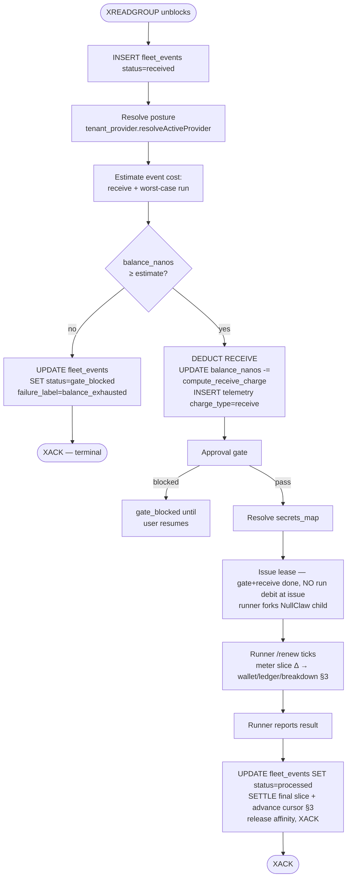

# Billing and self-managed provider key

> Parent: [`README.md`](./README.md)

How users pay for what they run, and how the runtime stays neutral between two cost realities: us paying the language-model provider, or the user paying the language-model provider directly.

This is a cross-cutting topic. The data model lives in the tenant provider records, the runtime hooks live in the control plane's lease path (`agentsfleetd`) and the runner's NullClaw child, and the install-time path lives in the `agentsfleet` CLI and the Fleet Bundle. The end-to-end walkthroughs are in [`scenarios/`](./scenarios/). This file is the canonical concept reference.

The billing model is **credit-based, Amp-style**: every tenant has a single credit balance in nanos (1 USD = 1,000,000,000 nanos); events deduct credits at two points (receive + run); when the balance hits zero the gate trips. There are no plan tiers in the cost function and no "included events" tier ladder — credits flow in (one-time starter grant in v2.0; Stripe purchase in v2.1+) and credits flow out per event. Receive is a fixed amount in both postures; **run** is posture-dispatched and is the friction-reducing gradient (platform default subsidises inference; self-managed runs cheaper because the user is paying their own provider for tokens). This file is the **concept reference** — it describes shape and behaviour.

> **Where the live values are.** [`https://agentsfleet.net/#pricing`](https://agentsfleet.net/#pricing) is the canonical source of truth for current rates and the starter-grant value. There is no promotional window (§2.3). This doc and the scenarios in this directory deliberately do not quote dollar amounts — they go stale the moment a rate moves. For implementers: server-authoritative constants live in `src/agentsfleetd/state/tenant_billing.zig` (pin-tested), mirrored to `ui/packages/website/src/lib/rates.ts` and `~/Projects/docs/snippets/rates.mdx`. Identifier names match across Zig/TS/JS so a rate bump is a coordinated PR.

---

## Facts

Every row is extracted from the numbered sections below; the owner column names the section that carries the full story.

| Invariant | Value | Mechanism | Owner section |
|---|---|---|---|
| Currency unit | nanos — 1 USD = 1,000,000,000 | `billing.tenant_wallet.balance_nanos BIGINT CHECK (>= 0)`; i64 caps one tenant at ~$9.2B | §2 |
| Postures | exactly 2, tenant-scoped | `core.tenant_model_selection.mode` ∈ {`platform`, `self_managed`}; a missing row means `platform` | §1 |
| Debit points | 2 per event | receive (`EVENT_NANOS`, posture-independent today) + run (metered per `/renew`, settled at report — M80_010) | §3 |
| Run slice charge | `run_fee + token_cost` | `run_fee = elapsed_ms × RUN_NANOS_PER_SEC / 1000`; platform adds the three-tier Δ-token cost; self-managed records tokens but never charges them | §3, §4.2 |
| Wallet clamp | `charged = LEAST(slice, balance)` | wallet write is `GREATEST(0, …)` — never negative, never credits a negative Δ | §3 |
| Money writes per slice | 2, atomic | wallet debit + accumulated `stage` ledger row, inside the fenced renewal CTE (which also advances the two lease cursors) | §3 |
| Ledger keying | `UNIQUE (event_id, charge_type)` | one `receive` row + one accumulated `stage` row per event — two rows total, however many times the run renews | §3 |
| Free usage | the starter grant only | a balance that drains, bounded by `balance_exhausted_at`; no promotional window and no mechanism for one | §2.3 |
| Exhaustion policy | `BALANCE_EXHAUSTED_POLICY`, default `stop` | `warn` / `continue` opt out of blocking | §5 |
| Mid-run exhaustion | next `/renew` refused | `UZ-RUN-012`; the run ends at its current deadline, never extended | §3, §5 |
| Budget gate | per-fleet, independent of the balance gate | `daily_dollars` rolling 24 h · `monthly_dollars` UTC calendar month; mid-run refusal `UZ-RUN-015` | §5.1 |
| Budget no-verdict posture | asymmetric | database failure → admit; no budget declared → admit; unparseable budget → refuse | §5.1 |
| `api_key` boundary | process-internal vs user-facing | never in responses, logs, fleet context, or persisted rows; the runner lease is the machine-plane exception | §8.2 |
| Credential list | metadata projection | `kind` ∈ {`provider_key`, `custom_endpoint`, `custom_secret`}; `api_key` structurally absent (no field to leak) | §8.3 |
| Model registry | one row per `(model_id, secret_ref)` | `core.tenant_model_entries`, `UNIQUE (tenant_id, model_id, secret_ref)`; entries reference keys, never own material | §8.4 |
| Rate lookup | generation-validated process cache | entry accepted only at the observed `core.model_catalogue_revision` or later; a miss loads the row | §4.2, §10 |
| Unknown model on platform | `error.ModelNotPriced` | never a default rate: renew and settle fail closed on it, the lease-estimate gate fails open because an estimate is not a charge | §2.3, §4.2 |
| Catalogue read | `GET /v1/models`, bearer-authed | the public `cap.json` route is retired — `404`, no alias | §10 |
| Plan tiers | none in the cost function | future paid plans manifest as grants or top-ups, never a `compute_charge` branch | §2.4 |
| Posture switch | claim-time snapshot wins | posture resolved once, at gate time, before the receive deduct | §7 |
| Blocked rows | terminal | no automatic replay after top-up; resume writes a continuation event | §6 |
| Live dollar values | never in this doc | canonical on `agentsfleet.net/#pricing`; constants pinned across 4 files by `audits/cross-tier-rates.sh` | preamble, §4.2 |

## Traps

Each trap is enforced in its owner section; this list is the index.

- Never quote dollar amounts in docs — they go stale the moment a rate moves (preamble).
- Metering never stops, and nothing zeroes the money column any more — a metered slice charges what the catalogue prices (§2.3).
- Never read a cache eviction as "this model is not in the catalogue" — a miss loads, it does not answer (§4.2).
- Renewal idempotency is the cumulative-token diff against the affinity cursor, not a slice number — a re-sent renewal charges ≈0 (§3).
- The budget gate apportions each ledger row's accumulated total across `[created_at, last_charged_at]` — never stamps the whole total on one instant, which under-enforces exactly where the amounts are largest (§5.1).
- No plan branch inside `compute_charge`, ever (§2.4).
- The provider `api_key` never joins `secrets_map`; it rides `ExecutionPolicy` on a different path entirely (§8.2).
- Model-registry entries reference vault keys — they never own credential material (§8.4).
- Absence of a `tenant_model_selection` row is `mode=platform`; new tenants get no eager row (§1).
- No silent auto-fallback from self-managed to platform on provider error — it would charge without consent (§13).
- `tenant provider create` never test-calls the provider; auth-validity surfaces at the first event as `provider_auth_failed` (§7).
- Budget overshoot is bounded, not zero — at most one renewal window past the cap (§5.1).

## Topology

The diagrams live with their flows: the per-slice metering picture (§3) and the balance-gate mermaid flowchart (§5).

## Decisions

| Decision | Reason | Where / artifact |
|---|---|---|
| Credit-based Amp-style billing, no tier ladder | one number that drains; refills are grants or purchases | preamble, §2 |
| Platform default routes through the admin tenant's own credential | no separate platform vault, no env-var fallback, one vault code path | §1 |
| Fireworks Kimi K2.6 as the v2.0 platform default | strong general model, 256K context, cheap wholesale, OpenAI-compatible | §1 |
| Free usage is a balance, not a promotional window | a number that drains cannot silently stay open; the timestamp-gated version priced every tenant at zero for its whole life | §2.3 |
| Incremental per-renewal metering replaced the one-shot estimate | drained credit equals runtime × rate + actual tokens; refund-on-actual superseded | §3, §13; M80_010 |
| Budget gate fails open on database failure | a metering outage must not halt every fleet on the platform | §5.1 |
| Catalogue read moved behind auth | per-token margins are no longer world-readable | §10 |
| Registry consistency via activation-time upsert, not read-time self-heal | a read handler must not mutate rows to paper over a write-path violation | §8.4; M121 |
| `fleet:` vault-name prefix removed repo-wide | it discriminated nothing; dead convention | §8.4 |
| No boot-time warm of the rate cache | a second fill path would drift from the first | §10 |
| Stripe purchase flow deferred | v2.1; schema anticipates it | §13 |

---

## Detail

Everything below is the full reference. Headings are stable — specs cite them by §-number and text; insert new sections, never rename or renumber existing ones.

## 1. The two postures

One persona carries the worked examples through this doc and the scenarios: **John Doe** — first-time user who installs a Fleet on the default platform-managed posture, runs for a while, then activates self-managed with his own Fireworks key so he stops paying agentsfleet for tokens. He's the same user across every scenario; only his posture changes over time. Both postures share the same code path; the only thing that differs is the per-event drain rate, so a single persona is enough to demonstrate the full surface.

A tenant is in exactly one of two postures at any moment. The posture is tenant-scoped (single value per tenant; not per workspace, not per fleet):

- **Platform-managed (v2.0 default = Fireworks Kimi K2.6).** agentsfleet routes platform-managed inference through the **admin tenant's self-managed credential**. The `agentsfleet-admin` user is one global account per environment, bootstrapped via [`playbooks/operations/admin_bootstrap/001_playbook.md`](../../playbooks/operations/admin_bootstrap/001_playbook.md). It signs up like a normal user and gets promoted to `role=admin` in Clerk. It stores a Fireworks credential in its own workspace's `vault.secrets` (the same M45 crypto_store path any self-managed user takes), then registers it as the active platform default via `PUT /v1/admin/platform-keys`. The `core.platform_provider_defaults` table records only a pointer `(provider, source_workspace_id)` — no key material lives there. At lease time the control plane (`agentsfleetd`) follows the pointer into the admin workspace's vault to fetch the api_key on-demand. There is no `PLATFORM_FIREWORKS_KEY` constant, no separate platform vault, no env-var fallback. The user pays agentsfleet a per-event fee that bundles inference (token-based, retail-rate-driven through the model library) plus orchestration, storage, and egress.
- **Self-managed provider keys.** The user stores their own provider credential — Fireworks, Anthropic, OpenAI, Together, Groq, Moonshot, OpenRouter, etc. — in the vault under a name they choose (`account-fireworks-key`, `anthropic-prod`, etc.). The tenant's `core.tenant_model_selection` row points at that name through `secret_ref`. The runner's NullClaw child uses that key to call the provider's API. The user pays their provider directly for inference; agentsfleet charges a smaller flat orchestration fee per event with no token markup.

**Why Fireworks Kimi K2.6 is the v2.0 platform default.** Kimi K2.6 is a strong general-purpose model with a 256K context window at significantly cheaper wholesale than Anthropic Sonnet or OpenAI GPT-class. Fireworks is OpenAI-compatible (NullClaw routes through `compatible.zig`), so one code path serves both postures. Under platform it dials Fireworks with the api_key the admin tenant provisioned via `PUT /v1/admin/platform-keys`. Under self-managed it dials Fireworks — or any other catalogue provider — with the user's own key. The runtime is uniform; only which workspace's vault holds the key (and the cost-function-vs-flat-fee distinction) differs.

The posture flip lives in `core.tenant_model_selection.mode` (`platform` or `self_managed`). Switching is a single command (`agentsfleet tenant provider create --secret <name>` / `agentsfleet tenant provider delete`) or a single dashboard toggle. **Absence of a `tenant_model_selection` row is equivalent to `mode=platform`** — the resolver synthesises the platform default for tenants who have never explicitly configured a provider. New tenants do not get an eager row; the row appears only when the user touches provider config.

---

## 2. Pure credits, one-time starter grant

Every tenant has exactly one balance: `billing.tenant_wallet.balance_nanos` (`BIGINT NOT NULL CHECK (balance_nanos >= 0)`, holds 9 decimal places of USD precision; i64 caps a single tenant at ~$9.2B, headroom for sub-cent rates without another unit change). The gate compares this column against the estimated event cost. Deductions are SQL `UPDATE … SET balance_nanos = balance_nanos - <nanos>`. There is no second column for "free vs paid," no replenishing bucket, no included-events quota. One number, drains over time, refills only when the user buys credits.

### 2.1 The starter grant

Each new tenant receives a **one-time starter credit** at tenant-create time, named `STARTER_CREDIT_NANOS` in `src/agentsfleetd/state/tenant_billing.zig`. The credit is inserted into `tenant_billing.balance_nanos` synchronously when the tenant row is created. There is no replenish; it's a one-time onboarding allowance, not a recurring stipend. Read the source for the current dollar amount; it sits behind a pin test that fails if it drifts from the Mintlify display snippet.

Under M80_010's metering the grant drains at the run fee (`RUN_NANOS_PER_SEC` × runtime) under self-managed, and at the run fee plus the three-tier per-token cost under platform. A quiet long run therefore stretches the grant further than a token-heavy one, and platform spend depends on the model (see §4.2). The grant is sized so a new user comfortably covers a few thousand runs on either posture without thinking about top-ups.

### 2.2 What happens when the starter grant runs out

When `balance_nanos` cannot cover the next event's estimated cost, the gate trips. The event is blocked at the gate (`status='gate_blocked'`, `failure_label='balance_exhausted'`). The CLI prints a one-line pointer at the dashboard billing page; the dashboard shows the empty-balance state. **Stripe-backed Purchase Credits is deferred to v2.1.** In v2.0, a user whose grant runs out either contacts us (manual top-up via support) or stops using the platform. The pricing model and the schema both anticipate Stripe — they just don't ship the integration in v2.0.

### 2.3 Free usage is a balance, never a window

**There is no promotional window, and there is no mechanism for one.** A tenant's free usage is the starter grant and nothing else: a number that drains, bounded by `balance_exhausted_at` when it reaches zero. Pricing consults the model catalogue and the posture — never the clock. No rate resolver takes a time parameter, which is asserted rather than left to review.

This replaced a timestamp-gated window, and the reason is worth keeping. The cutoff was a per-tenant column (`billing.tenant_wallet.free_trial_ends_at`) that was nullable with no default, and null read as "open". Its only writer in the repository was a test fixture, so **every tenant held null and every metered stage priced to zero — stage billing never charged anyone.** The gate sat ahead of the catalogue lookup, so it also masked an uncatalogued model: a pair with no rate row resolved to zero instead of refusing.

Two properties fall out of the removal, both load-bearing:

- **The balance gate can refuse.** While the window was open, run charge was `0` for every posture, so `balanceCoversEstimate` could never refuse anyone — `0 balance ≥ 0 charge` always covers. Both money checkpoints were effectively open for all tenants. They now bite: lease-issue blocks an exhausted tenant (`balance_exhausted`), and renewal refuses one (`UZ-RUN-012`; the run ends at its current deadline, never extended).
- **An unpriceable model fails closed.** Platform posture with no catalogue row returns `error.ModelNotPriced`. Renew and settle fail closed on it; the lease-estimate gate fails open, because an estimate is not a charge.

Metering itself is unchanged and never stopped: telemetry rows INSERT with posture and token counts regardless of what is charged. What changed is that `credit_deducted_nanos` now carries the catalogue's number instead of zero.

How free usage is presented is canonical on [`agentsfleet.net/#pricing`](https://agentsfleet.net/#pricing). `GET /v1/tenants/me/billing` carries exactly four members — `balance_nanos`, `updated_at`, `is_exhausted`, and `exhausted_at` — which is the whole state a client needs. It carries no `free_trial` member; that removal is breaking and is recorded in the changelog. The set is pinned by an integration test rather than described only here, so a member arriving or departing fails the suite instead of silently dating this page.

### 2.4 Plan tiers

There are no plan tiers in the cost function. The flat-rate `compute_receive_charge` and `compute_stage_charge` functions in §4 do not take a plan parameter. If we ever introduce paid plans (v2.1+), they will manifest as larger one-time grants, recurring Stripe charges that top up `balance_nanos`, or volume discounts on per-event rates — but not as a branch inside `compute_charge`.

---

## 3. The two debit points

Every event triggers two debits, in this order, from the same `tenant_billing.balance_nanos` column:

> **The run debit is metered incrementally, not estimated once.** On every `/renew` the runner reports cumulative token counts; the server charges the slice's delta and records it in **three places**, all inside M80_006's fenced renewal CTE (a `guard` arm gates every write — a lost/capped renewal writes none; `FOR UPDATE` on the lease+slot serialises same-lease renewals so a retry-in-flight charges ≈0). §4.2 is the charge function.
>
> ```
>  ONE event → the fleet runs in a sandbox, renewing as it works:
>    t0 ─renew─ renew ─renew─ … ─report(settle)─►   each tick meters the slice since the last:
>      slice = run_fee + token_cost
>        run_fee    = (now − last_metered_at) × RUN_NANOS_PER_SEC / 1000   (both postures, ms-precision)
>        token_cost = Δin·r_in + Δcached·r_cache + Δout·r_out              (platform only)
>
>    charged = LEAST(slice, balance)   the actual debit; == slice unless this slice exhausts the wallet
>    TWO guard-gated money writes per slice (atomic in the renewal CTE, which
>    also advances the lease and affinity cursors in the same statement):
>      ① WALLET     balance_nanos := GREATEST(0, balance_nanos − slice)       clamp, never negative (= −charged)
>      ② LEDGER     usage_ledger 'stage' row(event_id) += charged / Δtokens / Δt  per-EVENT total (Usage tab),
>                   last_charged_at := now                                    the span the budget gate apportions over
>
>    self_managed: run_fee only (tokens recorded, not charged — tenant paid the provider)
>    dormant fleet: not renewed → not charged (serverless). credit exhausted → next /renew refused (UZ-RUN-012)
>    idempotent: cumulative-token diff vs the lease cursor → a fail-safe retry charges ≈0
> ```

| # | Debit | When | Amount | Posture-dependent? |
|---|---|---|---|---|
| 1 | **Receive** | Right after `INSERT fleet_events (status='received')` and the gate passes | `computeReceiveCharge(posture)` = `EVENT_NANOS` | No today — both postures use the same `EVENT_NANOS` constant. Function signature keeps `posture` so a future ratchet can re-introduce asymmetry without touching callers. |
| 2 | **Run** | Metered **incrementally** across the run — a delta on every `/renew`, settled at report (M80_010 replaced the one-shot lease-issue estimate) | `computeStageCharge` over the per-slice deltas (run fee + token delta) | Yes — platform: per-second run fee (`RUN_NANOS_PER_SEC`) + per-token cost (input/cached-input/output) from the model-library rate cache. self-managed: the run fee only (tokens recorded, not charged). |

Why two debit points and not one:

- **Receive is kept in the path for shape stability, not for revenue today.** The two-debit shape lets the telemetry writer, the gate, and the recovery path stay uniform across rate-table changes — receive can be zero today and non-zero post-GA without re-plumbing.
- **Run captures the cost of running NullClaw.** Under platform that's our flat overhead plus the token rate × tokens we paid Anthropic / OpenAI / Fireworks for. Under self-managed that's just the flat overhead — the user paid the provider for tokens; we did the lease/report round-trip, the runner's sandbox setup, and the result plumbing.

**Ledger rows (M80_010).** `billing.usage_ledger` is keyed `(event_id, charge_type)`: one `receive` row, and **one `stage` row that M80_010 accumulates** across the run's renewals. The `UNIQUE (event_id, charge_type)` constraint updates the `stage` row in place, never multiplies it; the run is billed under `charge_type = stage`. So one event → exactly 2 ledger rows, whether the run renewed once or forty times.

A per-renewal breakdown table used to sit beside them, one row per `/renew`/settle. M154 §4 deleted it: at a renewal roughly every twenty seconds it was the fastest-growing table in the schema, and its only reader was the budget gate, which the span columns now serve directly. Revenue-by-charge-type is still a one-line query here. The slice-by-slice accrual detail is no longer answerable from Postgres — it is a durable-stream concern, recorded in [`roadmap.md`](./roadmap.md) under *Payload offload and the durable stream*.

**Run metering — three layers.** The run debit follows the real run, not a one-shot estimate.

On every `/renew` the runner reports its **cumulative** `(input, cached_input, output)` token counts. The server charges the **delta** since the lease's last-metered cursor: `run_fee = (now − last_metered_at) × RUN_NANOS_PER_SEC / 1000` (ms precision), plus the per-token cost of the token delta on the platform posture. It then applies two money writes atomically inside M80_006's fenced renewal CTE, advancing both cursors in the same statement:

1. debit the **wallet** `balance_nanos`, clamped at 0;
2. accumulate the per-event `stage` **ledger** row, stamping `last_charged_at`.

The per-event slice number is gone with the breakdown table that needed it, and so is the `meter_slice_seq` counter on the affinity slot. Nothing was lost: slice numbering never provided idempotency. That comes from the **cumulative-token diff against the affinity cursor** — a re-sent renewal reports the same cumulatives, computes a zero delta, and charges ≈0 — and ordering comes from the `FOR UPDATE OF l, a` that serialises renewals of one lease.

Ledger ② records `charged = LEAST(slice, balance)` — the actual debit — so the audit row equals the wallet drain even on the slice that exhausts the wallet. A final settle at report closes the last partial slice, so the credit drained equals **exactly** runtime × rate + actual tokens. That settle is **fused into the report claim**: the lease's `active→reported` flip and the final-slice charge ride one fenced CTE under `FOR UPDATE OF l, a`, so a reclaim racing the report cannot strand the final slice on the `MAX_RUNTIME` cap path.

Properties: same-lease renewals are serialised (`FOR UPDATE` on lease+slot), so a fail-safe retry re-sends the same cumulatives and charges ≈0 (cumulative-diff idempotency). A negative Δ clamps to 0 and never credits. The wallet debit is `GREATEST(0, …)` and never goes negative. A balance that can no longer fund the run refuses the **next** renewal (`UZ-RUN-012`; the run terminates). A lost or fenced-out renewal writes neither.

---

## 4. `computeReceiveCharge` and `computeStageCharge`

Two functions, both in `src/agentsfleetd/state/tenant_billing.zig`. Both take `posture`. Neither takes plan. Receive is posture-independent in the current rate table; the signature keeps `posture` so a future ratchet can re-introduce asymmetry without a fn-shape change.

### 4.0 Worked examples up front

Two events for John, taken at different points in his journey, drive the worked examples below. Both run against Kimi K2.6 — only the posture differs:

- **John on platform-managed.** A typical webhook event under `mode=platform`: 800 input tokens / 1040 output tokens against `accounts/fireworks/models/kimi-k2.6`. agentsfleet holds the Fireworks key; we pay Fireworks for the tokens and bill John at the retail rate from the model library plus orchestration overhead.
- **John on self-managed.** Same workload, `mode=self_managed`: 800 input / 1040 output against `accounts/fireworks/models/kimi-k2.6`. John holds the Fireworks key; he pays Fireworks directly. agentsfleet bills the flat orchestration overhead, no token markup.

### 4.1 Receive charge

Function shape:

```zig
pub const Posture = enum { platform, self_managed };

pub fn computeReceiveCharge(posture: Posture) i64 {
    _ = posture;
    return EVENT_NANOS;
}
```

Receive is a single named constant, `EVENT_NANOS`, defined in `src/agentsfleetd/state/tenant_billing.zig`. Both postures currently resolve to the same value via this function; the `posture` parameter stays on the signature so a future ratchet can re-introduce asymmetry without touching callers. The function shape is what matters: posture-aware, plan-independent, plumbed through the lease path (`leaseNext` / `runBilling`). Live value lives in the source — read it there; pin tests lock it.

### 4.2 Run charge

Function shape:

Function shape (M80_010) — **deltas** in, run fee + three-tier token cost out; the cumulative→delta subtraction happens in the renewal CTE, so this function never sees cumulative counts:

```zig
pub fn computeStageCharge(
    conn:       *pg.Conn,      // the caller's already-acquired connection (M143 §2.2)
    provider:   []const u8,    // composite-key half — "anthropic", "pioneer", … (§9)
    posture:    Posture,
    model:      []const u8,    // "accounts/fireworks/models/kimi-k2.6", "kimi-k2.6", …
    elapsed_ms: i64,           // active wall time of the slice
    d_input:    u32,           // per-slice token deltas (CTE-computed max(0, cumulative − metered))
    d_cached:   u32,
    d_output:   u32,
) !i64 {
    // self_managed prices with NO statement at all. Only the platform branch
    // consults the catalogue, and it prices against the generation `conn`
    // observes. No clock is involved at any point.
    // An uncatalogued model is an OPERATIONAL state, not a programmer bug: an
    // admin can DELETE a rate row while a tenant still names that model. This
    // used to panic, which aborted the whole replica for one fleet's stale
    // model, on every replica that picked the fleet up. It returns an error so
    // each caller takes its own documented posture — see §2.3.
    const rates = (try resolveRenewSliceRates(conn, provider, posture, model)) orelse
        return error.ModelNotPriced;
    // ms-precision: divide AFTER multiplying, so a 20_500 ms slice bills the full
    // 20.5 s, not a second-truncated 20 s (the per-slice debits then sum to the
    // real runtime × rate — never under-bill across N renewals).
    return sliceCharge(rates, elapsed_ms, d_input, d_cached, d_output);
}
```

One named constant drives the run fee — `RUN_NANOS_PER_SEC`, in `src/agentsfleetd/state/tenant_billing.zig`, applied identically to **both** postures. Under platform: the run fee plus a three-tier per-token component (input / cached-input / output) from the model-library rate cache (§10). Under self-managed: the run fee only — we did not pay for the tokens, only for running the fleet.

Posture changes only whether the per-token component is added (platform) or not (self-managed); the run fee is the same. That gradient is the friction-reducing signal: on-ramp on platform without a key, graduate to self-managed once the cost-vs-convenience tradeoff tilts. `RUN_NANOS_PER_SEC` is pinned across the four rate files (`tenant_billing.zig` + `rates.ts` + `app/lib/types.ts` + `cli/src/constants/billing.ts`) by `audits/cross-tier-rates.sh` so a bump surfaces immediately.

Rates come from a process-local cache in front of `core.model_library` (`state/model_rate_cache.zig`), on the shared `common.CacheTable` primitive. The table is the single source of truth; the cache exists to keep the charge path off it in the common case.

**A miss loads, it does not answer (M143 §2.2).** The cache is fixed-capacity and evicts, so it cannot promise completeness — and a charge path must never read "evicted" as "this model is not in the catalogue". It used to: an absent entry panicked the issue-time estimate and silently dropped renewal to run-fee-only, which is the revenue leak this milestone closes. So a miss loads the one row it asked about, and "not catalogued" is now a database answer.

**Freshness is the catalogue generation, not a deadline.** Each entry stores the `core.model_catalogue_revision` value it was read at. A charge reads the generation on its own connection and accepts a cached entry only at that generation or later; otherwise it reloads. So a warm charge path costs one statement (the generation) and a cold one costs two. That is the price of the guarantee that no slice is ever priced against a catalogue state the platform has moved past — a guarantee a boot-time snapshot could not make, because nothing told a replica its snapshot had aged.

Every admin mutation runs inside the generation transaction: lock the singleton row `FOR UPDATE`, change the catalogue, increment the generation, commit. The rows and the generation describing them therefore become visible together, and a replica that never saw the mutation still cannot serve the old rate — its entry carries the old generation and every charge compares it.

`error.ModelNotPriced` under platform, not a panic and never a default rate. The upstream validators do reject an uncatalogued model — at `tenant provider create` time (`400 model_not_in_caps_catalogue`) and when the bundle's frontmatter is authored — but the catalogue can move after they ran: an admin `DELETE` of a non-default row leaves any tenant still naming that model reaching this resolve and getting a database answer of "no row".

That is an operational state, not a programmer bug, which is why this path used to panic and does not any more. A panic aborted the whole replica for one fleet's stale model, on every replica that picked the fleet up — one tenant's stale configuration taking down the daemon for everyone. The error lets each caller take its own documented posture instead: renew and settle fail closed, and the lease-estimate gate fails open, because an estimate is not a charge.

### 4.3 What an event costs — by shape, not by number

A worked example with hardcoded dollar amounts goes stale the moment a rate moves. Instead, here is the *cost shape* a caller can reason about without consulting the doc again after a rate ratchet — under M80_010 the run is summed across the run's `/renew` slices (Σ over slices), each slice metered on its own deltas:

**Platform posture, single event (M80_010):**

```
total_nanos = EVENT_NANOS                              // receive
            + Σ_slices [ (elapsed_ms/1000) × RUN_NANOS_PER_SEC            // run fee
                       + (Δinput  × rate.input_nanos_per_mtok)        / 1_000_000
                       + (Δcached × rate.cached_input_nanos_per_mtok) / 1_000_000
                       + (Δoutput × rate.output_nanos_per_mtok)       / 1_000_000 ]
```

The token component dominates a token-heavy run; the run fee dominates a long, quiet one. `rate` is the row for the active model in the model-library rate cache (§10).

**Self-managed posture, single event (M80_010):**

```
total_nanos = EVENT_NANOS                              // receive
            + Σ_slices [ (elapsed_ms/1000) × RUN_NANOS_PER_SEC ]         // run fee only, no token math
```

`RUN_NANOS_PER_SEC` is the one run rate for both postures (receive stays `EVENT_NANOS`); platform additionally layers the three-tier token cost. The live dollar amounts are canonical on [`agentsfleet.net/#pricing`](https://agentsfleet.net/#pricing); implementers read the pin-tested constants in `src/agentsfleetd/state/tenant_billing.zig` and the model library (GET /v1/models) for the per-token rates.

---

## 5. The balance gate — code path

`runBilling` (on the lease path, in `agentsfleetd`) runs both the gate and both debits. Single code path for both postures.



> **The run debit is metered across the run, not deducted once at issue.** Lease issue runs the *entry gate* (a one-shot coverage check), the receive deduct, and the approval gate — but **no run debit**. The run is charged as a per-slice Δ-debit on the runner's `/renew` ticks plus a settle at report (§3). The receive deduct and the entry gate are unchanged.

Properties:

- **Single-pass gate.** One `balance_nanos < estimate` check at the start. If the user can't cover one event's worst-case, the event is rejected at the gate. The estimate is conservative — uses the worst-case-tokens estimate from the prompt size for the run portion. Whether the gate actually blocks is governed by the `BALANCE_EXHAUSTED_POLICY` env var (default `stop`, which blocks the exhausted tenant; set `warn` or `continue` to opt out of blocking and let the event through).
- **Receive deduct at issue + incremental run metering.** The receive deduct + its telemetry insert is one transaction at lease issue. The run half is metered incrementally — a per-`/renew` accumulate plus a settle at report (one `receive` row + one *accumulated* `stage` row — see §3). If `agentsfleetd` crashes between writes, the receive row is the durable record that the receive overhead was charged; each accumulated slice is likewise durable (committed in the renewal CTE), so reclaim meters forward from the cursor.
- **Mid-event balance crossing zero is fine.** In-flight events run to completion under the snapshot taken at receive time. The next event hits the gate cleanly.
- **Concurrent events on near-zero balance.** Two events claim simultaneously, both pass the gate (balance was sufficient for one), both deduct → balance can briefly go negative. We accept the small overshoot rather than serialise all events behind a row lock. Recovery: next event sees `balance_nanos < 0`, gate trips.

### 5.1 The per-fleet budget gate — a second, independent ceiling

The balance gate above bounds what a **tenant** may spend: one credit pool, one `balance_nanos`. It says nothing about how that pool is divided. A single misbehaving fleet in a tool-call loop can drain the whole pool while every other fleet in the tenant starves.

`daily_dollars` / `monthly_dollars` in a fleet's `TRIGGER.md` are the **fleet-scoped** ceiling — the blast-radius guard. The two gates are independent and both must pass:

| | Balance gate | Budget gate |
|---|---|---|
| Scope | tenant (`billing.tenant_wallet.balance_nanos`) | one fleet (`core.fleets.config_json` → `x-agentsfleet.budget`) |
| Question | "can this tenant afford one more event?" | "has this fleet spent its own allowance?" |
| Pre-run refusal | `gate_blocked` + `balance_exhausted` | `gate_blocked` + `budget_breach` |
| Mid-run refusal | `/renew` → `UZ-RUN-012` → `renewal_terminate` | `/renew` → `UZ-RUN-015` → `budget_breach` |
| Source of truth | wallet balance | `billing.usage_ledger.credit_deducted_nanos`, apportioned across each row's `[created_at, last_charged_at]` span by its overlap with the window |

**Where it fires.** `runBilling` checks the budget after the balance gate and **before the receive deduct**, so a refused event is never charged. `session.config.budget` is already parsed onto the session, so the check costs one indexed aggregate and no extra lookup. Mid-run, `service_renew` re-reads the ceiling live from `config_json` on every renewal tick inside the window — lowering a runaway fleet's `daily_dollars` therefore bites at its next tick, not only at its next run.

**Windows.** `daily_dollars` is a **rolling 24 hours** (`last_charged_at >= now − 86_400_000`); `monthly_dollars` is the **UTC calendar month** (`clock.startOfUtcMonthMillis`). The row filter keys on `last_charged_at` — when a run stopped charging — which is exact where the retired table's filter was a heuristic: it had to widen the scan by `MAX_RUNTIME` to catch slices whose run began before the floor. Both derive from a single `now_ms` per gate invocation, passed in, so the two windows can never straddle a tick. `monthly_dollars` is optional — absent means no monthly ceiling.

**Spend means credit *drained*,** not credit metered. On the slice that exhausts a wallet, `charged_nanos < run_fee + token_cost` and the remainder is forgiven (§3); a budget counts money that actually left the pool.

**Timed by drain, not by run start.** The problem this solves outlived the table that first solved it. A run's stage row accumulates in place across renewals, so a single stored instant describes the whole run — and attributing a 12-hour run's spend to its start ages that spend out of a rolling 24-hour window up to 12 hours early, or slips it across a month boundary entirely. Under-enforcement, precisely on the long runaway a budget exists to stop.

The first fix stored per-slice rows in `fleet.metering_periods` and summed them by each slice's own `created_at`. That table is gone: it wrote a row roughly every twenty seconds of every run, which is the growth the schema rebuild removed. The property survives without it. `billing.usage_ledger` carries `last_charged_at` alongside `created_at`, so the accumulated total describes a *span* rather than an instant, and the gate apportions it across `[created_at, last_charged_at]` by overlap with the window being enforced. A run straddling the window boundary contributes the fraction that actually fell inside it.

The slice-by-slice audit trail is a separate concern from enforcement, and it is not in Postgres — see [`roadmap.md`](./roadmap.md) under *Payload offload and the durable stream*, which records where it goes instead.

**Overshoot is bounded, not zero.** The ceiling is a floor-check: a run is admitted while `spend < cap`. An already-running run may exceed its cap by at most one renewal window's worth of tokens before its next `/renew` refuses it. Enforcing a *predicted* end-of-run cost would refuse runs that would have finished under budget.

**Failure posture, deliberately asymmetric.** Three distinct "no verdict" causes, three different answers:

| Cause | Answer | Why |
|---|---|---|
| Database unreachable / query failed | **admit** (fail open) | mirrors `balanceCoversEstimate` — a metering outage must not halt every fleet on the platform |
| Fleet declares **no** `budget` | **admit** | undeclared is unbounded, exactly as before this gate existed. The tenant credit pool still bounds it. Refusing would enforce a ceiling nobody wrote |
| `budget` declared but unparseable | **refuse** (fail closed) | a ceiling we cannot read is not a ceiling we may ignore |

The stored budget is parsed by `config_helpers.parseFleetBudget`, the same validator that accepted it at ingest, so the ceiling that admits a run and the ceiling that kills it are one number.

**The gate consumes what the catalogue prices.** A fleet accrues `credit_deducted_nanos` from its first metered slice, so the budget is spent against real rates rather than against zero. This is a change: while the promotional window existed, every charge was zero, so no budget was ever consumed and neither gate could refuse anyone (§2.3).

---

## 6. The credit-exhausted user experience

When the gate blocks, the user's surfaces show:

- **`agentsfleet events {id}`** — the gate-blocked row appears with `status='gate_blocked'`, `failure_label='balance_exhausted'`. The CLI prints a one-line pointer: *Credits exhausted. See https://app.agentsfleet.net/settings/billing.*
- **`agentsfleet billing show`** — balance reads `$0.00`; below it, the most recent N event rows showing where the credits went.
- **Dashboard `/fleets/{id}/events`** — the row renders with a red *Blocked: balance* chip linking to the billing page.
- **Dashboard `/settings/billing`** — empty-balance hero state. The Purchase Credits button is visible but disabled in v2.0 with a tooltip *"Coming in v2.1 — contact support for a top-up."*. The Usage tab still shows the historical drain.

The blocked row is **terminal** (XACKed, immutable narrative). When the user's balance is later topped up (manually by us in v2.0, or via Stripe in v2.1+), there is **no automatic replay**. If they want the missed events processed, they either re-trigger from the source (push another commit, send another steer) or use the resume affordance, which writes an `actor=continuation:<original>` event referencing `resumes_event_id=<blocked_row>`.

The reasoning is that a balance-exhausted event is usually evidence the user was already off the rails (runaway loop, mis-configured cron). Auto-replay would compound the bill.

---

## 7. Switching posture mid-stream

A user can switch between platform and self-managed at any time. Effects on subsequent billing:

- **Platform → self-managed** (user runs out of platform credit, brings own Fireworks key): `agentsfleet tenant provider create --secret <name>` flips `tenant_model_selection.mode=self_managed` immediately. The next event's receive + run debits use the self-managed constants and rate path. In-flight events finish under the platform snapshot they were claimed under.
- **self-managed → platform** (user stops paying their provider): `agentsfleet tenant provider delete` flips `mode=platform`. The next event uses platform rates. If the credit balance is now too low for platform pricing, the gate trips on the next event.
- **Mid-event change.** The snapshot taken at claim time wins. Provider posture is resolved exactly once, at gate time, before the receive deduct.

The "in-flight events" question matters because self-managed and platform have different per-event costs. We never want a request that the user started under one posture to bill at another.

The `tenant provider create` PUT validates eagerly on structure (body shape, credential presence, JSON shape, model-library catalogue membership). It does **not** make a synthetic call to the large language model provider to verify the key works — auth-validity surfaces at the first event as `provider_auth_failed`. The command line interface (CLI) prints a one-line *"Tip: run a test event to verify the key works"* hint after a successful set.

---

## 8. The self-managed credential and the api_key visibility boundary

### 8.1 The credential body — user-named, opaque

Vault credentials are opaque JSON objects keyed by name (M45 contract). The self-managed record uses an **user-chosen name**: John picks `account-fireworks-key`, another user might pick `anthropic-prod` or `openai-team-shared`. The name is whatever makes sense to the user; the schema does not impose a convention.

```json
{
  "provider": "fireworks",
  "api_key":  "fw_LIVE_xxxxxxxxxxxxxxxx",
  "model":    "accounts/fireworks/models/kimi-k2.6"
}
```

`provider` is one of the names NullClaw's provider catalogue recognises (`anthropic`, `openai`, `fireworks`, `together`, `groq`, `moonshot`, `kimi`, `openrouter`, `cerebras`, …). `model` is the provider's model identifier. `api_key` is the user's credential.

The `tenant_model_selection` row points at the credential by name through `secret_ref`. Multi-credential tenants are supported (a user can store `anthropic-prod` AND `fireworks-staging` in vault and flip between them with `agentsfleet tenant provider create --secret <other>`); only one is *active* at a time per tenant.

**Vault scope: workspace-keyed; tenant→workspace bridge.** `vault.secrets` is keyed by `(workspace_id, key_name)` per the M45 schema. Tenant-scoped lookups (the self-managed resolver, the `agentsfleet secret create` write path) bridge through `tenant_provider_resolver.resolvePrimaryWorkspace(tenant_id)` which picks the earliest-named workspace owned by the tenant. Single-workspace tenants (the v2.0 default) work transparently. Multi-workspace tenants implicitly pin **all** self-managed credentials to the earliest-named workspace; per-workspace credential isolation — and a fully tenant-keyed vault — is post-v2.0 work. Until then, the bridge is the rule.

**`context_cap_tokens` is not in the credential body.** The cap is resolved separately, at `tenant provider create` time, from the model library (§10), and pinned into `tenant_model_selection.context_cap_tokens`. Splitting the two lets the cap be re-resolved when the model changes without touching the vault.

### 8.2 The api_key visibility boundary

The api_key — platform OR self-managed — crosses one boundary cleanly. It exists only in places that need to call the provider's API; it never appears in any user-facing surface.

**The api_key MAY exist in:**

- `vault.secrets` rows as envelope ciphertext.
- Server-side process memory — `agentsfleetd`'s process (the return value of `tenant_provider.resolveActiveProvider`) **and** the runner's NullClaw session + per-call HTTP client. `agentsfleetd` resolves the key on the lease path (fresh + reclaim) and delivers it inline on `ExecutionPolicy.provider` + `ExecutionPolicy.api_key`; the runner injects it into the engine for the inference call and `secureZero`s it after use. The key rides the same trusted-fleet inline envelope as `secrets_map`. The control plane synchronously writes that machine response, closes the connection on write failure, then erases the serialized response buffer and request arena.
- Outbound HTTPS request headers to the LLM provider (e.g. `Authorization: Bearer …`).

**The api_key MUST NEVER appear in:**

- User-facing HTTP response bodies — `agentsfleet doctor --json` output, `GET /v1/tenants/me/provider`, the `GET /v1/workspaces/{ws}/secrets` metadata list (§8.3), and any other JSON a user sees. The authenticated runner lease is the machine-plane exception described above.
- Logs — `agentsfleetd`, runner, structured logs, request logs.
- The fleet's tool context — placeholders are substituted *after* sandbox entry by the tool bridge; the provider key is on a different path entirely (the runner's NullClaw uses it for the inference call only, never via `secrets_map`).
- Persisted event rows — `core.fleet_events`, `billing.usage_ledger`, anything else under `core.*` or `billing.*`.
- User-facing artefacts — frontmatter, the dashboard, CLI table output, status-page bodies.

The boundary is "process-internal vs user-facing," not "in memory vs not in memory." Within `agentsfleetd`: decrypted vault buffers and canonical secret JSON are erased before release. Secret-bearing route bodies are erased after dispatch, including authentication short-circuits. Request-arena pages are erased at teardown. Serialized lease or mint bytes are erased after their synchronous write. Authorization-header storage and plaintext during active use remain outside this guarantee. A grep across the event log, `agentsfleetd` logs, runner logs, and user-facing HTTP responses for the api_key bytes after a self-managed run is a Continuous Integration (CI) invariant (M48 acceptance criteria).

### 8.3 The credential metadata list and whole-body replace

`GET /v1/workspaces/{ws}/secrets` projects each stored credential's **non-secret** descriptor so the dashboard classifies and labels without guessing from the user-chosen name. Each row carries a server-derived `kind` ∈ {`provider_key`, `custom_endpoint`, `custom_secret`} plus the non-secret `provider` / `model` / `base_url`, and **never** `api_key`. The list path decrypts each opaque body on read (the same `vault.loadJson` the mint path uses), projects everything *except* the key, then erases the raw decrypt buffer before release; its parse storage is erased with the request arena. The projection type has no `api_key` field, so a leak is a compile error rather than a review catch. `kind` is derived from the `provider` field — `openai-compatible` → `custom_endpoint`, any other provider string → `provider_key`, missing/non-string → `custom_secret` — never from the name. An unparseable or legacy body degrades to `custom_secret` and the list still returns 200. The list stays operator-gated (`workspace_guards.enforce(.operator)`).

`PUT /v1/workspaces/{ws}/secrets/{name}` with body `{data}` — the same shape `create` takes — replaces the stored body **whole**. It superseded a field-level `PATCH {api_key}`: a stored secret is never readable, so a partial write could not be reasoned about by the caller, and on any body not keyed `api_key` the merge silently added an unused field beside the live credential and answered 200. Replacement is total by design; the client recomposes the full body from this list's projection plus the one field the list never carries, which this call supplies.

The write is one `UPDATE … WHERE workspace_id AND key_name` — deliberately not an upsert. Zero affected rows is `UZ-VAULT-003` (404) and nothing is created, so a replace racing a delete cannot resurrect the deleted credential, and claiming a name stays `create`'s sole job. Body validation matches `create` (`UZ-VAULT-001` non-object/empty, `UZ-VAULT-002` over 4 KiB), and the envelope plus its `meta_*` projection are rewritten in the same statement, so they can never describe different bodies.

Both endpoints honour §8.2: the metadata is a read-time *projection*, not a new stored column, so the M45 opaque-body invariant (§8.1) is unchanged; `api_key` is structurally absent from the list response, and the replace body is never returned or logged. (A non-secret metadata sidecar column — which would let the list avoid decrypting at all — is the named Option B follow-up, deferred to keep the M45 invariant.)

**Nav placement history:** M87 (`docs/v2/done/M87_001_P1_UI_MODELS_CREDENTIALS_REDESIGN.md`) deliberately collapsed Models and Credentials into one dashboard nav entry. M113 reverses that — Secrets & ENVs gets its own nav entry and route again. M87's spec is left as-written (a historical record of the reasoning at the time); this note is the pointer for anyone reading it cold.

### 8.4 The tenant model registry — many entries, one shared key (M121)

The 4-fixed-slot Models page (Default / Anthropic / Other provider / Custom) could not represent a real tenant's model set: every Anthropic key past the first was hidden, every non-Anthropic provider piled into one bucket row, and the same model on two hosts (e.g. GLM 5.2 on `fireworks.ai` vs `wafers.ai`) had nowhere to live. `core.tenant_model_entries` (`schema/440_tenant_model_entries.sql`) adds the missing noun: one row per configured `(model_id, secret_ref)` pair, so N model rows can reference the same vault credential.

```sql
core.tenant_model_entries (id, tenant_id, model_id, secret_ref, created_at, updated_at)
  UNIQUE (tenant_id, model_id, secret_ref)
```

**Entries reference keys — they never own credential material.** `secret_ref` names a `vault.secrets` row (§8.1); the entry table carries no `provider` / `base_url` / `api_key` columns. `GET /v1/tenants/me/models` joins each entry to its secret's §8.2-safe metadata projection (provider, kind, `base_url`, `has_key`) at read time, the same projection §8.3's credential list already uses — `api_key` is structurally absent from the join, not filtered out. A keyless endpoint (Out of Scope: runner auth behaviour is unchanged) stores an empty `api_key` in the secret body so the activate/resolve chain in §9 stays uniform whether or not a key exists.

**Activation upserts the entry — the registry is always representable by construction.** The tenant's *active* selection still lives on `core.tenant_model_selection` (renamed from `tenant_providers` this milestone — see below). The selection write (`upsertSelfManaged` in `state/tenant_provider.zig`) upserts the matching entry row and writes the selection inside one `BEGIN`/`COMMIT` transaction. `ensureEntry` is `INSERT … ON CONFLICT DO NOTHING`, a clean no-op on the common re-activation case. So "every active selection has a matching entry" holds for every caller, and a partial failure leaves nothing behind. Repeat PUTs converge (PUT stays idempotent). `GET /v1/tenants/me/models` is a **pure read**: it computes each entry's `active` flag by comparing `(secret_ref, model_id)` against the selection row and never writes. Side effect worth knowing: a secret activated via bare `PUT /provider` is immediately referenced by an entry, so the referenced-secret delete guard (above) protects the credential backing the active selection. (The original M121 shape was a synthesize-on-read self-heal inside GET; it was reworked pre-merge — a read handler mutating rows papered over an invariant the write path was allowed to violate. Pre-2.0, no legacy backfill: an old selection with no entry simply shows no Active row until the next activation.)

**Guards.** POST/PATCH validate `secret_ref` names an existing vault secret (`UZ-MODELS-002` 404 otherwise) and refuse an exact `(model_id, secret_ref)` duplicate (`UZ-MODELS-003` 409). DELETE refuses the entry backing the tenant's active selection (`UZ-MODELS-001` 409) — the UI pre-disables Remove on that row rather than round-tripping the guard. The existing secret-delete path (`DELETE /v1/workspaces/{ws}/secrets/{name}`) is extended symmetrically: deleting a secret still referenced by ≥1 entry is refused, naming the reference count, so a credential can never be deleted out from under a live entry.

**Table renames (same milestone, no behaviour change).** `platform_llm_keys` → `core.platform_provider_defaults` and `tenant_providers` → `core.tenant_model_selection` — both were singular-sounding names that no longer read clearly next to the new plural `tenant_model_entries`. Every reader/writer (state, handlers, fixtures, billing) was repointed at the new table names in the same diff; no column or behaviour changed.

**Vault key-name convention (adjacent cleanup, same milestone).** While wiring the entry-create guard's secret-existence check, a `fleet:`-prefix convention on dashboard-created secret names (`fleet_runtime/credential_key.zig`) turned out to discriminate nothing — every current writer already applied it. It is removed repo-wide: every `vault.secrets` writer and reader now uses the raw user-chosen name directly, and `secret_list.zig`'s `LIKE 'fleet:%'` filter + display-prefix-stripping are gone as dead code. No live data needed migrating.

---

## 9. Provider routing — what makes Fireworks + Kimi K2.6 work today

NullClaw already speaks the OpenAI-compatible wire format. From `nullclaw/src/providers/factory.zig`:

| Provider name | Endpoint | Wire format |
|---|---|---|
| `fireworks` / `fireworks-ai` | `https://api.fireworks.ai/inference/v1` | OpenAI-compatible |
| `together` / `together-ai` | `https://api.together.xyz` | OpenAI-compatible |
| `groq` | `https://api.groq.com/openai/v1` | OpenAI-compatible |
| `moonshot` / `kimi` | `https://api.moonshot.cn/v1` | OpenAI-compatible |
| `kimi-intl` / `moonshot-intl` | `https://api.moonshot.ai/v1` | OpenAI-compatible |
| `openai` | `https://api.openai.com` | Native OpenAI |
| `anthropic` | `https://api.anthropic.com` | Native Anthropic |
| `openrouter` | `https://openrouter.ai/api/v1` | OpenAI-compatible (multi-provider gateway) |

For self-managed provider key with Fireworks + Kimi K2.6 (also known as Kimi K2-Instruct):

```
provider: "fireworks"
model:    "accounts/fireworks/models/kimi-k2.6"
```

The OpenAI-compatible client routes the call to `https://api.fireworks.ai/inference/v1/chat/completions`. No provider-specific code needed in this repo. The same path opens up every other compatible provider in NullClaw's catalogue without further work.

---

## 10. The model library — catalogue table + authenticated read

The single source of truth for model context caps **and per-model token rates** is the `core.model_library` table, managed by platform admins through `POST/PATCH/DELETE /v1/admin/models` and read by tenants through the bearer-authed **`GET /v1/models`**. The install-time vs trigger-time resolution flow — which posture reads what, when, and how the frontmatter overlay works — is documented in [`user_flow.md` §8.7](./user_flow.md#87-model-and-context-cap-origin-platform-vs-self-managed); this section covers what the library *is* and how it is served.

For billing specifically: `computeStageCharge` prices platform-posture slices from a process-local rate cache in front of `core.model_library`, validated against the catalogue generation the caller's own connection observes (see §4.2). It makes no network call; it does read the generation on a connection it already holds, which is what keeps a slice from being priced against a catalogue state that has since changed.

Read shape. **Live values are the source of truth** — the snippet below shows the response *shape*, not canonical values. Specific nanos-per-million figures change as upstream provider pricing moves and the admin-fleet reconciles. Do not hardcode them in code or paraphrase them in docs.

```
GET /v1/models            (Bearer — any authenticated tenant; no capability scope)

200 {
  "version":      "<ISO date — the max row updated_at, bumped on every catalogue change>",
  "models": [
    {
      "id":                    "<model identifier as the provider expects it>",
      "provider":              "<provider slug>",
      "context_cap_tokens":    <int — context window in tokens>,
      "input_nanos_per_mtok":        <int — retail rate per 1M input tokens, in nanos>,
      "cached_input_nanos_per_mtok": <int — retail rate per 1M cached-input tokens, in nanos>,
      "output_nanos_per_mtok":       <int — retail rate per 1M output tokens, in nanos>
    },
    …one row per supported model…
  ]
}
```

The full live catalogue includes Anthropic Claude (Opus / Sonnet / Haiku), OpenAI GPT-class, Fireworks Kimi K2.6 + DeepSeek + Llama, Moonshot Kimi, Zhipu GLM, OpenRouter passthrough rows, and so on. Adding a model is an admin row append. Operators don't need to know the row contents. `tenant provider create` validates membership server-side. The API server caches rates on first use, at the generation each read observes (there is no boot warm). This doc deliberately quotes shape, not numbers, so a rate ratchet doesn't make it stale.

The provider hosting a given model is encoded in the `model_id` itself (`accounts/fireworks/...` is Fireworks; bare `kimi-k2.6` is Moonshot; `claude-*` is Anthropic; `gpt-*` is OpenAI; `glm-*` is Zhipu). Users pick their provider via their self-managed credential body, not via this catalogue.

Properties:

- **The public `cap.json` route is retired.** The former unauthenticated, cryptic-prefix document (`/_um/<key>/cap.json`, M86) returns `404` — no alias, no redirect. Its only live consumer was the dashboard Models page (the CLI resolves caps server-side via `PUT /v1/tenants/me/provider`; the install-skill never called it), so the read moved behind auth. The dashboard now fetches through a token-minting Server Action.
- **Pricing is no longer world-readable.** The old "public-but-unguessable" trade-off — anyone with the URL could read our per-token margins — is closed: reading the rates now requires an authenticated tenant. This resolves the §10 pricing-visibility caveat the M86 design accepted.
- **The global `rates`/`billing` block retired with the endpoint.** It had zero consumers — the dashboard discarded it, the CLI pins `cli/src/constants/billing.ts`, the website pins `rates.ts`. The billing constants stay pinned in `src/agentsfleetd/state/tenant_billing.zig` and its cross-tier twins.
- **Consumed per-session, not cached at the edge.** The dashboard fetches the library once per session; the payload is small and the read is no longer a Content Delivery Network (CDN) concern.
- **Resolved at install or provider-set time, never at trigger time.** The context cap is pinned in either `tenant_model_selection` (self-managed) or the synth-default constant (platform). Token rates load into the process cache on first use and are invalidated by the catalogue generation stored with them; the hot path never makes a network call. There is deliberately **no boot-time warm** — a bulk preload would be a second way to fill one cache, and the two would drift.

---

## 11. Dashboard `/settings/billing` (Amp-style, read-only in v2.0)

The billing dashboard mirrors Amp's settings page in shape. Layout and what ships in v2.0 vs later:

### 11.1 Balance card

- Large display: `$X.XX USD` (the balance_nanos value formatted as dollars).
- Subtitle: `Covers all your fleet events.`
- **Purchase Credits** button — present, **disabled in v2.0** with a tooltip *"Coming in v2.1 — contact support for a top-up."* The button moves to enabled in v2.1 once the Stripe integration ships.

### 11.2 Tabs — Usage / Invoices / Payment Method

- **Usage** (default tab, shipped in v2.0). Per-event credit drain history filterable by fleet / time range. Each row shows event_id, fleet, timestamp, posture, model (under platform), tokens (under platform), receive nanos, run nanos, total nanos (rendered as dollars via the website's `formatDollars` helper). Sortable and exportable to CSV.
- **Invoices** (shipped as empty state in v2.0). Renders *"No invoices yet — invoicing arrives with Purchase Credits in v2.1."*
- **Payment Method** (shipped as empty state in v2.0). Renders *"No payment method on file — coming in v2.1."*

### 11.3 Auto Top Up card

Hidden entirely in v2.0. Re-introduced in v2.1 alongside Stripe.

### 11.4 What gets read by this page

Everything on the page is sourced from rows the runtime already writes:
- `billing.tenant_wallet.balance_nanos` for the headline.
- `billing.usage_ledger` (filtered by tenant_id, with the `charge_type` discriminator) for the Usage tab.
- No Stripe, no purchase tables, no invoicing tables — those land in v2.1.

---

## 12. CLI billing surface — `agentsfleet billing show`

One read-only subcommand in v2.0:

```
agentsfleet billing show [--limit N]
```

Output (shape — actual dollar columns reflect current rates):

```
Tenant balance:    $X.XX
Last 10 events drained credits:
  EVENT_ID       POSTURE       MODEL                                IN_TOK  OUT_TOK  RECEIVE  STAGE     TOTAL
  evt_01HXG2K4…  platform      accounts/fireworks/models/kimi-k2.6    800    1040    $0      $0.001…   $0.001…
  evt_01HXG3M2…  self_managed  accounts/fireworks/models/kimi-k2.6    800    1320    $0      $0.0001   $0.0001
  …
ⓘ Out of credits? See https://app.agentsfleet.net/settings/billing
   Or run agentsfleet billing show --json | jq for machine-readable output.
```

No `purchase` / `topup` / `configure` subcommands in v2.0. The CLI's job is to surface state, not to drive Stripe — that lives in the dashboard once it ships in v2.1.

When the gate trips, every event-emitting CLI command (e.g. `agentsfleet steer`) prints a one-line pointer at the dashboard billing page. The CLI never blocks the user from making the next call (you can still issue another `steer` even with zero balance) — the gate is server-side, and the CLI surfaces the eventual rejection through `agentsfleet events`.

---

## 13. Open questions deferred to v2.1+ and v3

- **Stripe Purchase Credits flow.** v2.1. Adds `core.credit_purchases` table, Stripe webhook handler, dashboard button enablement, CLI subcommand if/when warranted.
- **Auto Top Up.** v2.1, alongside Stripe. Adds threshold + reload-amount config on the tenant.
- **Plan tiers as recurring grants.** v2.1+ if onboarding metrics suggest it. Encoded as recurring Stripe charges that top up `balance_nanos`, not as branches in `compute_charge`.
- **Refund-on-actual-tokens.** **Superseded by M80_010** (incremental per-renewal metering). The run debit follows the real run via per-`/renew` deltas + a settle at report, so the credit drained equals actual runtime × rate + actual tokens — there is nothing to reconcile or refund after the fact.
- **Per-workspace soft caps inside a tenant** ("the staging workspace can spend at most $10/day even if the tenant balance is $100"). v3 — needs a new gate at the workspace level.
- **Volume discounts beyond a threshold.** v3, sales-led.
- **Metering self-managed spend for cost reporting.** Users check their provider's dashboard today.
- **Auto-fallback from self-managed to platform on provider error.** Errors surface to the user; no silent fallback (it would charge them without consent).
