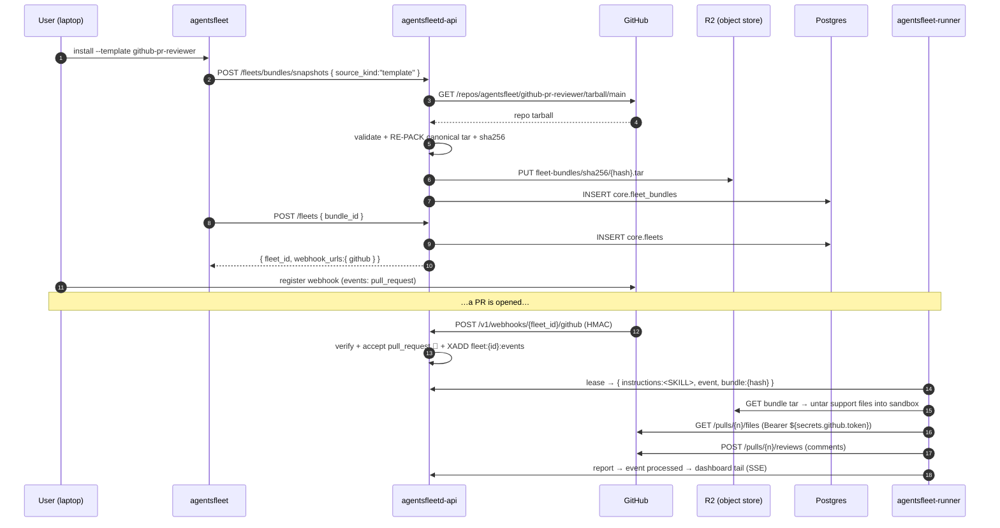

# Scenario — GitHub PR reviewer (the golden path)

> Parent: [`README.md`](./README.md) · References: [`../fleet_bundles.md`](../fleet_bundles.md) (bundle storage), [`../data_flow.md`](../data_flow.md) (trigger/execute loop), [`../billing_and_provider_keys.md`](../billing_and_provider_keys.md) (provider posture + credit gate).
>
> This is the single end-to-end walkthrough. It follows one persona — **John Doe** — installing the `github-pr-reviewer` fleet from a GitHub repo, wiring the webhook, and watching a Pull Request (PR) get reviewed. Provider posture, billing math, and the credit gate are **not** re-narrated here — those facts live in their topic docs (linked above); this scenario references them instead of duplicating them.

**Outcome under test:** from a GitHub bundle to a posted PR review comment, with GitHub never on the runtime path and the fleet running its installed `SKILL.md` against each event.

Legend: ✅ built today · 🔨 to-build.

---

## 1. Install — the bundle storage journey

John runs `agentsfleet install --template github-pr-reviewer`. Two API calls: **snapshot** (bytes land in storage) then **create** (a fleet references them).

1. **Snapshot.** `POST /v1/workspaces/{ws}/fleets/bundles/snapshots { source_kind:"template", source_ref:"github-pr-reviewer" }`. The template id maps to the repo `agentsfleet/github-pr-reviewer`. `agentsfleetd`: `GET api.github.com/repos/.../tarball/main` → **validate** (strip wrapper, reject symlinks/`..`/dotfiles, cap 16 MiB / 4096 entries) → **re-pack a NEW canonical tar** (`canonicalTar()`, root-level, deterministic — agentsfleet's own tar, not GitHub's archive) → `content_hash = sha256(skill + trigger + support files)` → `R2.put("fleet-bundles/sha256/{hash}.tar")` → `INSERT core.fleet_bundles (skill_markdown, trigger_markdown, support_files_json, content_hash, snapshot_key, requirements_json)`. Caps: **32 files · 64 KiB each · 256 KiB total**.
2. **Create.** `POST /v1/workspaces/{ws}/fleets { bundle_id, name }` → `INSERT core.fleets (source_markdown, trigger_markdown, bundle_id, bundle_content_hash)` + `XGROUP CREATE fleet:{id}:events`. Returns `{ fleet_id, webhook_urls:{ github } }`.

Full storage detail: [`../fleet_bundles.md`](../fleet_bundles.md).

## 2. Two layers: immutable Bundle vs live Fleet

| | **Bundle** (`core.fleet_bundles` + R2 tar) | **Fleet** (`core.fleets`) |
|---|---|---|
| Mutability | immutable, content-addressed | live — `SKILL.md`/`TRIGGER.md` editable via `PATCH` |
| Runtime role | source of **support files** | source of **SKILL.md/TRIGGER.md** (rides every lease) |

The runner executes the **fleet's** SKILL.md (which reflects any PATCH), not the bundle's import-time copy.

## 3. Wire the webhook, the PR fires

1. **Credentials.** `agentsfleet credential add github --data @-` with `{ "token":"ghp_…", "webhook_secret":"…" }` → vault key `fleet:github`.
2. **Register the webhook** on GitHub (Settings ▸ Webhooks, or the pre-filled `gh api …/hooks` command the dashboard renders), `events: pull_request`, `config[secret]` = the `webhook_secret`.
3. **A PR is opened.** GitHub `POST /v1/webhooks/{fleet_id}/github` with `X-Hub-Signature-256`. The receiver verifies the Hash-based Message Authentication Code (HMAC) against `fleet:github.webhook_secret`, then `XADD fleet:{id}:events`. 🔨 **Today the receiver accepts only `workflow_run`; accepting `pull_request` is the one piece of trigger plumbing this fleet needs** — until it lands, the PR event is ignored.

## 4. The run — SKILL.md drives the review

A runner leases the event (one active lease per fleet). The lease carries `instructions` (the fleet's stored `SKILL.md`, resolved fresh from `core.fleets`), the raw PR payload as the event, and `bundle:{content_hash}`. The runner pulls the support tar from R2 into the sandbox, then NullClaw runs the SKILL.md prose against the payload:

- `http_request GET api.github.com/repos/{owner}/{repo}/pulls/{n}/files` with `Authorization: Bearer ${secrets.github.token}` (substituted at the tool bridge inside the sandbox).
- forms findings, then `http_request POST …/pulls/{n}/reviews` with the comments. ✅ Comment posting rides the generic `http_request` tool — there is no native `github_review_comment` tool, by design (the integration is the bundle, not Zig).

The gate + billing path is identical to every other event — see [`../billing_and_provider_keys.md`](../billing_and_provider_keys.md) for the credit-pool deductions and the gate.

## 5. What John sees

- The PR carries the fleet's review comments.
- `agentsfleet events {id}` / the dashboard `/fleets/{id}` thread shows the run: the `http_request` tool calls and the response, streamed over Server-Sent Events (SSE), durable in `core.fleet_events`.

## 6. Built vs to-build

| Step | Status |
|---|---|
| Install bundle from GitHub → R2 + Postgres | ✅ |
| Webhook HMAC verify · queue · lease · run | ✅ |
| `SKILL.md` delivered as `instructions` per lease | ✅ |
| Read the diff + post comments via `http_request` | ✅ |
| Accept `pull_request` events (today only `workflow_run`) | 🔨 |
| Compounding memory across PRs | 🔨 (parked design) |

## 7. What is NOT in this scenario

- **Provider posture, billing math, the credit gate.** These had their own scenarios; the canonical facts now live in [`../billing_and_provider_keys.md`](../billing_and_provider_keys.md). The lease/execute/bill loop is unchanged from what that doc describes.
- **Compounding memory** across PRs — a separate, parked design.

## 8. What this scenario proves

- **One reasoning loop.** A webhook event and a manual steer enter the same lease/execute path with the same envelope; the runtime never branches on actor type.
- **GitHub is a one-time source, never a runtime dependency.** The fleet runs from the internal snapshot even if the source repo is later made private or deleted.
- **The integration is the bundle**, not native per-system code: `SKILL.md` + `http_request` + injected `${secrets.*}` do the GitHub work.
