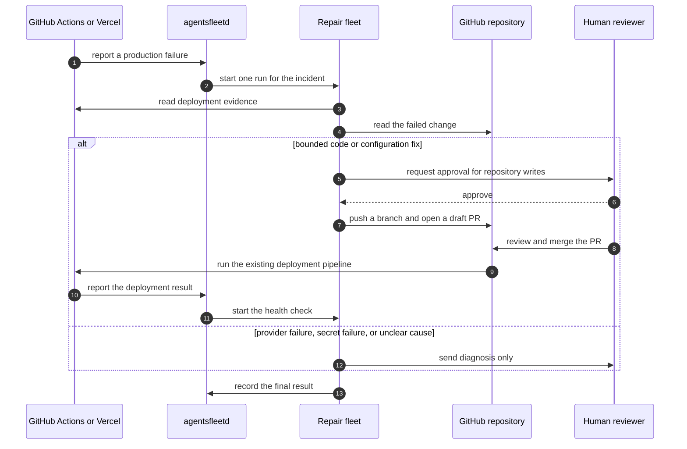

# Scenario — Production deploy repair

> Parent: [`README.md`](./README.md) · References: [`../user_flow.md`](../user_flow.md) §8.5, [`../capabilities.md`](../capabilities.md), and [`../connectors.md`](../connectors.md).

**Outcome:** a failed production deployment becomes a diagnosis or a bounded draft Pull Request (PR). A human decides whether the fix ships.

**Proof boundary:** diagnosis works today. Repository checkout, Vercel intake, draft-PR creation, and post-deployment checks are not yet proven together.

Legend: ✅ implemented and tested · 🟡 present but not proven for this flow · 🔨 not built.

## 1. Start one incident

GitHub can wake the fleet with a failed `workflow_run` event. The GitHub App route verifies the event before selecting a workspace and fleet.

GitHub retries use the existing replay guard. Repeated delivery does not create another fleet event for the same body and fleet.

A Vercel Log Drain is a target input. `agentsfleet` does not yet ship the Vercel intake needed by this scenario.

Fly.io is an evidence source in this flow. A GitHub failure, health check, or manual steer starts the run that reads Fly.io evidence.

## 2. Gather evidence

The fleet reads the failed workflow, recent code changes, and provider evidence. The fleet compares timestamps before naming a cause.

The hosted run uses workspace secrets and the credential firewall. The hosted run does not use a developer's local 1Password session.

A missing grant or secret stops the affected tool call. The activity stream keeps the failure and its stable error code.

## 3. Decide whether to change code

The fleet sends a diagnosis without code changes when the cause is unclear. The same rule applies to provider outages and secret failures.

The repair path requires an allowed repository, allowed file paths, defined checks, and human approval. A target implementation must also set file and diff limits.

Until those limits and checks exist in code, the repair path remains unproven. Documentation must not present the repair path as shipped.

## 4. Prepare the draft PR

The target runner checks out the allowed repository into its workspace. The fleet uses allow-listed file and Git tools only.

The fleet creates a branch, changes the smallest safe surface, and runs the repository checks. Failed checks stop the repair.

The fleet opens a draft PR only after the checks pass. The PR states the cause, evidence, changed files, checks, and rollback steps.

The fleet never merges the PR. The fleet never deploys production.

## 5. Verify the deployment

A human reviews and merges the PR. The repository's existing deployment pipeline handles the merge.

A deployment result starts a later verification run. The fleet links the health result to the original incident and PR.

If the deployment still fails, the fleet records the new evidence. The fleet does not roll back production without another approved action.

## 6. What exists today

| Part | Status | Evidence |
|---|---|---|
| GitHub App failure routing | ✅ | Signed GitHub events route by installation, repository, event, and approved grant. |
| GitHub replay protection | ✅ | A repeated signed body does not create another event for the same fleet. |
| HTTP evidence reads | ✅ | The runner exposes policy-bound HTTP requests with secret substitution and host controls. |
| Slack diagnosis and activity history | ✅ | The existing platform-operations flow records a result and can post the diagnosis. |
| File and Git tools | 🟡 | The runner registers these tools, but this repair path has no end-to-end proof. |
| Vercel Log Drain intake | 🔨 | No Vercel error intake is wired to a fleet. |
| Repository checkout and bounded write policy | 🔨 | The runner has no proven repair workspace with file and diff limits. |
| Draft PR creation | 🔨 | No test proves branch creation, checks, push, and draft-PR creation together. |
| Post-deployment verification | 🔨 | No test links the repaired deployment result back to the original incident. |
| Email notification | Excluded | Slack and the activity stream are the available notification surfaces. |

## 7. Test fixture boundary

`tests/fixtures/fleetbundle/platform-ops` is test input. Acceptance tests use the fixture for library upload, install, update, lifecycle, and deletion.

The API, dashboard, and Command Line Interface (CLI) do not load that directory in production. Platform libraries come from stored library entries and bundle snapshots.

The fixture is not the `github-pr-reviewer` library. The fixture also does not prove the repair path described above.
