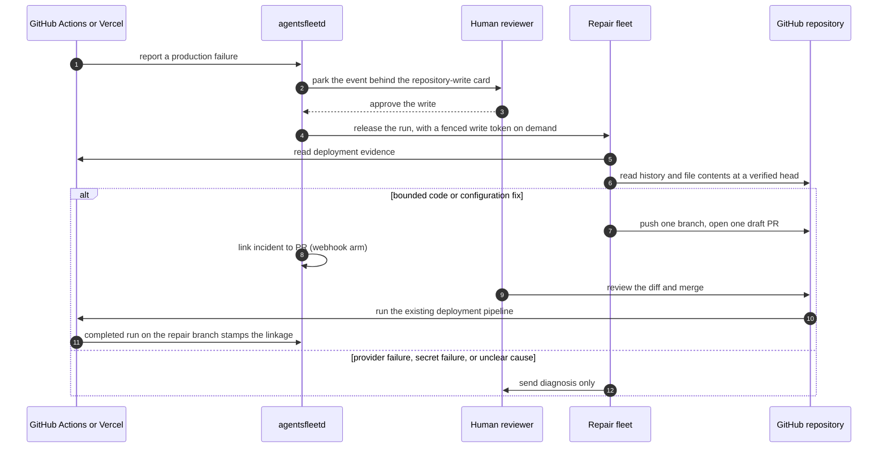

# Scenario — Production deploy repair

> Parent: [`README.md`](./README.md) · References: [`../user_flow.md`](../user_flow.md) §8.5, [`../capabilities.md`](../capabilities.md), and [`../connectors.md`](../connectors.md).

**Outcome:** a failed production deployment becomes a diagnosis or a bounded draft Pull Request (PR). A human approves the write before any run starts, and a human reviews the actual diff before it ships.

**Proof boundary:** diagnosis, the write approval gate, the fenced write mint, the repairer bundle, and the incident → PR → deploy-result linkage are implemented and tested. Vercel intake and an end-to-end acceptance run against a live repository are not yet proven together. Repository checkout is not on the path at all — the write is five API calls (§4).

Legend: ✅ implemented and tested · 🟡 present but not proven for this flow · 🔨 not built.

```mermaid
sequenceDiagram
  autonumber
  participant Provider as GitHub Actions or Vercel
  participant API as agentsfleetd
  participant Human as Human reviewer
  participant Fleet as Repair fleet
  participant GitHub as GitHub repository

  Provider->>API: report a production failure
  API->>Human: park the event behind the repository-write card
  Human-->>API: approve the write
  API->>Fleet: release the run, with a fenced write token on demand
  Fleet->>Provider: read deployment evidence
  Fleet->>GitHub: read history and file contents at a verified head
  alt bounded code or configuration fix
    Fleet->>GitHub: push one branch, open one draft PR
    API->>API: link incident to PR (webhook arm)
    Human->>GitHub: review the diff and merge
    GitHub->>Provider: run the existing deployment pipeline
    Provider->>API: completed run on the repair branch stamps the linkage
  else provider failure, secret failure, or unclear cause
    Fleet->>Human: send diagnosis only
  end
```

## 1. Start one incident

GitHub wakes the repair fleet with a failed `workflow_run` event over the signed per-fleet webhook; a human can also steer an incident to it directly. GitHub retries use the existing replay guard — repeated delivery does not create another fleet event for the same body and fleet.

The responder keeps the scheduled sweeps, and the repairer takes the concrete incidents: the two members' triggers are disjoint by construction, so which one handles an event is wiring, never judgment.

A Vercel Log Drain is a target input. `agentsfleet` does not yet ship the Vercel intake needed by this scenario.

## 2. The human answers before the run starts

A fleet whose repository binding declares WRITE access parks **every** first-encounter event at the approval gate — before gate rules are consulted, and even when no gates are configured. Gate rules cannot hold this boundary: they ride the fleet's own config, editable under the same scope that wakes the fleet, and their no-match fallthrough is auto-approve. The kind check lives in the daemon instead.

The card states the daemon's own facts first: the repository the token will reach, the access level, and the blast radius — at most one branch and one draft PR. The gate resolves between runs; approval releases the lease, and the park records the stated binding durably on the gate row.

## 3. Gather evidence, decide whether to change code

The released run reads the failed workflow, recent code changes, provider telemetry, and — this is what makes a fix authorable — the current file contents at a branch head it verified this run. The hosted run uses workspace secrets and the credential firewall; a missing grant or secret stops the affected tool call.

The fleet sends a diagnosis without code changes when the cause is unclear, and always for provider outages and data-shaped incidents. The repair is a **forward fix**: the fleet authors the next change against the head it verified — corrected code, or new files. It never proposes rewinding history.

## 4. The fleet ships the draft PR

The write is five API calls over the same `http_request` tool that does the reading — blobs, tree, commit, ref, then the draft PR. No checkout, no git tooling, no shell.

What bounds it is the credential, not the prose:

- The write-scoped token mints only against an **approved repository-write gate for this lease's event** whose recorded binding still matches the fleet's current one — a config edit between the human's answer and the mint refuses as drift (`UZ-REPAIR-011`).
- The token carries `contents: write` + `pull_requests: write` for exactly the bound repository, expires in an hour, and never carries a `workflows` permission — GitHub itself refuses a push into `.github/workflows/`.
- The mint verifies the token GitHub returned: its stated repositories AND its stated permissions must match what was requested; unknown reach refuses.

The branch name derives from the incident event id (`agentsfleet-repair/<event id>`), so a replayed run finds the ref taken and reports a duplicate rather than pushing twice. The webhook arm links the opened PR back to its incident in the same table an operator reads — and repair-branch traffic never re-enters the event stream, so the crew cannot be woken by its own output.

The human's byte-level approval happens where bytes are best reviewed: on the PR diff itself, with the repository's own continuous integration reporting beside it. The daemon never merges. The daemon never deploys production.

## 5. Verify the deployment

A human reviews and merges the PR. The repository's existing deployment pipeline handles the merge.

A completed workflow run on the repair branch stamps the linkage row (`pending` → `deploy_ok` / `deploy_failed`), so "did the fix work" is a column, not a model run. A richer post-deploy verification member is deliberately deferred: the linkage carries the signal until the crew regrows.

If the deployment still fails, the record says so. Undoing anything is a fresh forward fix through the same approval gate.

## 6. What exists today

| Part | Status | Evidence |
|---|---|---|
| GitHub App failure routing | ✅ | Signed GitHub events route by installation, repository, event, and approved grant. |
| GitHub replay protection | ✅ | A repeated signed body does not create another event for the same fleet. |
| Write-kind approval park | ✅ | A write-access fleet parks with no gates config and past the rule fallthrough; approval releases the owned lease. |
| Fenced write mint | ✅ | Refuses without the approved gate row, on binding drift, and on a token whose stated permissions exceed the request. |
| Repairer bundle | ✅ | Read-verify-author-push discipline, driven through the real mint by the crew tests; two-member crew onboards through the shipped library endpoint. |
| Incident → PR → deploy linkage | ✅ | The webhook arms insert and stamp the slot-830 row; repair-branch traffic never wakes the fleet. |
| HTTP evidence reads | ✅ | The runner exposes policy-bound HTTP requests with secret substitution and host controls. |
| Slack diagnosis and activity history | ✅ | The existing platform-operations flow records a result and can post the diagnosis. |
| File and Git tools | 🟡 | The runner registers these tools. This repair path does not use them — the write is five API calls (§4). |
| Vercel Log Drain intake | 🔨 | No Vercel error intake is wired to a fleet. |
| Live-repository acceptance run | 🔨 | No test drives a real GitHub repository end to end; the wire-level path is integration-proven. |
| Post-deploy verification member | 🔨 | Deferred; the linkage row carries the deploy signal until the crew regrows. |
| Email notification | Excluded | Slack and the activity stream are the available notification surfaces. |

## 7. Test fixture boundary

`tests/fixtures/fleetbundle/platform-ops` is test input. Acceptance tests use the fixture for library upload, install, update, lifecycle, and deletion.

The API, dashboard, and Command Line Interface (CLI) do not load that directory in production. Platform libraries come from stored library entries and bundle snapshots.

The shipped crew lives in `library/` — `incident-responder` (reads, diagnoses) and `incident-repairer` (reads, ships the draft PR) — and installs through the same library endpoints as any bundle, one upload per member.
