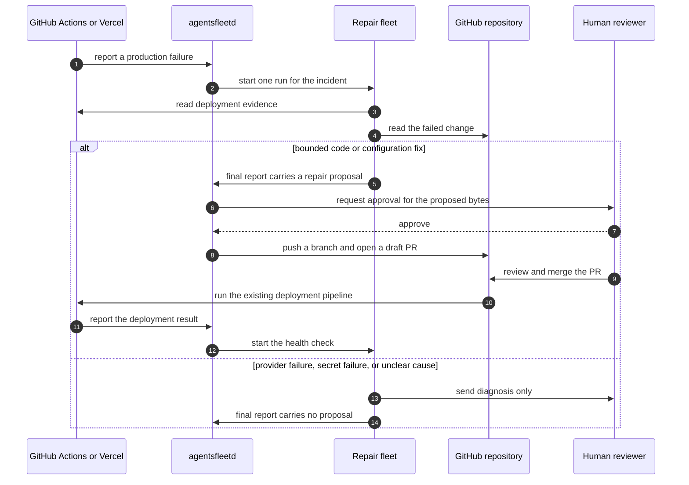

# Scenario — Production deploy repair

> Parent: [`README.md`](./README.md) · References: [`../user_flow.md`](../user_flow.md) §8.5, [`../capabilities.md`](../capabilities.md), and [`../connectors.md`](../connectors.md).

**Outcome:** a failed production deployment becomes a diagnosis or a bounded draft Pull Request (PR). A human decides whether the fix ships.

**Proof boundary:** diagnosis works today. Vercel intake, draft-PR creation, and post-deployment checks are not yet proven together. Repository checkout is no longer on the path at all — see §4.

Legend: ✅ implemented and tested · 🟡 present but not proven for this flow · 🔨 not built.

```mermaid
sequenceDiagram
  autonumber
  participant Provider as GitHub Actions or Vercel
  participant API as agentsfleetd
  participant Fleet as Repair fleet
  participant GitHub as GitHub repository
  participant Human as Human reviewer

  Provider->>API: report a production failure
  API->>Fleet: start one run for the incident
  Fleet->>Provider: read deployment evidence
  Fleet->>GitHub: read the failed change
  alt bounded code or configuration fix
    Fleet->>API: final report carries a repair proposal
    API->>Human: request approval for the proposed bytes
    Human-->>API: approve
    API->>GitHub: push a branch and open a draft PR
    Human->>GitHub: review and merge the PR
    GitHub->>Provider: run the existing deployment pipeline
    Provider->>API: report the deployment result
    API->>Fleet: start the health check
  else provider failure, secret failure, or unclear cause
    Fleet->>Human: send diagnosis only
    Fleet->>API: final report carries no proposal
  end
```

## 1. Start one incident

GitHub can wake the fleet with a failed `workflow_run` event. The GitHub App route verifies the event before selecting a workspace and fleet.

GitHub retries use the existing replay guard. Repeated delivery does not create another fleet event for the same body and fleet.

A Vercel Log Drain is a target input. `agentsfleet` does not yet ship the Vercel intake needed by this scenario.

Fly.io is an evidence source in this flow. A GitHub failure, health check, or manual steer starts the run that reads Fly.io evidence.

## 2. Gather evidence

The fleet reads the failed workflow, recent code changes, and provider evidence. The fleet compares timestamps before naming a cause.

The hosted run uses workspace secrets and the credential firewall. The hosted run does not use a developer's local 1Password session.

A missing grant or secret stops the affected tool call. The activity stream keeps the failure and its stable error code.

## 3. Decide whether to change code

The fleet sends a diagnosis without code changes when the cause is unclear. The same rule applies to provider outages and secret failures.

The repair path requires an allowed repository, allowed file paths, file and diff limits, and human approval.

The repair is a forward fix. The fleet describes the next change that fixes the incident — corrected code, or new files — against the branch head it verified during the run. It never proposes rolling history back.

Those limits are design, not code. An earlier proposal kernel validated file count, path shapes, and diff size at report time and re-checked them at apply time; it was retired unused. Rebuilding it is the write half's first piece, and documentation must not present the repair path as shipped.

## 4. Prepare the draft PR

The fleet does not write. It ends its run with a **repair proposal**: the repository, the base commit it read, the files it may touch, the diff, the cause, and the evidence. The daemon validates that proposal, stores it immutably, content-addresses it, and parks it behind the existing approval gate.

This is a deliberate departure from an earlier shape in which the runner checked out the repository and opened the PR itself, and it follows from where approval actually binds. The approval gate resolves at `lease` — between runs, not inside one. A fleet cannot pause mid-reasoning to await a human, so an approval granted during a run would be an approval of intentions, and a second model run would then decide what to write. Approving the bytes instead removes that gap.

On approval the daemon applies the proposal deterministically. No model runs. It recomputes the content hash and refuses on any mismatch, re-checks base freshness and bounds, mints a short-lived GitHub App installation token, creates a branch named from the proposal identifier, applies exactly the approved bytes, and opens a draft PR stating cause, evidence, changed files, and rollback steps.

Because the branch name derives from the proposal identifier, a replayed approval finds the branch already there and refuses as a duplicate rather than opening a second PR. Every refusal — stale base, bounds exceeded, duplicate, upstream failure — carries a `UZ-REPAIR-*` code to Slack and the activity stream, and retries nothing silently.

There is no repository checkout on this path, so the runner's file and Git tools play no part in the write. Repository checks run on the draft PR through the repository's own continuous integration, which is where code review already lives.

The daemon never merges the PR. The daemon never deploys production.

## 5. Verify the deployment

A human reviews and merges the PR. The repository's existing deployment pipeline handles the merge.

A deployment result starts a later verification run. The fleet links the health result to the original incident and PR.

If the deployment still fails, the fleet records the new evidence. The fleet does not roll back production without another approved action.

## 6. What exists today

| Part | Status | Evidence |
|---|---|---|
| GitHub App failure routing | ✅ | Signed GitHub events route by installation, repository, event, and approved grant. |
| GitHub replay protection | ✅ | A repeated signed body does not create another event for the same fleet. |
| HTTP evidence reads | ✅ | The runner exposes policy-bound HTTP requests with secret substitution and host controls. |
| Slack diagnosis and activity history | ✅ | The existing platform-operations flow records a result and can post the diagnosis. |
| File and Git tools | 🟡 | The runner registers these tools. This repair path does not use them — the write is daemon-side (§4). |
| Vercel Log Drain intake | 🔨 | No Vercel error intake is wired to a fleet. |
| Proposal validation, content hash, and bounds | 🔨 | An earlier kernel proved hash canonicality, path safety, and allowlist enforcement, then was retired unused. Nothing validates, hashes, or stores a proposal today. |
| Proposal record and approval parking | 🔨 | Nothing persists a proposal or requests approval for one. |
| Draft PR creation | 🔨 | No test proves token minting, branch creation, push, and draft-PR creation together. |
| Post-deployment verification | 🔨 | No test links the repaired deployment result back to the original incident. |
| Email notification | Excluded | Slack and the activity stream are the available notification surfaces. |

## 7. Test fixture boundary

`tests/fixtures/fleetbundle/platform-ops` is test input. Acceptance tests use the fixture for library upload, install, update, lifecycle, and deletion.

The API, dashboard, and Command Line Interface (CLI) do not load that directory in production. Platform libraries come from stored library entries and bundle snapshots.

The fixture is not the `github-pr-reviewer` library. The fixture also does not prove the repair path described above.
