<!--
SPEC AUTHORING RULES (load-bearing — the one comment that survives):
- Body order = the executing agent's read order. Fill via the kishore-spec-new
  skill (authoring order lives there); after filling, DELETE every "tpl:"
  guidance comment — the SPEC TEMPLATE GATE blocks tpl residue, unfilled
  {slots}, and missing required sections (audits/spec-template.sh --staged).
- No time/effort/hour/day estimates anywhere. No effort columns, complexity
  ratings, percentage-complete, implementation dates, assigned owners.
- Priority (P0/P1/P2/P3) is the only sizing signal; Dependencies are the only
  sequencing signal. A section that contradicts these rules loses — delete it.
-->

# M139_001: Owner-safe deadlines share one monotonic scheduler

**Prototype:** v2.0.0
**Milestone:** M139
**Workstream:** 001
**Date:** Jul 22, 2026
**Status:** DONE
**Priority:** P1 — reliability and bounded resource use across every daemon and runner outbound call
**Categories:** API, INFRA
**Batch:** B2 — begins by explicit Indy direction; independent of M133 acceptance
**Branch:** feat/m139-deadline-scheduler
**Test Baseline:** unit=2814 integration=376
**Depends on:** None — Indy explicitly removed M133 acceptance as a prerequisite for this workstream
**Provenance:** LLM-drafted (gpt-5.4, Jul 22, 2026) from Indy's approved follow-up to the M133 deadline-watchdog review
**Canonical architecture:** `docs/architecture/concurrency.md` §Thread map, §Lock-invariant registry, and §Shutdown choreography

---

## Overview

**Goal (testable):** Every migrated HTTP and Redis operation is bounded by a monotonic deadline whose cancellation can affect only the owning transport generation, while each process uses one scheduler worker regardless of concurrent call count and shuts it down without races or leaks.
**Problem:** The shared `call_deadline` watchdog currently stores a raw descriptor, reads wall time, polls from one lazy thread per watchdog instance, and can add a polling slice to teardown. Request-scoped callers may create and join a worker per call. A raw integer descriptor cannot prove that it still names the connection that armed it after descriptor reuse, and Redis dial, Transport Layer Security (TLS), authentication, reconnect, and resubscribe are not uniformly bounded. M133's hub is adequate for its current shape—one reusable watchdog, no watchdog work on fan-out, and the wire lock pins connection lifetime while armed—but that local lock proof does not make raw-descriptor cancellation a safe platform interface.
**Solution summary:** Replace per-instance polling watchdogs with one explicitly injected, process-owned monotonic scheduler backed by an earliest-deadline queue and a wakeable timed wait. Arming returns a guard; finishing the guard is a quiescence barrier for exactly that registration. Registrations target stable owner control blocks carrying operation identity and connection generation, so a stale deadline cannot shut down a recycled descriptor, moved value, or successor connection. HTTP uses an owner-validated pin/fetch lease; Redis creates its attempt control before resolution/dial and carries one absolute budget through TLS/auth/subscribe. Extend this boundary across every caller, then remove or privatize public raw-socket shutdown. This is distinct from the completed M133 test fix: the test-only server-wide `CLIENT KILL TYPE pubsub` command is already gone, tests now disconnect only their own hub socket, and production never issued that Redis command.

## PR Intent & comprehension handshake

- **PR title (eventual):** refactor(deadlines): add owner-safe process scheduler
- **Intent (one sentence):** Hung network work is cancelled by its owning connection only, with one bounded scheduler worker per process instead of one watchdog worker per caller.
- **Handshake** — replace descriptor-based per-instance watchdogs with one injected monotonic scheduler whose guards quiesce callbacks and whose targets can interrupt only the connection generation that armed them. `ASSUMPTIONS I'M MAKING: 1. Section 1 lands the scheduler beside the existing watchdog; callers migrate before the watchdog is removed in Section 4. 2. Zig's boot clock is the production monotonic source; wall time never participates in deadline ordering, and machine suspension counts against a network deadline where the operating system supports it. 3. Guards identify heap-stable registrations by scheduler-issued identity, so copied guards fail harmlessly after the first finish. 4. std.Treap supplies ordered minimum lookup and direct-node removal without a hand-written queue.`

## Timing picture

Wall time answers “what calendar time is it?” and may jump forward or backward. Monotonic time answers “how much time has elapsed?” and never moves backward. A 30-second network deadline is therefore stored as `boot_now + 30 seconds`; changing the calendar clock has no path into its ordering or expiry.



## Implementing agent — read these first

1. `src/lib/call_deadline/call_deadline.zig` — current wall-clock, polling, raw-descriptor mechanism and its fail-closed behavior.
2. `src/lib/http_pin/http_pin.zig` — current HTTP pool pinning assumptions and the descriptor-reuse race its module comment already names.
3. `src/agentsfleetd/queue/redis_subscriber.zig` and `redis_transport.zig` — Redis dial/TLS/auth/send/read ownership where interrupt and generation validation belong.
4. `src/agentsfleetd/events/subscription_hub.zig` and `subscription_hub_reader.zig` — long-lived wire ownership, reconnect/resubscribe, and M133's current lock-pinned deadline usage.
5. `docs/architecture/concurrency.md` — canonical worker, lock, ownership, and stop→join→deinit rules this milestone must update.

## Files Changed (blast radius)

| File | Action | Why |
|------|--------|-----|
| `src/lib/call_deadline/call_deadline.zig` | EDIT | Replace per-instance wall-clock polling watchdogs with the process-owned monotonic scheduler, generation-bound targets, guards, and lifecycle tests. |
| `src/lib/call_deadline/scheduler.zig` | CREATE | Own the single scheduler worker, guard lifecycle, registration identity, monotonic backend, and quiescence barriers. |
| `src/lib/call_deadline/scheduler_test.zig` | CREATE | Prove preemption, lifecycle validation, quiescence, concurrency cardinality, and bounded queue work through injected timing seams. |
| `diagrams/deadline-scheduler-flow.mmd` | CREATE | Keep the scheduler timing and ownership flow editable as Mermaid source. |
| `diagrams/deadline-scheduler-flow.excalidraw` | CREATE | Provide an editable visual scene for architecture review. |
| `diagrams/deadline-scheduler-flow.svg` | CREATE | Embed the scheduler flow in this specification without raster loss. |
| `diagrams/deadline-scheduler-flow.png` | CREATE | Provide a chat and issue-friendly rendered diagram. |
| `src/lib/common/sync.zig` | EDIT if needed | Supply the wakeable timed wait required to preempt a later scheduled wake when an earlier deadline is armed. |
| `src/lib/http_pin/http_pin.zig` | EDIT | Return an owner-validating HTTP interruption target instead of exposing a bare pooled socket descriptor. |
| `src/lib/http_pin/http_pin_test.zig` | EDIT | Prove stale pins and descriptor reuse cannot interrupt a successor HTTP connection. |
| `src/runner/daemon/control_plane_client.zig` | EDIT | Migrate the persistent runner client to scheduler guards and transport-owned interruption. |
| `src/runner/daemon/control_plane_client_test.zig` | EDIT | Preserve bounded verbs and prove teardown and reconnect safety. |
| `src/runner/daemon/loop.zig` | EDIT | Inject the runner process scheduler into persistent control-plane client construction. |
| `src/runner/daemon/worker_pool.zig` | EDIT | Carry the root-owned scheduler to worker client construction without creating worker-owned schedulers. |
| `src/runner/cmd/status.zig` | EDIT | Inject the scheduler into the command's control-plane client. |
| `src/runner/cmd/doctor.zig` | EDIT | Inject the scheduler into the diagnostic control-plane client. |
| `src/runner/credential_mint_e2e_test.zig` | EDIT | Update direct runner-client construction and preserve credential-mint coverage. |
| `src/runner/daemon/forwarders_test.zig` | EDIT | Update direct runner-client construction in forwarding tests. |
| `src/runner/daemon/loop_test.zig` | EDIT | Update loop fixtures and prove one scheduler is shared across workers. |
| `src/agentsfleetd/http/handlers/connectors/bounded_fetch.zig` | EDIT | Make the shared connector fetch boundary use the process scheduler without caller-owned watchdog threads. |
| `src/agentsfleetd/http/handlers/connectors/oauth2.zig` | EDIT | Remove request-scoped watchdog ownership from token exchange. |
| `src/agentsfleetd/http/handlers/connectors/github/ownership.zig` | EDIT | Remove request-scoped watchdog ownership from installation verification. |
| `src/agentsfleetd/http/handlers/connectors/jira/callback.zig` | EDIT | Remove request-scoped watchdog ownership from resource resolution. |
| `src/agentsfleetd/http/handlers/connectors/slack/thread.zig` | EDIT | Remove request-scoped watchdog ownership from thread re-read. |
| `src/agentsfleetd/http/handlers/connectors/slack/post.zig` | EDIT | Accept the shared scheduling boundary for outbound posts. |
| `src/agentsfleetd/http/handlers/connectors/outbound/worker.zig` | EDIT | Remove its dedicated watchdog and use process-owned scheduling. |
| `src/agentsfleetd/http/handlers/connectors/slack/outbound_integration_test.zig` | EDIT | Remove direct watchdog construction and prove outbound delivery through the shared scheduler. |
| `src/agentsfleetd/credentials/serve_broker.zig` | EDIT | Replace the per-call watchdog with an owner-safe scheduled HTTP interruption. |
| `src/agentsfleetd/credentials/serve_broker_test.zig` | EDIT | Preserve broker timeout classification and prove no per-call worker remains. |
| `src/agentsfleetd/cron/QStashClient.zig` | EDIT | Replace the per-call watchdog with an owner-safe scheduled HTTP interruption. |
| `src/agentsfleetd/cron/qstash_client_test.zig` | EDIT | Preserve QStash fail-closed timeout behavior and owner safety. |
| `src/agentsfleetd/queue/redis_transport.zig` | EDIT | Own interrupt state and validate connection generation before touching its socket. |
| `src/agentsfleetd/queue/redis_subscriber.zig` | EDIT | Bound dial/TLS/auth/subscribe operations and expose subscriber-owned interruption rather than `socketHandle`. |
| `src/agentsfleetd/queue/redis_subscriber_test.zig` | EDIT | Cover handshake timeout, stale-generation cancellation, reconnect, and shutdown races. |
| `src/agentsfleetd/events/subscription_hub.zig` | EDIT | Migrate normal SUBSCRIBE/UNSUBSCRIBE sends and the targeted test disconnect to subscriber-owned interruption. |
| `src/agentsfleetd/events/subscription_hub_reader.zig` | EDIT | Bound Redis reconnect and every resubscribe send with owner-safe guards. |
| `src/agentsfleetd/events/subscription_hub_test.zig` | EDIT | Prove reconnect, descriptor reuse, concurrent send/read, and bounded stop behavior. |
| `src/agentsfleetd/cmd/serve.zig` | EDIT | Own exactly one daemon scheduler and place its shutdown in process lifecycle order. |
| `src/runner/main.zig` | EDIT | Own exactly one runner scheduler and place its shutdown in process lifecycle order. |
| `docs/architecture/concurrency.md` | EDIT | Replace the per-call watchdog thread entry with the process scheduler, ownership invariant, and stop ordering. |
| `src/lib/call_deadline/InterruptTarget.zig` | CREATE | Type-erased owner-mediated interrupt handle — the target type the scheduler stores instead of a descriptor. |
| `src/lib/call_deadline/InterruptTarget_test.zig` | CREATE | Prove a target exposes a generation and no descriptor. |
| `src/lib/call_deadline/SocketOwner.zig` | CREATE | Generation-guarded socket control block: begin/attach/end attempt, owner-locked interrupt, private shutdown. |
| `src/lib/call_deadline/SocketOwner_test.zig` | CREATE | Generation decision proofs plus the real-descriptor reuse integration proof (2.1–2.3). |
| `src/lib/call_deadline/migration_audit_test.zig` | CREATE | Source audit for 4.1 and the metrics row: no watchdog type, no raw-fd surface, redacted structured events. |
| `src/agentsfleetd/cmd/serve_deadline.zig` | CREATE | Daemon-root ownership of the one process scheduler (backend + scheduler in one stable value). |
| `src/agentsfleetd/cmd/serve_background.zig` | EDIT | Thread the root scheduler through background-stack construction. |
| `src/agentsfleetd/events/subscription_hub_wire.zig` | CREATE | Bounded connection setup and bounded wire writes for the hub (RULE FLL split from `subscription_hub.zig`). |
| `src/agentsfleetd/http/handlers/common.zig` | EDIT | Carry the scheduler on the daemon request context. |
| `src/agentsfleetd/http/handlers/connectors/callback.zig` | EDIT | Watchdog-removal fan-out at the shared connector callback boundary. |
| `src/agentsfleetd/http/handlers/connectors/github/callback.zig` | EDIT | Watchdog-removal fan-out for the GitHub callback. |
| `src/agentsfleetd/http/handlers/connectors/slack/events.zig` | EDIT | Watchdog-removal fan-out for Slack event ingress. |
| `src/agentsfleetd/http/handlers/fleets/cron_sync.zig` | EDIT | QStash client construction takes the process scheduler. |
| `src/agentsfleetd/http/handlers/schedules/api.zig` | EDIT | QStash client construction takes the process scheduler. |
| `src/agentsfleetd/http/test_harness.zig` | EDIT | Harness `Context` carries a started test scheduler (one of the three Context construction sites). |
| `src/agentsfleetd/http/test_harness_test.zig` | EDIT | Cover the harness's scheduler ownership. |
| `src/agentsfleetd/http/handlers/cross_workspace_idor_test.zig` | EDIT | The third Context construction site gains the scheduler. |
| `src/runner/cmd/registry.zig` | EDIT | Operator-command dispatch hands the root scheduler to every handler. |
| `src/runner/daemon/runner_deadline.zig` | CREATE | Runner-root ownership of the one process scheduler, twin of `cmd/serve_deadline.zig`. |
| `src/runner/daemon/control_plane_deadline.zig` | CREATE | Stack-local armed-attempt lifecycle for the runner client (RULE FLL split from `control_plane_client.zig`). |
| `src/runner/daemon/control_plane_deadline_test.zig` | CREATE | Fail-closed arming, generation-scoped fire, idempotent release. |
| `src/runner/daemon/deadline_test_support.zig` | CREATE | Shared test fixture owning a started scheduler the way the runner root does. |
| `src/runner/daemon/worker_pool_test.zig` | EDIT | Pool fixtures borrow one scheduler across workers. |

## Applicable Rules

- **`docs/greptile-learnings/RULES.md`** — OWN, ECL, TIM, XCC, NDC, NLR, ORP, TST, TNM, ZIG, and OBS: one connection owner, distinct timeout outcomes, explicit timing/lifecycle invariants, complete migration, descriptive discovered tests, and observable retries/failures.
- **`dispatch/write_zig.md`** — concurrency, deterministic resource budget, allocator choice, public surface, panic/hang, and cross-compile requirements apply to the scheduler worker, queue, guards, and transport interruption APIs.
- **`docs/LIFECYCLE_PATTERNS.md`** — scheduler/target init, partial-init unwind, idempotent shutdown, and stop→join→deinit ordering.
- **`docs/LOGGING_STANDARD.md`** — deadline, stale-target refusal, retry, and scheduler-unavailable events remain structured and free of credentials.

## Applicable Gates

| Gate | Fires? | Satisfaction strategy |
|------|--------|-----------------------|
| ZIG GATE | yes — shared Zig runtime changes | Run lint, all affected test graphs, and both Linux cross-target builds. |
| PUB / Struct-Shape | yes — scheduler, guard, and interrupt surfaces change | Keep raw descriptors private; each public symbol has an external consumer and ownership documentation. |
| File & Function Length (≤350/≤50/≤70) | yes — shared modules are touched | Split scheduler queue mechanics only if the existing module would exceed the enforced cap. |
| UFS (repeated/semantic literals) | yes — timeout and event names are shared | Reuse named deadline constants and structured event constants. |
| UI Substitution / DESIGN TOKEN | no — no UI files | N/A. |
| LOGGING / LIFECYCLE / ERROR REGISTRY / SCHEMA | yes — logging and lifecycle; no schema | Preserve existing error classifications; add registry entries only if a new externally surfaced error exists; prove stop→join→deinit. |

## Prior-Art / Reference Implementations

- **Reference:** Zig `std.Treap`, Bun `src/runtime/timer/Timer.zig`, Bun `src/threading/Futex.zig`, Ghostty `src/Surface.zig`, and `src/lib/common/sync.zig` — use a standard intrusive ordered tree, one absolute monotonic deadline across spurious wakes, and stop → wake → join → deinit ordering.
- **Reference:** `src/agentsfleetd/events/subscription_hub.zig` — preserve its one-wire-owner and no-map-lock-during-I/O invariants while moving interruption authority into the subscriber transport.

## Sections (implementation slices)

### §1 — One monotonic scheduler owns deadline timing

Each process root owns and explicitly injects one scheduler worker and an earliest-deadline queue. Deadline arithmetic uses an injectable monotonic clock/wait backend. An idle worker blocks without polling, and arming a new earliest deadline preempts its current wait. `Guard.finish()` is a quiescence barrier: after it returns, that target callback is neither running nor eligible to run, so its owner may move or free transport state. `Scheduler.stop()` rejects new arms, interrupts and drains pending registrations rather than merely abandoning blocked operations, and waits for in-flight callbacks; network users then join and finish guards before owner deinit, followed by scheduler storage deinit. **Implementation default:** a copy-tolerant identity handle lets the first finish consume the registration and makes later copies harmless. Every thread capable of calling arm, finish, or stop is joined before exclusive scheduler deinit begins.

- **Dimension 1.1 — DONE** — deadlines fire in monotonic order, a newly earlier arm wakes the worker, and wall-clock changes cannot advance or delay them → Test `test_scheduler_preempts_wait_with_monotonic_deadline_order`
- **Dimension 1.2 — DONE** — double finish and arm-after-stop are rejected or harmless according to one explicit guard state model → Test `test_deadline_guard_validates_lifecycle`
- **Dimension 1.3 — DONE** — finish/stop racing fire invokes the target at most once and both barriers return only after any callback quiesces → Test `test_deadline_finish_and_stop_are_quiescence_barriers`

### §2 — Cancellation belongs to a transport generation

The scheduler stores no actionable raw descriptor and never points at a movable `Subscriber`/`Transport` value. A stable operation control block outlives its guard and carries process-unique operation identity plus non-repeating connection generation; the owner validates both before touching its current socket. For HTTP, the exclusive client owner creates a unique pin/fetch lease, validates it under the owner lock during interruption, invalidates it at completion, and finishes the guard before another pin/fetch window. For Redis, the attempt control exists before connection setup and owns any socket as soon as one exists; a fresh subscriber cannot move into the hub until its setup guard is quiescent. **Implementation default:** stale interruption is a no-op outcome visible to tests and debug logs, not an attempt against the owner's current socket.

- **Dimension 2.1 — DONE** — a live registration interrupts only the exact HTTP or Redis connection generation that armed it → Test `test_interrupt_targets_exact_connection_generation`
- **Dimension 2.2 — DONE** — descriptor-number reuse followed by a stale deadline leaves the successor connection usable → Test `test_stale_deadline_cannot_interrupt_reused_descriptor`
- **Dimension 2.3 — DONE** — owner teardown racing scheduler fire waits for callback quiescence, then completes without use-after-free, double close, or leaked registration → Test `test_interrupt_owner_teardown_waits_for_quiescence`

### §3 — The complete Redis subscriber lifecycle is bounded

Redis name resolution/dial, TLS, authentication, initial subscribe, reconnect, and every resubscribe send use the shared scheduler. DNS is included in the dial budget: setup uses a cancellable resolver/dial seam with deterministic injection tests and never abandons an unjoinable helper after timeout. Each attempt receives one absolute monotonic budget across all setup stages rather than resetting the full allowance at each stage. Resubscribe checks stop between sends so a channel sweep cannot multiply shutdown latency by channel count. Timeout errors remain distinct from authentication and transport failures; reconnect retries remain stop-aware. Existing hub fan-out and map/wire lock ordering do not change.

- **Dimension 3.1 — DONE** — deterministic stalls in Redis dial/TLS/auth/initial subscribe return their classified timeout within the configured bound → Test `test_redis_handshake_stages_are_deadline_bounded`
- **Dimension 3.2 — DONE** — a stalled reconnect or resubscribe is interrupted, retried, and remains promptly stoppable → Test `test_redis_reconnect_and_resubscribe_are_bounded`
- **Dimension 3.3 — DONE** — normal hub sends retain first/last-subscriber behavior and recover after an owner-targeted interruption → Test `test_hub_send_deadline_preserves_recovery`

### §4 — Every caller migrates and resource use stays bounded

HTTP connector, credential-broker, QStash, runner, and Redis hub callers use guards from their process scheduler. Per-instance watchdog workers disappear, and public raw socket shutdown is removed or made private after the final migration. Scheduler tests use high concurrency and deterministic counters rather than timing-only performance claims.

- **Dimension 4.1 — DONE** — production source has no per-instance watchdog type, public raw socket shutdown, `socketHandle` deadline seam, or caller-owned descriptor arm → Test `test_deadline_migration_has_no_raw_fd_surface`
- **Dimension 4.2 — DONE** — at least 100 concurrent registrations use one scheduler worker, preserve earliest-first firing, and use direct-node `std.Treap` insertion/removal without a linear registration scan → Test `test_scheduler_concurrency_has_one_worker_and_bounded_queue_work`
- **Dimension 4.3 — DONE** — process shutdown with pending, firing, and cancelled registrations joins the scheduler within the test bound and leaks no memory or threads → Test `test_scheduler_shutdown_is_bounded_and_leak_free`

## Interfaces

```text
Scheduler.arm(target: InterruptTarget, timeout) -> ArmError!Guard
Guard.finish() -> FinishOutcome
Transport.interrupt(expected_generation) -> InterruptOutcome
Subscriber.interrupt(expected_generation) -> InterruptOutcome

Process roots explicitly pass *Scheduler to every network owner; there is no
hidden global scheduler. InterruptTarget points to a stable operation control
block and identifies one non-repeating owner/connection generation. It never
exposes a socket descriptor. Its interrupt method is a bounded, nonblocking,
non-reentrant leaf operation and never calls scheduler barriers. Guard.finish
and Scheduler.stop wait for selected callbacks to quiesce before their
owner/control-block storage may be freed.
```

## Failure Modes

| Mode | Cause | Handling (system response + what the caller observes) |
|------|-------|--------------------------------------------------------|
| Scheduler unavailable | process scheduler failed to initialize or is stopping | Refuse the network operation fail-closed; emit the existing bounded-call failure class. |
| Stale registration | connection was replaced before its deadline fired | Owner returns `stale`; successor connection is untouched. |
| Finish/fire race | operation completes as scheduler selects the registration | Exactly one outcome wins; no later interrupt reaches owner state. |
| Redis handshake stall | dial, TLS, auth, or subscribe stops making progress | Owner-safe interruption releases the caller with a classified timeout. |
| Reconnect stall | Redis reconnect or resubscribe blocks during hub recovery | Interrupt, log, and retry while stop remains promptly observable. |
| Shutdown with pending work | process exits while deadlines remain armed | Stop admission, interrupt/drain pending work, quiesce callbacks, join network users, free transports, then deinit scheduler storage. |
| Queue pressure | many concurrent operations arm deadlines | One worker and bounded queue operations; no thread-per-call or polling fan-out. |

## Invariants

1. A scheduler registration cannot directly access a raw descriptor — the target type exposes only owner-mediated generation validation.
2. A process-unique operation identity and non-repeating connection generation exist in stable storage before setup begins; replacement advances identity before becoming interruptible — runtime assertions and descriptor-reuse tests enforce ordering.
3. Each process constructs at most one production scheduler worker — root ownership plus the concurrency test enforces cardinality.
4. Guard finish and scheduler stop are quiescence barriers; owners finish guards before move/free, while process shutdown drains network users before scheduler storage — lifecycle ordering and race tests enforce it.
5. Timeout, authentication, retryable transport, and scheduler-unavailable outcomes remain distinct — exhaustive result handling and negative tests enforce classification.

## Metrics & Observability

| Metric / event | Owner | Fires when | Properties allowed | Privacy guard | Test proof |
|----------------|-------|------------|--------------------|---------------|------------|
| existing deadline/retry events | ops | a deadline fires, a stale target is refused, scheduler setup fails, or Redis recovery retries | operation class, transport kind, generation relation, outcome, duration | no URL credentials, tokens, Redis password, payload, or raw descriptor | `test_deadline_events_are_structured_and_redacted` |

**Signal routing:** the shared scheduler core emits standard logfmt mechanism events in every process: worker-start failure at `err`, plus arm rejection, fire, and stop/drain detail at `debug`. Owning integrations emit the visible warn/error event with their registered error code and safe operation context. In `agentsfleetd`, structured logs fan out through the existing OpenTelemetry Protocol (OTLP) sink; `agentsfleet-runner` emits the same standard locally and reports its existing liveness/results. Deadline mechanics are not new PostHog product-analytics events; product-event capture remains an `agentsfleetd` owner decision, never a scheduler-core side effect.

## Test Specification (tiered)

| Dimension | Tier | Test | Asserts (concrete inputs → expected output) |
|-----------|------|------|---------------------------------------------|
| 1.1 | unit | `test_scheduler_preempts_wait_with_monotonic_deadline_order` | worker parked on a late deadline, then an earlier registration plus simulated wall-clock movement → wake and monotonic earliest-first fire order. |
| 1.2 | unit | `test_deadline_guard_validates_lifecycle` | invalid guard transitions and arm after stop → explicit refusal with no target call. |
| 1.3 | unit | `test_deadline_finish_and_stop_are_quiescence_barriers` | callbacks held at a deterministic barrier while finish/stop races fire → calls block until release, then no callback remains eligible. |
| 2.1 | unit | `test_interrupt_targets_exact_connection_generation` | current and non-current generations → only current owner receives interruption. |
| 2.2 | integration | `test_stale_deadline_cannot_interrupt_reused_descriptor` | force descriptor reuse before stale fire → successor exchanges data successfully. |
| 2.3 | unit | `test_interrupt_owner_teardown_waits_for_quiescence` | synchronized owner teardown/fire → teardown waits for callback completion, then frees safely with no leak. |
| 3.1 | integration | `test_redis_handshake_stages_are_deadline_bounded` | injected resolver/dial/TLS/auth/subscribe stalls under one absolute budget → classified timeout at every stage and no abandoned worker. |
| 3.2 | integration | `test_redis_reconnect_and_resubscribe_are_bounded` | stalled recovery and multi-channel sweep with stop signal → interruption/retry occurs and stop is checked between sends. |
| 3.3 | integration | `test_hub_send_deadline_preserves_recovery` | first/last channel sends plus targeted stall → one connection recovers and fan-out resumes. |
| 4.1 | unit | `test_deadline_migration_has_no_raw_fd_surface` | source audit after migration → no public raw-fd shutdown or per-instance watchdog production use. |
| 4.2 | unit | `test_scheduler_concurrency_has_one_worker_and_bounded_queue_work` | 100+ parallel arms with concurrent finishes → one worker, correct outcomes, direct-node `std.Treap` removal, and no linear registration scan. |
| 4.3 | unit | `test_scheduler_shutdown_is_bounded_and_leak_free` | pending/firing/cancelled registrations at shutdown → worker joined, targets quiescent, allocator clean. |
| metrics | unit | `test_deadline_events_are_structured_and_redacted` | fire/stale/setup-fail/retry branches → named events with no credential or descriptor fields. |

## Acceptance Rubric (single scoring surface)

| # | Criterion (observable outcome) | Verify (copy-paste) | Expected | Priority | Graded (VERIFY) |
|---|--------------------------------|---------------------|----------|----------|-----------------|
| R1 | Deadline cancellation is owner/generation-safe and quiescent (§1, §2) | `zig build test-lib --summary all` | exit 0; type-shape, descriptor-reuse, and finish/stop barrier regressions pass | P0 | |
| R2 | Complete Redis lifecycle is bounded (§3) | `make test-unit-agentsfleetd && make test-integration-redis` | exit 0 | P0 | |
| R3 | One scheduler worker handles concurrent registrations (§1, §4) | `zig build test-lib --summary all` | exit 0; 100+ registration concurrency test passes | P0 | |
| R4 | Raw-descriptor and per-instance watchdog surfaces are gone (§4) | `rg -n 'shutdownSocket|socketHandle\(\)|CallWatchdog|Watchdog\(' src --glob '*.zig'` | 0 production migration leftovers; owner-target type assertions and safety regressions pass under R1 | P0 | |
| R5 | Diff stays inside Files Changed | `git diff --name-only origin/main` | 0 paths missing from the Files Changed table | P0 | |
| S1 | Lint and unit suites pass | `make lint-all && make test-unit-all` | exit 0 | P0 | |
| S2 | Integration suites pass | `make test-integration` | exit 0 | P0 | |
| S3 | Memory/leak suite passes | `make memleak` | exit 0 | P0 | |
| S4 | Both Linux targets compile | `zig build -Dtarget=x86_64-linux && zig build -Dtarget=aarch64-linux` | exit 0 | P0 | |
| S5 | No secrets | `gitleaks detect` | exit 0 | P0 | |
| S6 | No oversize source file or orphan | `make lint-all && git diff --check` | exit 0 | P0 | |

**Grading protocol (VERIFY):** run the Verify command verbatim; grade ONLY from its output. Graded = ✅/❌ + the one decisive output line (`342 passed`); long evidence goes to PR Session Notes with a pointer here. **Ship gate:** every row graded, every P0 ✅ → eligible for CHORE(close); any ❌ or empty cell → return to EXECUTE; a P1 ❌ ships only with an Indy-acked deferral quote in Discovery.

## Dead Code Sweep

**1. Orphaned files — deleted from disk and git.**

N/A — no files deleted.

**2. Orphaned references — zero remaining imports/uses.**

| Deleted symbol/import | Grep | Expected |
|-----------------------|------|----------|
| public raw socket shutdown and raw socket deadline seam | `rg -n 'shutdownSocket|socketHandle\(\)' src --glob '*.zig'` | 0 production matches |
| per-instance watchdog type | `rg -n 'CallWatchdog|Watchdog\(' src --glob '*.zig'` | 0 production matches |

## Out of Scope

- Changing M133's workspace-stream protocol, fan-out, authorization, browser behavior, or acceptance criteria.
- Reintroducing Redis `CLIENT KILL`; test recovery remains owner-targeted and production has no server-wide kill path.
- General cancellation for database queries, child processes, or non-network work.
- Changing externally visible HTTP response shapes unless preserving timeout classification requires an already-registered error code.

---

## Product Clarity (authoring record)

1. **Successful user moment** — a stalled provider or Redis operation times out, the service recovers, and an unrelated concurrent connection continues uninterrupted.
2. **Preserved user behaviour** — connector calls, QStash schedules, runner control-plane verbs, and M133 live streams keep their current successful responses and retry semantics.
3. **Optimal-way check** — transport-owned cancellation plus one monotonic scheduler directly fixes ownership, deadline coverage, and worker scaling together; retaining raw-descriptor adapters would leave the central safety gap.
4. **Rebuild-vs-iterate** — a larger refactor serves better: the generic watchdog shape is the source of the ownership and scaling limitations, so caller-by-caller patches would preserve the unsafe abstraction.
5. **What we build** — one scheduler per process, guard lifecycle, generation-bound HTTP/Redis interruption, full Redis lifecycle deadlines, migrated callers, and deterministic race/performance tests.
6. **What we do NOT build** — no stream redesign, no generic task-cancellation framework, and no datastore cancellation layer because none is needed for this outcome.
7. **Fit with existing features** — compounds the bounded HTTP calls from M108 and Redis hub hardening from M126/M133 without destabilizing workspace SSE fan-out.
8. **Surface order** — N/A: internal runtime refactor with no new API or UI surface.
9. **Dashboard restraint** — N/A: existing structured operational events are sufficient; no new dashboard precedes deployed signal evidence.
10. **Confused-user next step** — existing timeout/error responses and retry behavior remain the self-serve signal; operators use structured deadline/retry logs for diagnosis.

## Decomposition & alternatives (patch vs refactor)

- **Chosen shape:** scheduler lifecycle first, owner/generation targets second, complete Redis coverage third, and caller migration/resource proof last; each slice establishes an invariant consumed by the next.
- **Alternatives considered:** keep M133's lock-pinned watchdog and only replace test disconnects; rejected because that test issue is already fixed and does not address wall time, request-scoped workers, incomplete deadline coverage, or generic descriptor ownership. A smaller generation integer beside the raw descriptor was also rejected because validation must occur at the connection owner, not in a scheduler that cannot prove descriptor identity.
- **Patch-vs-refactor verdict:** this is a **refactor** because the shared cancellation boundary, process lifecycle, and all production callers change while successful external behavior is preserved.

## Discovery (consult log)

- **Consults** — Architecture / Legacy-Design / gate-flag triage: pending; the prior M133 acceptance prerequisite was removed by Indy before CHORE(open).
- **Metrics review** — pending; no product analytics or funnel change is expected because this is internal reliability work.
- **Skill-chain outcomes** — `/write-unit-test` clean for the scheduler-core slice: deterministic production expiry, parked-worker preemption, lifecycle failures, allocation failures, pending drain, 128 parallel arms, and 64 concurrent finishes are covered. Native `codex review` read the diff twice but returned no final verdict (`Jul 23, 2026: 12:24 AM`); rerun before merge. The gstack `/review` route found and fixed absolute-to-relative timeout drift, unconditional in-lock wakes, missing deterministic barriers/tests, logging ownership, deinit preconditions, and guard wording; final testing, performance, and red-team passes returned no findings. `kishore-babysit-prs` remains pending until push.
- **Deferrals** — none at creation.
- **Dependency decision** — > Indy (2026-07-22 23:29): "screw the depenedency - this spec doesnt need that" — context: M133 deployment and browser acceptance do not gate the owner-safe deadline scheduler.
- **Data-structure decision** — > Indy (2026-07-22): "I prefer to avoid hand woven custom zig concepts and use the standard battle tested ones from ghostty or bun" — context: the hand-written indexed heap was discarded; the scheduler uses Zig `std.Treap`, following Bun timer-node and Ghostty worker-lifecycle patterns.
- **PLAN surface call** — no OpenAPI, command-line interface behavior, user-facing documentation, release note, version, or schema change in Section 1; `docs/architecture/concurrency.md` changes before closure because the worker topology changes.
- **Section 1 evidence** — the scheduler core is implemented and verified; the clock backend exposes only Zig's monotonic boot clock, so wall time is structurally absent from deadline arithmetic. Process-root injection is complete in BOTH roots: `agentsfleetd` (`cmd/serve_deadline.zig`) and `agentsfleet-runner` (`daemon/runner_deadline.zig`, wired through `main.zig` → `loop.zig`/`worker_pool.zig` and `cmd/registry.zig` → `status`/`doctor`). Dimensions 1.1–1.3 are DONE with production owners armed from both process roots.
- **Section 4 evidence (Jul 23, 2026)** — the runner control-plane client migrated to a stack-local generation-guarded attempt (`daemon/control_plane_deadline.zig`); `Watchdog`, `LogSpec`, `ArmOutcome`, and public `shutdownSocket` are deleted from `call_deadline.zig` (325 → 82 lines); the last raw-descriptor seam (`redis_transport.socketHandle()`) became owner-mediated `Transport.attachTo`. The 4.1 source audit + metrics redaction audit (`migration_audit_test.zig`) sweep `src/agentsfleetd`, `src/runner`, and `src/lib` and enforce this stays true. Test-name reconciliation: dimension tests use the repository's prose/tier naming — 2.2's real-descriptor proof is `"integration: a stale deadline fire on a reused descriptor number leaves the successor connection usable"` (lib graph, via `std.posix.system.getsockname`, no libc needed), 2.3 is `test_interrupt_owner_teardown_waits_for_quiescence`, 3.1–3.3 carry the `integration:` prefix in `redis_subscriber_test.zig`/`subscription_hub_test.zig`, 4.3 is `test_scheduler_shutdown_is_bounded_and_leak_free`.
- **Spec-mandated fixes surfaced by the audits (Jul 23, 2026)** — (1) `resubscribeAll` now checks stop BETWEEN sends (§3 prose: a channel sweep cannot multiply shutdown latency by channel count); (2) a stage failure while the owner was interrupted now classifies as `RedisSetupTimedOut` in `connectFromConfig` instead of leaking the raw transport error (§3: timeout stays distinct from auth/transport failures).
- **`/write-unit-test` ledger** — `start` success/double-start/spawn-failure retry, `arm` success/stopped/allocation-failure, production absolute expiry, parked-worker preemption, `Guard.finish` pending/firing/fired/already-finished, `stop` before start/running/concurrent/repeated/pending-drain, repeated `deinit`, 128 parallel arm callers, and 64 concurrent finishes are covered. Identifier exhaustion is intentionally not forced through a public test seam: reaching it requires `2^64 - 1` successful arms, and exposing scheduler internals only for that unreachable boundary would weaken the production surface.
